****

**CEBU INSTITUTE OF TECHNOLOGY**

**UNIVERSITY**

COLLEGE OF COMPUTER STUDIES

Software Design Description

for

**AudioScholar: Transforming Audio into Actionable Insights for Learners**

AudioScholar: Transforming Audio into Actionable Insights for Learners

**Proponent(s):**

Biacolo, Math Lee L.

Terence, John Duterte

Orlanes, John Nathan

Barrientos, Claive Justin

Alpez, Christian Brent

**Adviser:**

Jasmine A. Tulin

\___________________\_

**Consultation Schedule:**

TULIWED11001200

**Date of Submission:**

September 20, 2025

# Signature

The undersigned acknowledge they have reviewed the Software Design Description for AudioScholar: Transforming Audio into Actionable Insights for Learners and agree with the content and approach presented herein.

| Name | Role | Organization | Signature | Date |
|------|------|--------------|-----------|------|
|      |      |              |           |      |
|      |      |              |           |      |
|      |      |              |           |      |
|      |      |              |           |      |
|      |      |              |           |      |

Change History

| Version | Date       | Author                   | Description of Change                              |
|---------|------------|--------------------------|----------------------------------------------------|
| 1.0     | 2025-20-03 | BIACOLO                  | Initial Draft                                      |
| 1.1     | 2025-21-03 | ALPEZ                    | Included Detailed Design for Module 1 & 2          |
| 1.2     | 2025-21-03 | DUTERTE                  | Included Detailed Design for Module 3              |
| 1.3     | 2025-22-03 | BARRIENTOS               | Included Detailed Design for Module 4, 5, 6, and 7 |
| 1.4     | 2025-22-03 | ORLANES                  | Included Detailed Design for Module 8              |
| 1.5     | 2025-22-03 | BIACOLO                  | Minor Adjustment (Layout, Styling, etc..)          |
| 1.6     | 2025-22-03 | BIACOLO                  | Pre-Final Submission                               |
| 1.7     | 2025-30-04 | BIACOLO                  | Fixed inconsistencies based on SPP and SRS         |
| 1.8     | 2025-09-05 | BIACOLO                  | Final fixing inconsistencies based on SPP and SRS  |
| 1.9     | 2025-17-09 | ORLANES                  | Requirements Refactoring                           |
| 2.0     | 2025-19-09 | BIACOLO                  | Requirements Refactoring                           |
| 2.1     | 2025-21-09 | ORLANES & BIACOLO        | Requirements Refactoring                           |
| 2.2     | 2025-28-10 | ORLANES, DUTERTE & ALPEZ | Requirements Refactoring                           |

# Preface

This Software Design Description (SDD) document provides a comprehensive blueprint for the AudioScholar application, detailing the design framework derived from the Software Requirements Specification. It is intended to guide the development team and stakeholders in understanding the system’s architecture and implementation strategy.

This document adheres to standard software design description conventions. The project team, comprised of students from the College of Computer Studies at Cebu Institute of Technology University, under the guidance of their advisor Jasmine A. Tulin, holds the authority for the content herein. Changes to this document are tracked in the “Change History” section. This SDD is designed to be a living document, serving as a reference throughout the software development lifecycle, from initial coding to testing and deployment. It should be consulted for detailed design decisions and architectural considerations for the AudioScholar project.

Table of Contents

[Signature](#signature)

[Change History](#_Toc193547944)

[Preface](#preface)

[Table of Contents](#_Toc193547946)

[1. Introduction](#introduction)

[1.1. Purpose](#purpose)

[1.2. Scope](#scope)

[1.3. Definitions, Acronyms and Abbreviations](#definitions-acronyms-and-abbreviations)

[1.4. References](#references)

[2. Architectural Design](#architectural-design)

[3. Detailed Design](#detailed-design)

[Module 1: Lecture Recording & Upload](#module-1-lecture-recording--upload)

[Module 2: Audio Processing & Summarization](#_Toc193547955)

[Module 3: Learning Material Recommendation](#module-3-learning-material-recommendation)

[Module 4: User Authentication & Account Management](#_Toc193547957)

[Module 5: Cloud Synchronization](#_Toc193547958)

[Module 6: PowerPoint Integration](#_Toc193547959)

[Module 7: Web Interface](#_Toc193547960)

[Module 8: Freemium Model (Mobile Kotlin & Web ReactJS Version)](#_Toc193547961)

# Introduction

## Purpose

***

This Software Design Description (SDD) document outlines the design framework for the AudioScholar application, translating the detailed requirements specified in the Software Requirements Specification (SRS) into a structured design. It serves as a blueprint for the development team, providing a clear and comprehensive description of the software architecture, components, modules, and interfaces. This document aims to bridge the gap between the ‘what’ (requirements in the SRS) and the ‘how’ (design in the SDD), facilitating a common understanding among stakeholders and guiding the implementation and testing phases of the AudioScholar project.

## Scope

***

This SDD document details the design for the AudioScholar software product, which will be delivered as a dual-platform solution, specifically focused on audio lecture recording and processing, as defined within the scope of the Software Requirements Specification (SRS) for version 1.8. It comprises a mobile application for Android devices and a web interface accessible through standard web browsers. The system is designed to capture, summarize, and recommend learning materials based on audio recordings of lectures, not video. This document provides a high-level design overview, focusing on the system architecture and key components necessary to realize the functionalities described in the SRS.

The functionalities explicitly **within the scope** of the AudioScholar software include:

-   **Lecture Recording:** Providing robust audio lecture recording capabilities via a dedicated mobile application. This feature accommodates real-time audio capture in both online and offline scenarios, offering flexibility for users in diverse learning environments. The recording functionality is designed to capture spoken content from lectures as high-quality audio.
-   **Audio Upload:** Enabling users to upload pre-recorded audio files through both the web interface and the mobile application, supporting diverse user workflows and existing content.
-   **AI-Powered Summarization:** Integrating with advanced AI APIs, specifically Google Gemini AI API, to automatically process audio recordings. This core feature will generate structured and concise summaries of lecture content, transforming lengthy audio into digestible key points.
-   **Personalized Learning Material Recommendations:** Offering a personalized learning experience by recommending supplementary learning materials. The initial focus will be on curating relevant educational resources from YouTube, a widely used platform for academic content.
-   **User Authentication and Account Management:** Implementing a secure and user-friendly authentication system within the mobile application. This will support multiple authentication methods, including federated login via Google OAuth 2.0 and GitHub OAuth 2.0, as well as traditional email/password login for user convenience and accessibility.
-   **Optional Cloud Synchronization:** Providing users with the option to synchronize their recordings and summaries to the cloud using Nhost Storage. This feature ensures data backup and accessibility across devices, enhancing user data security and flexibility.
-   **PowerPoint Integration for Enhanced Summarization:** Allowing users to optionally upload lecture PowerPoint presentations. When available, these presentations will be used to augment the AI summarization process, significantly improving the accuracy and contextuality of the generated summaries by providing visual and structural context to the audio content.
-   **Multi-User Support with Data Privacy:** Designing the system to support multiple users, each with individual accounts. Robust data privacy measures will be implemented to ensure that each user’s recordings, summaries, and personal data are securely segregated and protected.
-   **Web Interface for Comprehensive Access:** Developing a web interface that provides users with a comprehensive platform to access their recordings, review generated summaries, and explore learning material recommendations. The web interface will also support audio file uploads, mirroring the functionality of the mobile application for broader accessibility.
-   **Freemium Model Implementation:** Implementing a freemium service model with tiered feature access. The features available to users will be dynamically controlled based on their login status and subscription level, allowing for both free and premium user experiences.

The functionalities explicitly **outside the scope** of the AudioScholar software for its initial release include:

-   **Real-time Transcription:** Excluding real-time, live transcription of lectures. While the system records lectures in real-time, it does not provide immediate text transcription during the lecture. Summarization processes are applied post-lecture to ensure accuracy and resource efficiency, focusing on summarizing the audio content rather than providing live text transcripts.
-   **iOS Mobile Platform Support:** Limiting initial mobile application development to the Android platform. Support for the iOS mobile platform is deferred and considered for future development phases.
-   **Web Interface Audio Recording:** Omitting direct audio recording functionality within the web interface. The web interface will exclusively support the uploading of pre-recorded audio files, focusing its role on content review and management.
-   **Multi-language Support:** Initially supporting only English for lecture processing and summarization. Support for additional languages is planned for future iterations, contingent on user demand and AI API capabilities.
-   **Background Recording for Free Logged-in Users:** Restricting background recording functionality for free logged-in users on the mobile application. This feature may be reserved for premium subscribers as part of the freemium model strategy.
-   **Recommendation Engine Beyond YouTube (Free Users):** Limiting recommendation engine sources to YouTube for free users in the initial phase. Expansion to include additional educational content platforms for free users will be evaluated for future releases.

This SDD document details the software design that addresses the functional and non-functional requirements specified in the SRS essential for the successful development and deployment of AudioScholar.

## Definitions, Acronyms and Abbreviations

***

-   **Audio Upload (Web)**: Refers to the functionality within the web interface that allows users to upload pre-recorded audio files for processing by AudioScholar.
-   **Audio Upload (Mobile)**: Refers to the functionality within the mobile application that allows users to upload pre-recorded audio files for processing by AudioScholar.
-   **AudioScholar**: The name of the software application being designed, which aims to transform audio recordings of lectures into actionable insights for learners through features like recording, summarization, and learning material recommendations.
-   **Cloud Synchronization**: The optional feature of AudioScholar that allows users to synchronize their recordings and summaries to cloud storage (Nhost Storage), enabling data backup and accessibility across multiple devices.
-   **Freemium Model**: A business model implemented in AudioScholar that offers tiered feature access, where some features are available for free users, while others are reserved for premium subscribers based on their login status and subscription level.
-   **Kotlin**: A modern, statically-typed programming language that targets the JVM, Android, and browser. In AudioScholar, it is used for developing the Android mobile application.
-   **Lecture Recording (Mobile)**: The core functionality of the AudioScholar mobile application that provides robust audio recording capabilities for lectures in both online and offline environments.
-   **Mobile Application (Android)**: Refers to the AudioScholar application specifically designed and developed for Android mobile devices using Kotlin and Android UI components.
-   **Personalized Learning Material Recommendations**: A feature of AudioScholar that offers a tailored learning experience by suggesting supplementary educational resources, initially focusing on content from YouTube, based on the summarized lecture content.
-   **PowerPoint Integration**: An enhancement feature that allows users to optionally upload lecture PowerPoint presentations to augment the AI summarization process, aiming to improve the accuracy and contextuality of summaries.
-   **User Authentication and Account Management**: The system within AudioScholar responsible for securely verifying user identities and managing user accounts, supporting multiple authentication methods including Google OAuth 2.0, GitHub OAuth 2.0, and traditional email/password login within the mobile application.
-   **Runnable**: In the context of Android development (and specifically in Module 1), Runnable refers to a standard Java interface for defining a task that can be executed by a thread. Used here for updating the recording timer in the mobile app UI.
-   **Snackbar**: A UI element in Android (Material Design) that provides brief messages at the bottom of the screen. Used in AudioScholar mobile app to display success or error messages, for example, during file uploads.
-   **Spring Boot**: An open-source Java-based framework used for creating microservices and web applications. In AudioScholar, it is used for developing the server-side application.
-   **Toast**: A UI element in Android that provides simple feedback about an operation in a small popup. Similar to Snackbar, it’s used for displaying short messages to the user in the AudioScholar mobile app.
-   **Web Interface (ReactJS)**: Refers to the web-based component of AudioScholar, developed using ReactJS, which provides users with a comprehensive platform to access recordings, summaries, and learning material recommendations, and to upload audio files.
-   **AI**: **Artificial Intelligence**. Refers to the use of advanced algorithms and models, specifically the Google Gemini AI API, to automatically process audio recordings and generate summaries in AudioScholar.
-   **API**: **Application Programming Interface**. A set of defined rules and specifications that software programs can follow to communicate with each other. AudioScholar utilizes APIs such as Google Gemini AI API and YouTube Data API.
-   **ERD**: **Entity Relationship Diagram**. A type of structural diagram used in database design to illustrate the relationships between entities in a database. ERDs are used in this SDD to visualize data structures for AudioScholar.
-   **HTTP**: **Hypertext Transfer Protocol**. The foundation of data communication for the World Wide Web, used for requests and responses between the AudioScholar client and server.
-   **HTTPS**: **Hypertext Transfer Protocol Secure**. A secure version of HTTP, ensuring encrypted communication over a network, used for secure data transmission in AudioScholar.
-   **IEEE**: **Institute of Electrical and Electronics Engineers**. A professional organization for electrical and electronics engineers, known for its standards and publications. Referenced in Section 1.4 for SDD standards.
-   **ISO**: **International Organization for Standardization**. An international standard-setting body composed of representatives from various national standards organizations. Referenced in Section 1.4 for standards relevant to software engineering.
-   **JVM**: **Java Virtual Machine**. The runtime environment in which Java bytecode can be executed. Kotlin, used in the mobile app, compiles to bytecode that runs on the JVM.
-   **NLP**: **Natural Language Processing**. A field of Artificial Intelligence that deals with the interaction between computers and human language. NLP techniques are used in AudioScholar for analyzing lecture content.
-   **JDBC**: **Java Database Connectivity**. An API for Java that allows programs to access database management systems. Used in the AudioScholar server-side application for database interactions.
-   **OAuth 2.0**: **Open Authorization 2.0**. An open standard protocol for token-based authorization, used by AudioScholar for secure user authentication via Google and GitHub.
-   **PPT**: **PowerPoint Presentation**. Refers to files created by Microsoft PowerPoint, which can be optionally uploaded to AudioScholar to enhance the summarization process.
-   **ReactJS**: A JavaScript library for building user interfaces. Used to develop the web interface for AudioScholar.
-   **REST**: **Representational State Transfer**. An architectural style for designing networked applications, commonly used for web services. AudioScholar’s server-side components use RESTful APIs.
-   **SDD**: **Software Design Description**. This document itself, outlining the design framework for the AudioScholar application.
-   **SDK**: **Software Development Kit**. A set of software development tools that allows for the creation of applications for a certain software package, software framework, hardware platform, computer system, video game console, operating system, or similar development platform. AudioScholar utilizes Firebase SDK and Google Sign-In SDK.
-   **SRS**: **Software Requirements Specification**. A document that specifies the requirements for the software to be developed. The AudioScholar SDD translates the requirements from the SRS into a design.
-   **UI**: **User Interface**. The means by which the user and a computer system interact, particularly the use of input devices and software. Refers to the visual and interactive components of AudioScholar’s mobile and web applications.
-   **UUID**: **Universally Unique Identifier**. A 128-bit number used to uniquely identify information in computer systems. Used as identifiers for various entities within the AudioScholar system.
-   **XML**: **Extensible Markup Language**. A markup language designed to encode documents in a format that is both human-readable and machine-readable. Used for layout definitions in Android mobile application development (e.g., for UI layouts).
-   **EdTech:** Educational Technology. Refers to the use of technology to facilitate and enhance learning and teaching. AudioScholar is an EdTech application.
-   **Functional Requirements:** Define what the system is supposed to do. These are specified in the SRS (Software Requirements Specification).
-   **Google Files API:** An API that allows applications to interact with files stored in Google Drive or other Google storage services. Potentially used by AudioScholar for managing large audio file uploads/transfers for AI processing, particularly when interfacing with Google Gemini AI API.
-   **IEEE Std 830-1998:** An IEEE standard that provides a recommended practice for software requirements specifications. Referenced in the SRS as a guideline for structuring requirements.
-   **iOS:** Apple's mobile operating system. Support for an iOS mobile platform for AudioScholar is considered for future development phases and is currently out of scope.
-   **LMS:** Learning Management System. A software application for the administration, documentation, tracking, reporting, automation, and delivery of educational courses or training programs. Future integrations with LMS platforms may be considered for AudioScholar.
-   **Non-functional Requirements:** Define how the system is supposed to be, including quality attributes such as performance, security, usability, and reliability. These are specified in the SRS.
-   **SPP:** Software Project Proposal. The document that initially outlined the AudioScholar project, its objectives, scope, and initial requirements.
-   **UAT:** User Acceptance Testing. A phase of software testing where end-users test the software to ensure it meets their needs and business requirements in real-world scenarios.
-   **UX:** User Experience. Encompasses all aspects of the end-user's interaction with the AudioScholar application, focusing on usability, accessibility, and overall satisfaction.
-   **WebSocket:** A communication protocol providing full-duplex communication channels over a single TCP connection. While not a primary technology for the current version, it may be considered for future real-time interactive features.
-   **YouTube Data API:** An Application Programming Interface (API) provided by Google that allows developers to access and integrate YouTube's video content and functionality into their applications. AudioScholar utilizes this API for fetching and recommending learning materials.

## References

***

[1] Cebu Institute of Technology University, “Software Project Proposal for AudioScholar: Transforming Audio into Actionable Insights for Learners,” Cebu City, Philippines, Feb. 22, 2025.

[2] Cebu Institute of Technology University, “Software Requirements Specifications for AudioScholar: Transforming Audio into Actionable Insights for Learners,” Version 1.8, Cebu City, Philippines, May 09, 2025.

[3] E. Gamma, R. Helm, R. Johnson, and J. Vlissides, *Design patterns: elements of reusable object-oriented software*. Reading, MA, USA: Addison-Wesley, 1994.

[4] R. C. Martin, *Clean architecture: a craftsman’s guide to software structure and design*. Upper Saddle River, NJ, USA: Prentice Hall, 2018.

[5] Android Developers, *Android Developers Documentation*. [Online]. Available: <https://developer.android.com/docs>. [Accessed: Mar. 22, 2025].

[6] ReactJS, *ReactJS Documentation*. [Online]. Available: <https://react.dev/learn>. [Accessed: Mar. 22, 2025].

[7] Spring Boot, *Spring Boot Reference Documentation*. [Online]. Available: <https://docs.spring.io/spring-boot/index.html>. [Accessed: Mar. 22, 2025].

[8] Firebase, *Firebase Documentation*. [Online]. Available: <https://firebase.google.com/docs>. [Accessed: Mar. 22, 2025].

[9] Google AI, *Google Gemini AI API Documentation*. [Online]. Available: <https://ai.google.dev/gemini-api/docs>. [Accessed: Mar. 22, 2025].

[10] Google, *YouTube Data API Documentation*. [Online]. Available: <https://developers.google.com/youtube/v3?hl=en>. [Accessed: Mar. 22, 2025].

[11] D. Hardt, “The OAuth 2.0 authorization framework,” *RFC 6749*, Oct. 2012. [Online]. Available: <https://datatracker.ietf.org/doc/html/rfc6749>. [Accessed: Mar. 22, 2025].

[12] Stanford NLP Group, *Stanford CoreNLP*. [Online]. Available: <https://stanfordnlp.github.io/CoreNLP/>. [Accessed: Mar. 22, 2025].

# Architectural Design

*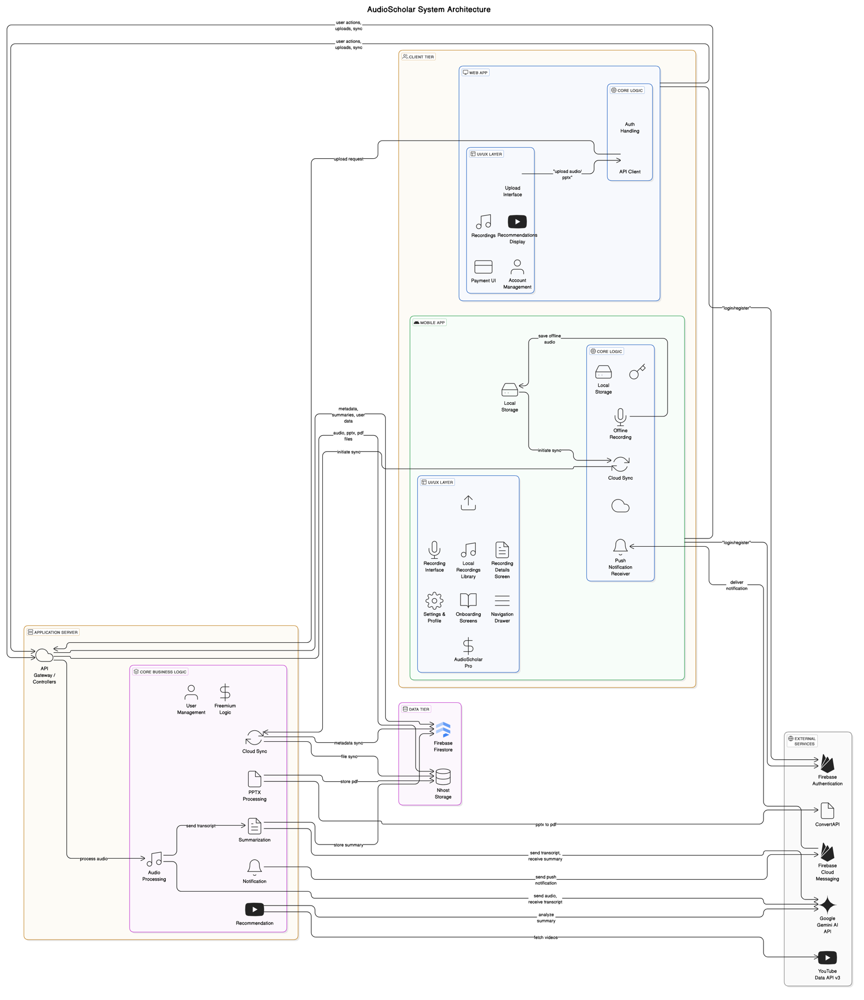*

*Figure 2a: System Architecture Block Diagram for AudioScholar*

# Detailed Design

### Module 1: Lecture Recording & Upload

#### 1.1 Start/Stop Lecture Recording

##### User Interface Design

-   **Mobile (Kotlin):** The Recording Screen (Figure 3.2.1.3) will be implemented using Android's native UI components with Kotlin. The "Tap to record" button will be a Floating Action Button in the layout XML that triggers audio recording start/stop. A Text View will display the recording timer, updated using a Handler posting Runnable on timer ticks. Status messages ("Ready to record", "Recording...") will also be displayed using Text View elements with text updates based on recording state. Permission handling for microphone access will be implemented using Android's runtime permissions system, prompting users if permissions are not granted.

##### Front-end component(s)

-   Recording Activity (Kotlin Class)
    -   Description and purpose: The main UI screen in the mobile app for initiating and controlling lecture recordings. It displays the record button, timer, and recording status.
    -   Component type or format: Android Activity

##### Back-end components(s)

-   Audio Recorder (Kotlin Class)
    -   Description and purpose: A Kotlin class within the Android mobile application responsible for handling the device's audio recording functionalities using Android's Media Recorder API. It manages starting, stopping, pausing, and saving audio recordings to local storage.
    -   Component type or format: Kotlin Class

##### Object-Oriented Components

-   **Class Diagram**

    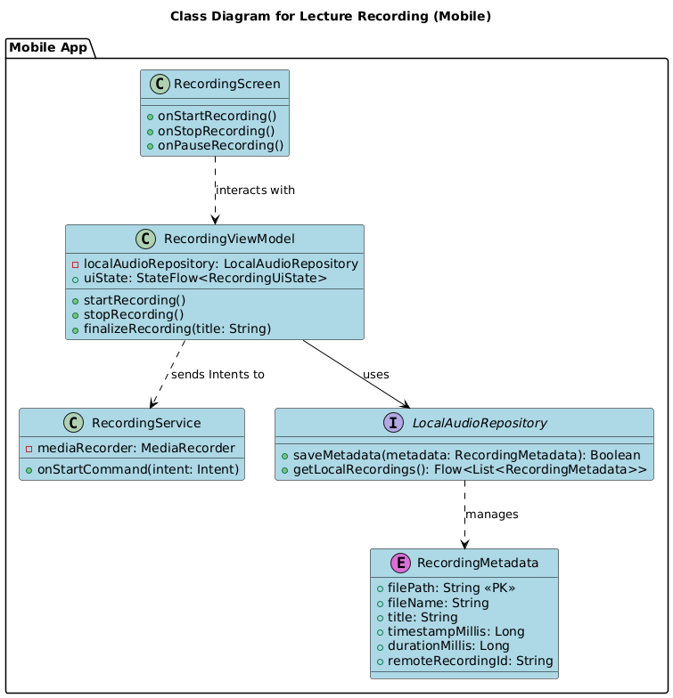

    *Figure 3.1.1: Class Diagram for Start/Stop Lecture Recording*

-   **Sequence Diagram**

    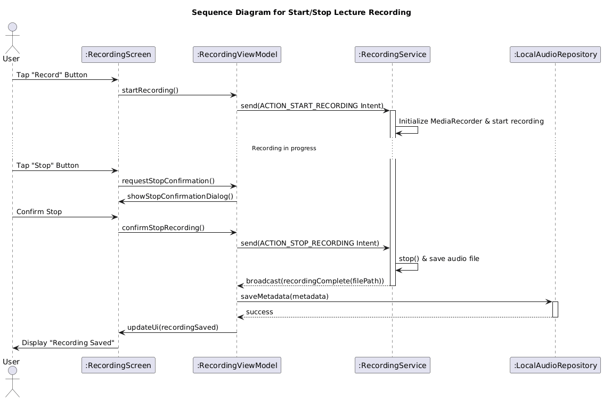

    *Figure 3.1.2: Sequence Diagram for Start/Stop Lecture Recording*

##### Data Design

-   *ERD*

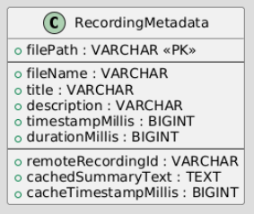

*Figure 3.1.3: ERD for Start/Stop Lecture Recording*

#### 1.2 Upload Audio File

##### User Interface Design

-   **Mobile (Kotlin):** The Upload Audio Screen (Figure 3.2.1.6) will be implemented using Android's native UI components with Kotlin. A Button labeled "Select Audio File" will trigger the Android file selection intent. Upon selection, the file name will be displayed in a Text View. An "Upload" Button will initiate the upload process. A Progress Bar will show upload progress. Snack bar or Toast will display success/error messages.
-   **Web (ReactJS):** The Upload Audio Screen (Figure 3.2.1.7) in ReactJS will use an \<input type="file"\> element styled to resemble a button ("Choose Audio File"). File selection will be handled by the browser. An "Upload" button will trigger the upload. Progress will be shown using a progress bar (e.g., \<progress\>). Alerts or similar components will display success/error messages.

##### Front-end component(s)

-   UploadAudioActivity (Kotlin Class)
    -   Description and purpose: Mobile UI component for uploading audio files from the device. Provides file selection, client-side validation (e.g., checking file size against a 500MB limit before upload initiation), upload initiation, and progress feedback..
    -   Component type or format: Android Activity
-   UploadAudioSection (React Component)
    -   Description and purpose: Web UI component for uploading audio files from a computer. Provides file selection, client-side validation (e.g., checking file size against a defined limit, e.g., 500MB, before upload initiation), upload initiation, and progress feedback.
    -   Component type or format: React Component

##### Back-end components(s)

-   AudioUploadService (Kotlin Class - Mobile)
    -   Description and purpose: Kotlin service in the mobile app to handle the actual audio file upload to the server using HTTP requests (e.g., using HttpURLConnection or a library like Retrofit or OkHttp). Manages file streaming and progress updates.
    -   Component type or format: Kotlin Class
-   AudioUploadAPIClient (JavaScript Class - Web)
    -   Description and purpose: JavaScript class in the web interface to handle audio file uploads to the server using fetch API or axios. Manages API calls and progress updates.
    -   Component type or format: JavaScript Class
-   AudioUploadController (Spring Boot Controller - Server)
    -   Description and purpose: Spring Boot REST controller on the server-side that exposes an endpoint (/api/upload/audio) to receive uploaded audio files. Handles file reception, server-side validation (including file type, and enforcing a maximum file size limit, e.g., 500MB), and queuing for processing.
    -   Component type or format: Spring Boot Controller

##### Object-Oriented Components

-   **Class Diagram**

    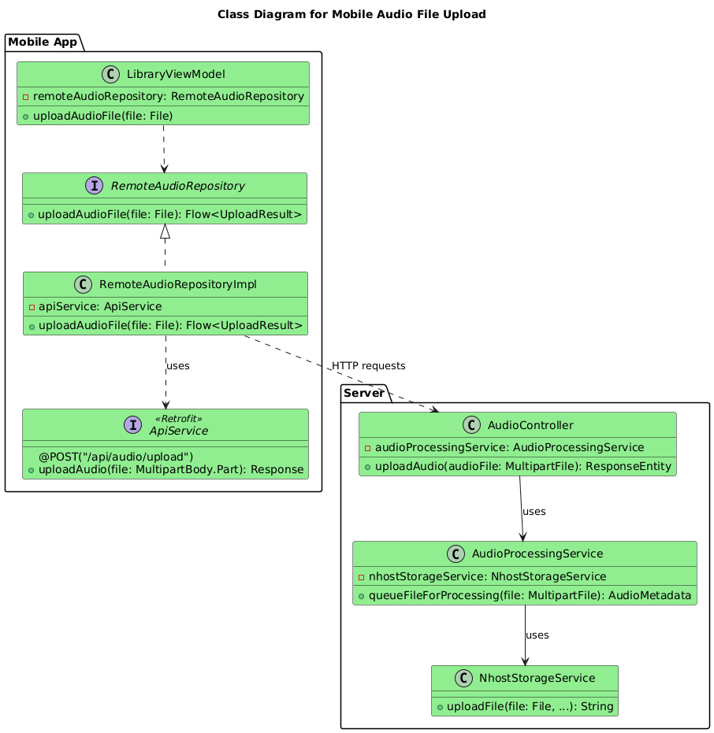

    *Figure 3.1.4: Class Diagram for Upload Audio File*

-   **Sequence Diagram**

    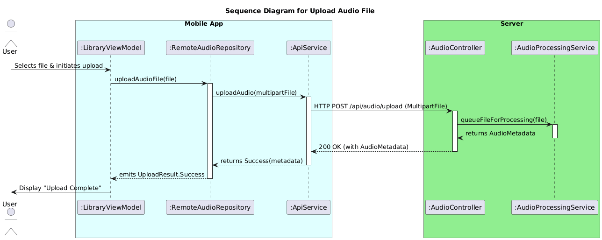

    *Figure 3.1.5: Sequence Diagram for Upload Audio File*

##### Data Design

-   ERD

    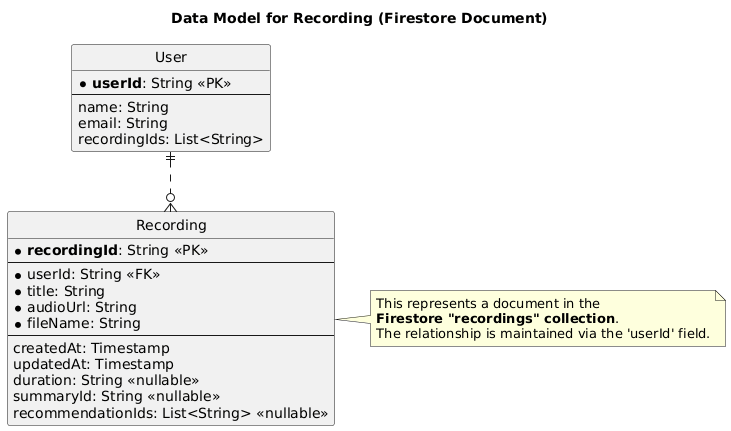

    *Figure 3.1.6: ERD for Upload Audio File*

### Module 2: Audio Processing & Summarization

#### 2.1 Receive Audio for Processing

##### User Interface Design

-   No direct UI for this server-side transaction.

##### Front-end component(s)

-   No front-end components directly involved in this server-side transaction.

##### Back-end components(s)

-   AudioIngestionService (Spring Boot Service)
    -   Description and purpose: Server-side service responsible for receiving uploaded audio files from the AudioUploadController. It validates the audio file, queues it for AI processing, and updates the processing status in the database.
    -   Component type or format: Spring Boot Service
-   AudioProcessingQueue (Message Queue - e.g., RabbitMQ or Redis Pub/Sub)
    -   Description and purpose: A message queue used to decouple audio ingestion from the AI processing. AudioIngestionService enqueues audio files here, and AudioAISummarizationService dequeues them.
    -   Component type or format: Message Queue (Conceptual)

##### Object-Oriented Components

-   **Class Diagram**

    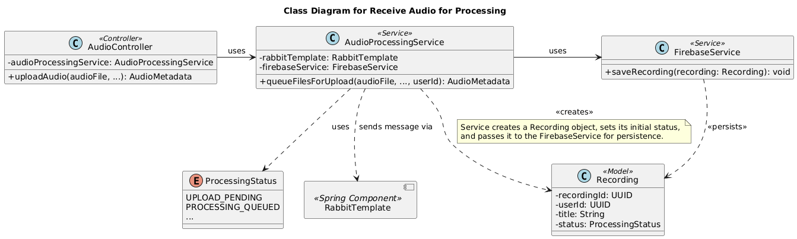

    *Figure 3.2.1: Class Diagram for Receive Audio for Processing*

-   **Sequence Diagram**

    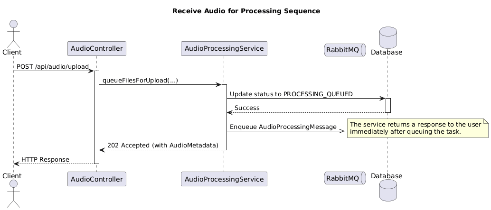

    *Figure 3.2.2: Sequence Diagram for Receive Audio for Processing*

##### Data Design

-   *ERD*

    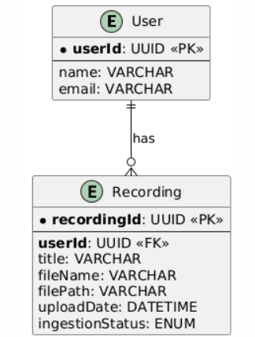

    *Figure 3.2.3: ERD for Receive Audio for Processing*

#### 2.2 Process Audio using AI API

##### User Interface Design

-   No direct UI for this server-side transaction.

##### Front-end component(s)

-   No front-end components directly involved in this server-side transaction.

##### Back-end components(s)

-   AudioAISummarizationService (Spring Boot Service)
    -   Description and purpose: Server-side service responsible for dequeuing audio files from AudioProcessingQueue, interacting with the Google Gemini AI API for summarization, handling API responses, and updating processing status. For large audio files that may exceed direct API input limits, this service may coordinate with a Google Files API client component to first upload the audio to a temporary cloud location accessible by the Gemini API, then provide a URI reference to the Gemini API for processing.
    -   Component type or format: Spring Boot Service
-   GeminiAPIClient (Java/Kotlin Class)
    -   Description and purpose: A client class to encapsulate communication with the Google Gemini AI API. Handles API request construction (potentially including file URIs from Google Files API for large audio files), sending requests, and parsing responses.
    -   Component type or format: Java/Kotlin Class

##### Object-Oriented Components

-   **Class Diagram**

    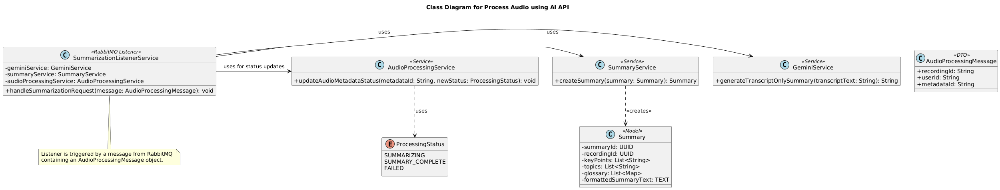

    *Figure 3.2.4: Class Diagram for Process Audio using AI API*

-   **Sequence Diagram**

    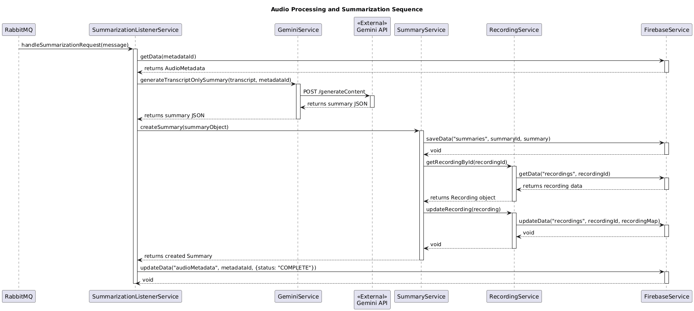

    *Figure 3.2.5: Sequence Diagram for Process Audio using AI API*

##### Data Design

-   ERD

    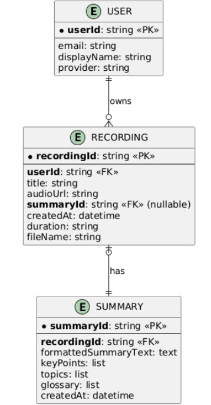

*Figure 3.2.6: ERD for Process Audio using AI API*

#### 2.3 Generate Lecture Summary

##### User Interface Design

-   No direct UI for this server-side transaction, output is used in UI.

##### Front-end component(s)

-   No front-end components directly involved in this server-side transaction.

##### Back-end components(s)

-   LectureSummaryGenerator (Spring Boot Service)
    -   Description and purpose: Server-side service that takes the raw summary text from AudioAISummarizationService, structures and formats it (e.g., using Markdown), and stores the formatted summary in the database.
    -   Component type or format: Spring Boot Service

##### Object-Oriented Components

-   **Class Diagram**

    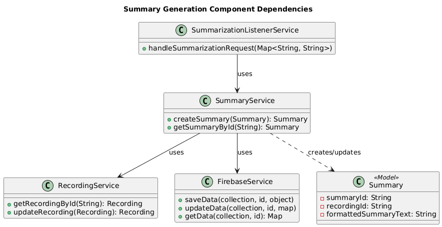

    *Figure 3.2.7: Class Diagram for Generate Lecture Summary*

-   **Sequence Diagram**

    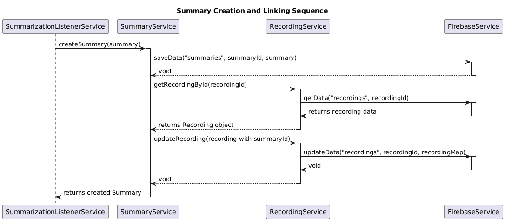

    *Figure 3.2.8: Sequence Diagram for Generate Lecture Summary*

##### Data Design

-   *ERD or schema*

    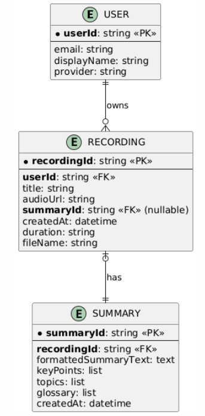

    *Figure 3.2.9: ERD for Generate Lecture Summary*

### Module 3: Learning Material Recommendation

#### 3.1 Analyze Lecture Content

##### User Interface Design

-   No direct UI for this server-side transaction.

##### Front-end component(s)

-   No front-end components directly involved in this server-side transaction.

##### Back-end components(s)

-   LectureContentAnalyzer (Spring Boot Service)
-   Description and purpose: Server-side service responsible for analyzing the lecture summary text using NLP techniques to extract keywords and key topics.
-   Component type or format: Spring Boot Service
-   NLPEngine(Java/Kotlin Class - NLP Library Integration)
-   Description and purpose: A class that integrates with an NLP library (e.g., Stanford CoreNLP, spaCy4j) to perform keyword extraction and topic identification.
-   Component type or format: Java/Kotlin Class

##### Object-Oriented Components

-   **Class Diagram**

    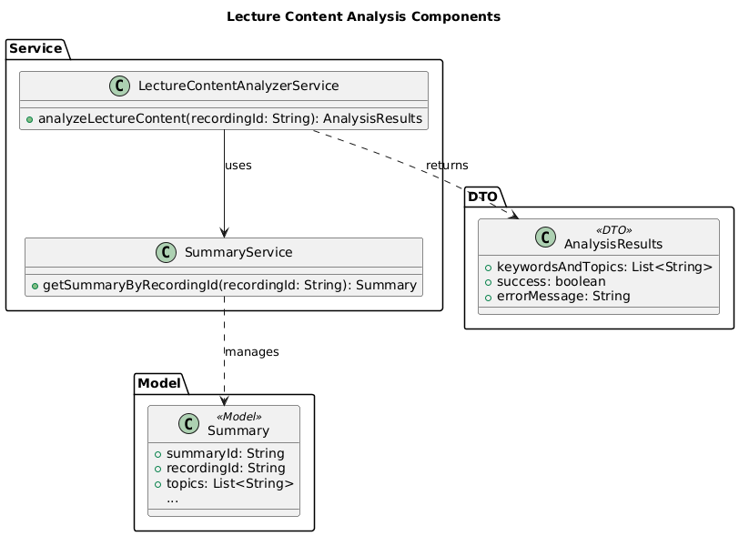

    *Figure 3.3.1: Class Diagram for Analyze Lecture Content*

-   **Sequence Diagram**

    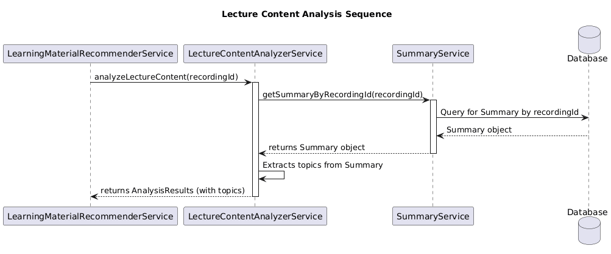

    *Figure 3.3.2: Sequence Diagram for Analyze Lecture Content*

##### Data Design

-   **ERD or schema**

    *Figure 3.3.3: ERD for Analyze Lecture Content*

#### 3.2 Generate Learning Material Recommendations

##### User Interface Design

-   No direct UI for this server-side transaction, output is used in UI.

##### Front-end component(s)

-   No front-end components directly involved in this server-side transaction.

##### Back-end components(s)

-   LearningMaterialRecommender (Spring Boot Service)
-   Description and purpose: Server-side service that uses the analysis results (keywords, topics) to query the YouTube Data API and generate learning material recommendations.
-   Component type or format: Spring Boot Service
-   YouTubeAPIClient (Java/Kotlin Class)
-   Description and purpose: A client class to interact with the YouTube Data API for searching videos based on keywords and topics.
-   Component type or format: Java/Kotlin Class

##### Object-Oriented Components

-   **Class Diagram**

    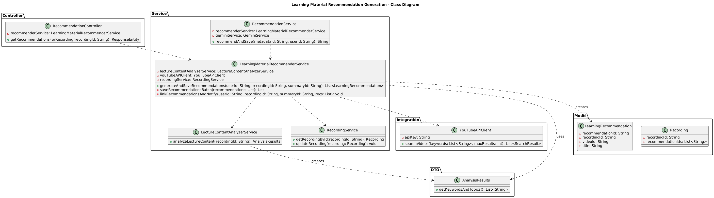

    *Figure 3.3.4: Class Diagram for Generate Learning Material Recommendations*

-   **Sequence Diagram**

    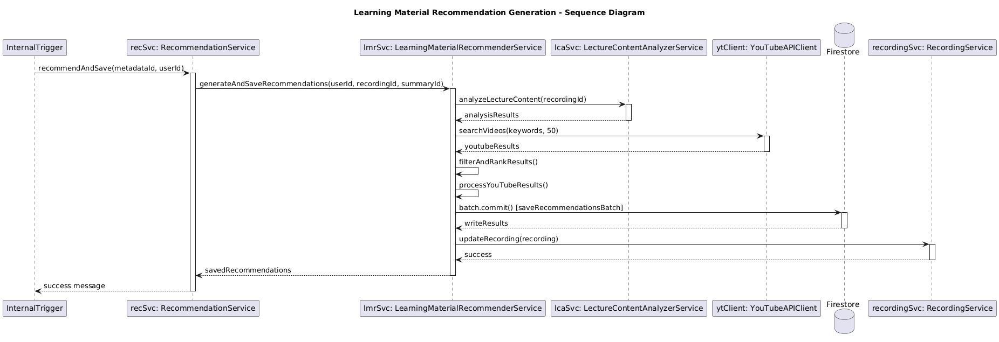

    *Figure 3.3.5: Sequence Diagram for Generate Learning Material Recommendations*

##### Data Design

-   **ERD or schema**

    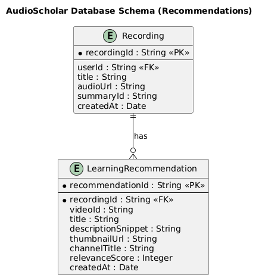

    *Figure 3.3.6: ERD for Generate Learning Material Recommendations*

### Module 4: User Authentication & Account Management

#### 4.1 User Registration

##### User Interface Design

##### Mobile (Kotlin): Registration Screen (Figure 3.2.4.3) will use EditText widgets for Name, Email, Password, and Confirm Password. Input validation will be performed using form validation methods. A "Register" Button submits the form. Error messages will be displayed below respective fields or using Snackbar.

##### Front-end component(s)

##### RegistrationActivity (Kotlin Activity)

-   Description and purpose: Mobile UI screen for user registration, collecting user details and initiating account creation.
    -   Component type or format: Kotlin Activity

##### Back-end components(s)

-   UserRegistrationService (Kotlin Class - Mobile)
-   Description and purpose: Kotlin service in the mobile app to handle user registration logic, including input validation and communication with the server-side authentication service.
-   Component type or format: Kotlin Class

##### Object-Oriented Components

-   **Class Diagram**

*Figure 3.4.1: Class Diagram for User Registration*

-   **Sequence Diagram**

*Figure 3.4.2: Sequence Diagram for User Registration*

##### Data Design

-   **ERD**

    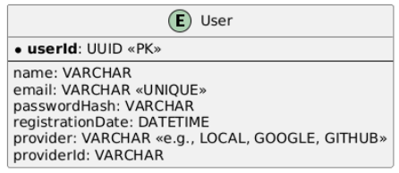

*Figure 3.4.3: ERD for User Registration*

#### 4.2 User Login (Google Oauth 2.0)

##### User Interface Design

-   **Mobile (Kotlin):** Login Screen (Figure 3.2.4.6) will have a "Login with Google" Button. Clicking this button will trigger Google Sign-In using Google Sign-In SDK for Android. Loading indicators (ProgressBar) and error messages (Snackbar) will be used for feedback.

##### Front-end component(s)

-   LoginActivity (Kotlin Activity)
-   Description and purpose: Mobile UI screen providing "Login with Google" button to initiate Google OAuth 2.0 login flow.
-   Component type or format: Kotlin Activity
-   GoogleSignInService (Kotlin Class - Mobile)
-   Description and purpose: Kotlin service in the mobile app to handle Google Sign-In using Google Sign-In SDK, obtain OAuth tokens, and communicate with the server for authentication.
-   Component type or format: Kotlin Class

##### Back-end components(s)

-   UserAuthenticationController (Spring Boot Controller – Server)
-   Description and purpose: Spring Boot REST controller on the server-side that exposes an endpoint (/api/auth/login/google) to handle Google OAuth login requests. Verifies Google ID token using Firebase Admin SDK and manages user sessions.
-   Component type or format: Spring Boot Controller

##### Object-Oriented Components

-   **Class Diagram**

*Figure 3.4.4: Class Diagram for User Login (Google Oauth 2.0)*

-   **Sequence Diagram**

*Figure 3.4.5: Sequence Diagram for User Login (Google Oauth 2.0)*

##### Data Design

-   **ERD**
-   Session management will likely be handled in memory or using Redis for scalability.  
    No explicit data schema for sessions needed for detailed design, conceptually managed by backend.

#### 4.3 Account Profile Management (View User Profile)

##### User Interface Design

-   **Mobile (Kotlin):** User Profile Screen (Figure 3.2.4.15) will display user details (Name, Email) using TextView widgets. Data will be fetched asynchronously using Coroutines or LiveData. "Edit Profile" and "Logout" buttons will be standard Android Button widgets.

##### Front-end component(s)

-   UserProfileActivity (Kotlin Activity)
    -   Description and purpose: Mobile UI screen to display the logged-in user's profile information.
    -   Component type or format: Kotlin Activity
-   UserProfileService (Kotlin Class - Mobile)
    -   Description and purpose: Kotlin service in the mobile app to fetch user profile data from the server.
    -   Component type or format: Kotlin Class

##### Back-end components(s)

-   UserProfileController (Spring Boot Controller - Server)
    -   Description and purpose: Spring Boot REST controller on the server-side that exposes an endpoint (/api/user/profile) to retrieve user profile data based on the authenticated user's ID.
    -   Component type or format: Spring Boot Controller

##### Object-Oriented Components

-   **Class Diagram**

*Figure 3.4.6: Class Diagram for Account Profile Management*

-   **Sequence Diagram**

*Figure 3.4.7: Sequence Diagram for Account Profile Management*

##### Data Design

-   **ERD**

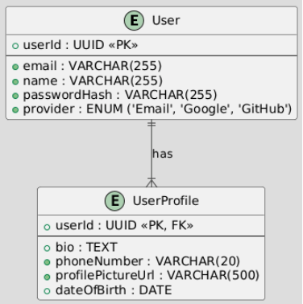

*Figure 3.4.8: ERD for Account Profile Management*

### Module 5: Cloud Synchronization

#### 5.1 Configure Cloud Sync Settings

##### User Interface Design

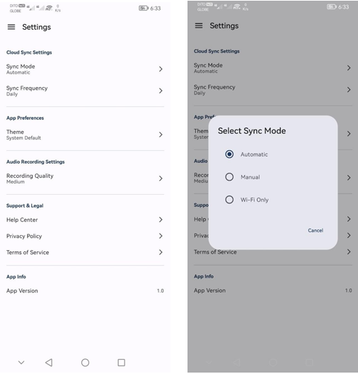

*Figure 3.4.8.1: Wireframe for Sync Settings Screen (Mobile)*

-   **Mobile (Kotlin):** Sync Settings Screen (Figure 3.4.8.1) will use Switch for "Enable Cloud Sync", Spinner for "Sync Frequency", and CheckBox with TextView for "Choose Data to Sync". Settings will be persisted locally using SharedPreferences.

##### Front-end component(s)

-   SyncSettingsActivity (Kotlin Activity)
    -   Description and purpose: Mobile UI screen to configure cloud synchronization settings (enable/disable, frequency, data types).
    -   Component type or format: Kotlin Activity
-   SyncSettingsManager (Kotlin Class - Mobile)
    -   Description and purpose: Kotlin class in the mobile app to manage local storage and retrieval of cloud sync settings.
    -   Component type or format: Kotlin Class

##### Back-end components(s)

-   No direct back-end components involved in *configuring* sync settings, settings are client-side.

##### Object-Oriented Components

-   **Class Diagram**

*Figure 3.5.1: Class Diagram for Configure Cloud Sync Settings*

-   **Sequence Diagram**

    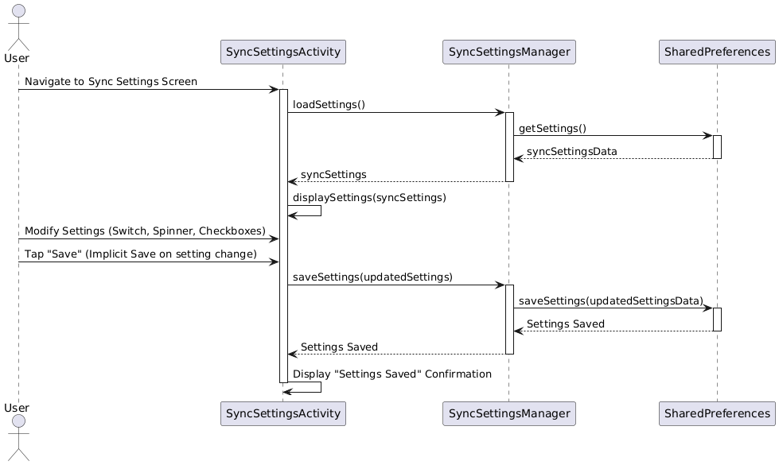

*Figure 3.5.2: Sequence Diagram for Configure Cloud Sync Settings*

##### Data Design

-   **ERD**
-   Sync settings are stored locally in SharedPreferences (Android). No explicit database schema needed, conceptual local storage.

#### 5.2 Manual/Automatic Cloud Sync

##### User Interface Design

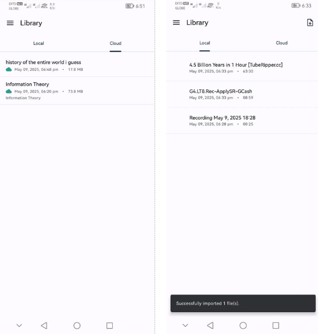

-   **Mobile (Kotlin):** Manual sync can be initiated from Settings screen or Recordings List (Figure *3.5.2.1*). Progress indicator (e.g., circular or horizontal ProgressBar) will be displayed during sync. Status messages and error Snackbar will provide feedback.

##### Front-end component(s)

-   CloudSyncService (Kotlin Class - Mobile)
    -   Description and purpose: Kotlin service in the mobile app responsible for orchestrating cloud synchronization, handling both manual and automatic sync processes. Manages data upload and download to/from Nhost Storage.
    -   Component type or format: Kotlin Class

##### Back-end components(s)

-   CloudStorageSyncService (Spring Boot Service - Server)
    -   Description and purpose: Spring Boot service on the server-side that provides APIs for mobile app to upload and download data to/from Nhost Cloud Storage. Primarily acts as a secure intermediary to Nhost Storage.
    -   Component type or format: Spring Boot Service

##### Object-Oriented Components

-   **Class Diagram**

*Figure 3.5.3: Class Diagram for Manual/Automatic Cloud Sync*

-   **Sequence Diagram**

*Figure 3.5.4: Sequence Diagram for Manual/Automatic Cloud Sync*

##### Data Design

-   **ERD**
-   Cloud storage schema is primarily managed by Nhost Storage.  
    AudioScholar database may store metadata about cloud storage paths.

### Module 6: PowerPoint Integration

#### 6.1 Upload PowerPoint

##### User Interface Design

-   **Mobile (Kotlin):** PowerPoint Upload Screen (Figure 3.2.6.3) will have a "Select PowerPoint File" Button to trigger file selection using Android's built-in file picker (Intent.ACTION_GET_CONTENT). File name will be displayed in a TextView. "Upload" Button initiates upload. Progress indicator (ProgressBar) and status messages (Snackbar) will be used.

##### Front-end component(s)

-   PowerPointUploadActivity (Kotlin Activity)
    -   Description and purpose: Mobile UI screen for uploading PowerPoint files from the device.
    -   Component type or format: Kotlin Activity
-   PowerPointUploadService (Kotlin Class - Mobile)
    -   Description and purpose: Kotlin service in the mobile app to handle PowerPoint file upload to the server.
    -   Component type or format: Kotlin Class

##### Back-end components(s)

-   PowerPointUploadController (Spring Boot Controller - Server)
    -   Description and purpose: Spring Boot REST controller on the server-side to receive uploaded PowerPoint files. Temporarily stores uploaded PPTs.
    -   Component type or format: Spring Boot Controller

##### Object-Oriented Components

-   **Class Diagram**

*Figure 3.6.1: Class Diagram for Upload Powerpoint*

-   **Sequence Diagram**

*Figure 3.6.2: Sequence Diagram for Upload Powerpoint*

##### Data Design

-   **ERD**

    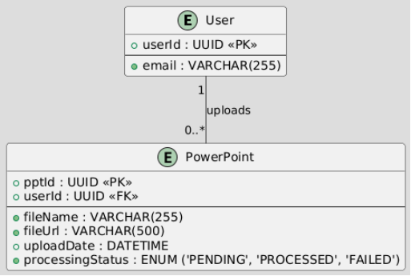

*Figure 3.6.3: ERD for Upload Powerpoint*

#### 6.2 Associate PowerPoint with Recording

##### User Interface Design

-   **Mobile (Kotlin):** Recording Details Screen (Figure 3.2.6.6) will have an "Associate PowerPoint" button. Tapping it will show a list of uploaded PPTs in an AlertDialog. Selecting a PPT will associate it with the recording. UI will update to show associated PPT.

##### Front-end component(s)

-   RecordingDetailsActivity (Kotlin Activity)
    -   Description and purpose: Mobile UI screen to display recording details and provide option to associate PowerPoint.
    -   Component type or format: Kotlin Activity
-   PowerPointAssociationService (Kotlin Class - Mobile)
    -   Description and purpose: Kotlin service in mobile app to handle PowerPoint association with recording, communicating with server to update metadata.
    -   Component type or format: Kotlin Class

##### Back-end components(s)

-   RecordingMetadataController (Spring Boot Controller - Server)
    -   Description and purpose: Spring Boot REST controller to handle updates to recording metadata, including PowerPoint association.
    -   Component type or format: Spring Boot Controller

##### Object-Oriented Components

-   **Class Diagram**

*Figure 3.6.4: Class Diagram for Associate Powerpoint with Recording*

-   **Sequence Diagram**

*Figure 3.6.5: Sequence Diagram for Associate Powerpoint with Recording*

##### Data Design

-   **ERD**

    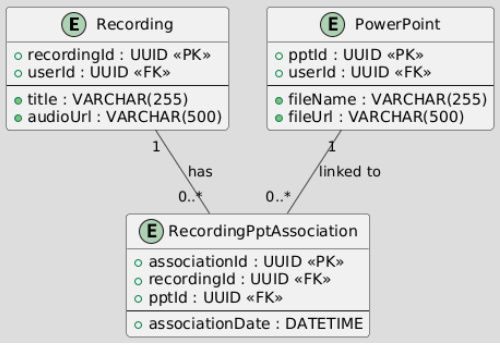

*Figure 3.6.6: ERD for Associate Powerpoint with Recording*

### Module 7: Web Interface

#### 7.1 View Recordings and Summaries

##### User Interface Design

-   **Web (ReactJS):** Recordings and Summaries View (Figure 3.2.7.3) in ReactJS will display a list of recordings using components like List or Table. Each item will show recording title, date, status (summarized/pending). Selecting a recording will display its summary below or on a separate panel. React components and state management (e.g., React Hooks) will be used to fetch and display data.

##### Front-end component(s)

-   RecordingsList (React Component)
    -   Description and purpose: React component to display a list of user's lecture recordings in the web interface.
    -   Component type or format: React Component
-   SummaryDisplay (React Component)
    -   Description and purpose: React component to display the summary of a selected lecture recording in the web interface.
    -   Component type or format: React Component
-   RecordingsAndSummariesPage (React Component)
    -   Description and purpose: Parent React component that orchestrates the display of RecordingsList and SummaryDisplay on the web page.
    -   Component type or format: React Component

##### Back-end components(s)

-   RecordingRetrievalController (Spring Boot Controller - Server)
    -   Description and purpose: Spring Boot REST controller to handle requests for retrieving user's recordings and summaries for the web interface.
    -   Component type or format: Spring Boot Controller

##### Object-Oriented Components

-   **Class Diagram**

    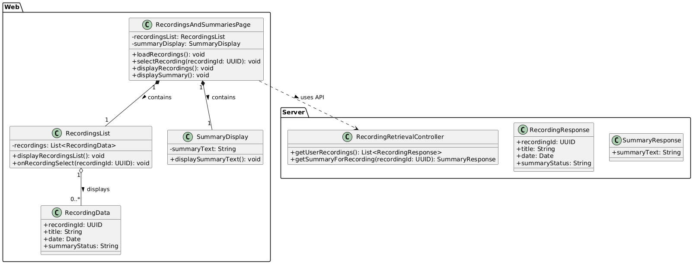

    *Figure 3.7.1: Class Diagram for View Recordings and Summaries*

-   **Sequence Diagram**

    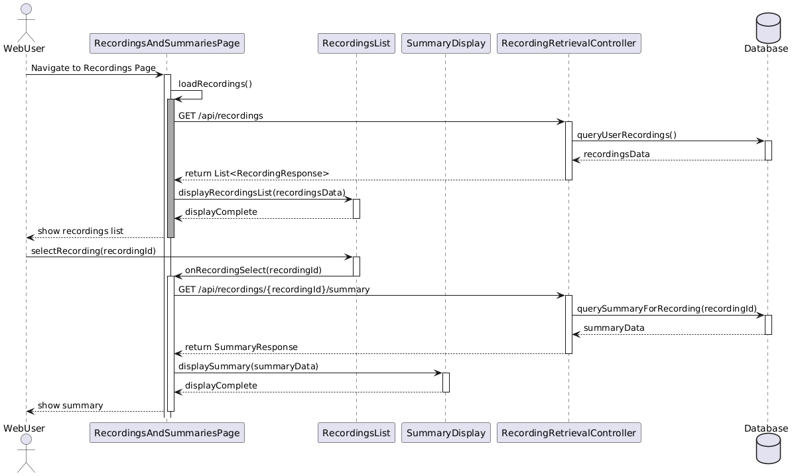

    *Figure 3.7.2: Sequence Diagram for View Recordings and Summaries*

##### Data Design

-   **ERD**
-   Data entities are already defined in previous modules (LectureRecording, LectureSummary).  
    Web interface primarily reads and displays data from these entities.

#### 7.2 Upload Audio Files (Web)

##### User Interface Design

-   **Web (ReactJS):** As described previously in "1.2 Upload Audio File", the Web (ReactJS) implementation for audio upload (Figure 3.2.1.7) uses an \<input type="file"\> element for file selection, styled as a button. An "Upload" button initiates the upload. Progress is displayed using a \<progress\> bar, and alerts handle success/error messages. React state will manage file selection and upload status.

##### Front-end component(s)

-   UploadAudioSection (React Component)
    -   Description and purpose: Web UI component for uploading audio files from a computer. Provides file selection, upload initiation, and progress feedback. (Reused from Module 1.2, but specifically in the context of the Web Interface Module now).
    -   Component type or format: React Component
-   AudioUploadAPIClient (JavaScript Class - Web)
    -   Description and purpose: JavaScript class in the web interface to handle audio file uploads to the server using fetch API or axios. Manages API calls and progress updates. (Reused from Module 1.2, but specifically in the context of the Web Interface Module now).
    -   Component type or format: JavaScript Class

##### Back-end components(s)

-   AudioUploadController (Spring Boot Controller - Server)
    -   Description and purpose: Spring Boot REST controller on the server-side that exposes an endpoint (/api/upload/audio) to receive uploaded audio files. Handles file reception, validation, and queuing for processing. (Reused from Module 1.2, as the backend endpoint is the same for both Mobile and Web upload).
    -   Component type or format: Spring Boot Controller

##### Object-Oriented Components

-   **Class Diagram**

    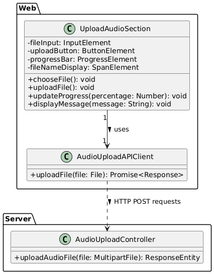

    *Figure 3.7.3: Class Diagram for Upload Audio Files (Web)*

-   **Sequence Diagram**

    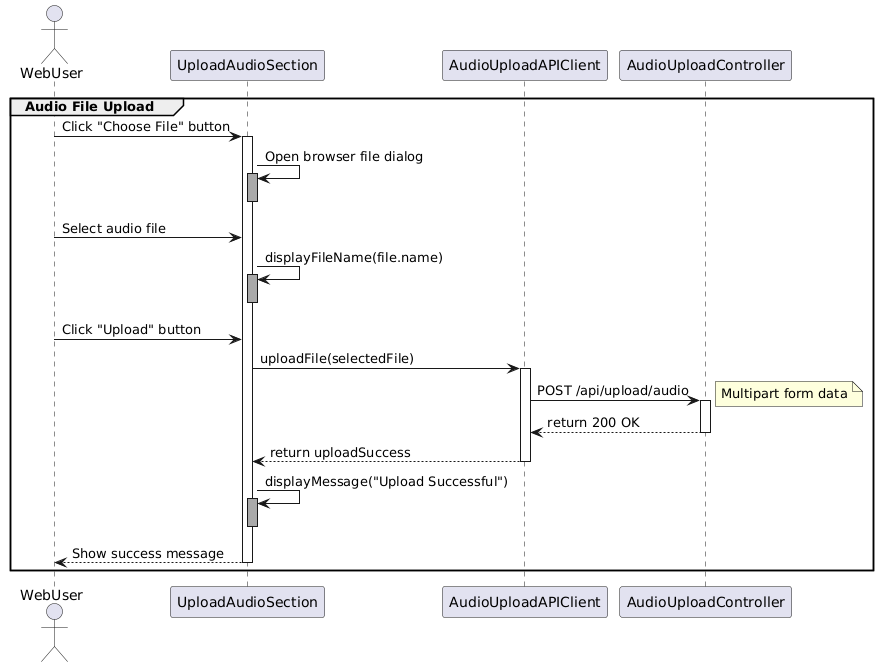

    *Figure 3.7.4: Sequence Diagram for Upload Audio Files (Web)*

##### Data Design

-   **ERD**

    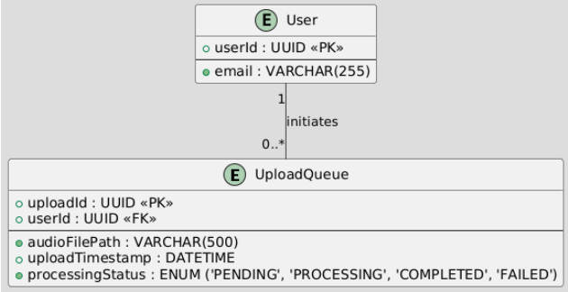

    *Figure 3.7.5: ERD for Upload Audio Files (Web)*

#### 7.3 View Recommendations (Web)

##### User Interface Design

-   **Web (ReactJS):** Recommendations View (Figure 3.2.7.9) within the Recording Details Screen in ReactJS will display a list of recommended learning materials. Each recommendation will be rendered as a clickable card or list item, showing video title, description snippet, and thumbnail. Clicking a recommendation will open the YouTube video in a new tab. React components and state management will handle fetching and displaying recommendations.

##### Front-end component(s)

-   RecommendationList (React Component)
    -   Description and purpose: React component to display a list of learning material recommendations for a selected recording in the web interface.
    -   Component type or format: React Component
-   RecommendationItem (React Component)
    -   Description and purpose: React component to render a single learning material recommendation (video card/list item) with title, description, and thumbnail.
    -   Component type or format: React Component
-   RecordingDetailsPage (React Component)
    -   Description and purpose: Parent React component for the Recording Details page in the web interface, containing SummaryDisplay and RecommendationList.
    -   Component type or format: React Component

##### Back-end components(s)

-   RecommendationRetrievalController (Spring Boot Controller - Server)
    -   Description and purpose: Spring Boot REST controller to handle requests for retrieving learning material recommendations for a specific recording in the web interface. (Reusing the controller from 7.1, as it handles retrieval of both summaries and recommendations).
    -   Component type or format: Spring Boot Controller

##### Object-Oriented Components

-   **Class Diagram**

    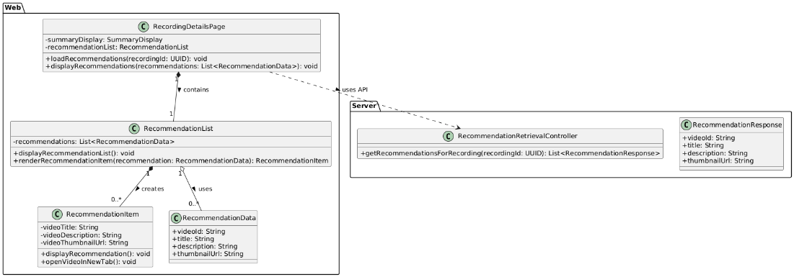

    *Figure 3.7.6: Class Diagram for View Recommendations (Web)*

-   **Sequence Diagram**

    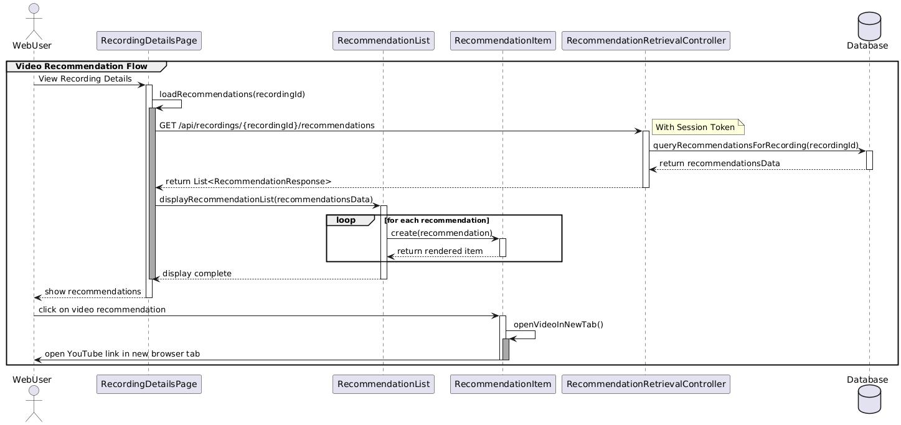

    *Figure 3.7.7: Sequence Diagram for View Recommendations (Web)*

##### Data Design

-   **ERD**

    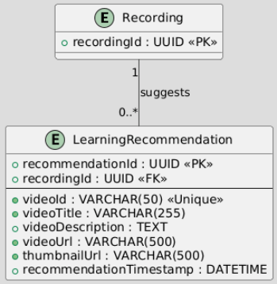

    *Figure 3.7.8: ERD for View Recommendations (Web)*

### Module 8: Freemium Model (Mobile Kotlin & Web ReactJS Version)

#### 8.1 Feature Access Control based on User Status

##### User Interface Design

-   **Mobile & Web (Kotlin & ReactJS):** Feature restriction UI (Figure 3.2.8.3) will be implemented by conditionally rendering or disabling UI elements based on user status. For example, premium features might be visually indicated with a "Premium" label and disabled for free users. Upgrade prompts (AlertDialog in Kotlin, Modal in ReactJS) will be used to encourage premium subscription.

##### Front-end component(s)

-   FeatureAccessControl (Abstract Class/Interface - Mobile & Web)
-   Description and purpose: Abstract class or interface defining methods for checking feature access based on user status. Implemented differently for mobile and web.
-   Component type or format: Abstract Class/Interface (Conceptual)
-   MobileFeatureAccessControl (Kotlin Class - Mobile)
-   Description and purpose: Kotlin class implementing FeatureAccessControl for mobile, using local user status and potentially server-side checks.
-   Component type or format: Kotlin Class
-   WebFeatureAccessControl (JavaScript Class - Web)
-   Description and purpose: JavaScript class implementing FeatureAccessControl for web, using local user status and potentially server-side checks.
-   Component type or format: JavaScript Class

##### Back-end components(s)

-   FeatureAccessController (Spring Boot Controller - Server)
-   Description and purpose: Spring Boot REST controller to provide endpoints for checking feature access permissions server-side (optional, for more robust security).
-   Component type or format: Spring Boot Controller
-   UserStatusService (Spring Boot Service - Server)
-   Description and purpose: Spring Boot service to determine user status (free/premium) based on authentication and subscription data.
-   Component type or format: Spring Boot Service

##### Object-Oriented Components

-   **Class Diagram**

    *Figure 3.8.1: Class Diagram for Feature Access Control based on User Status*

-   **Sequence Diagram**

    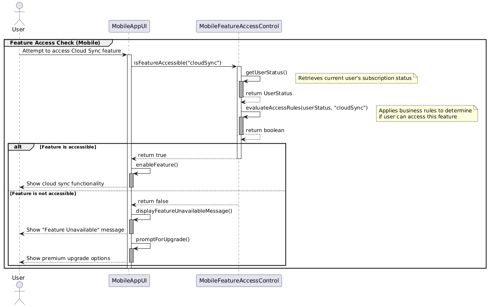

    *Figure 3.8.2: Sequence Diagram for Feature Access Control based on User Status*

##### Data Design

-   **ERD or schema**

    Freemium model primarily impacts feature access logic, not new data entities in this version.

#### 8.2 Premium Subscription Signup

##### User Interface Design:

-   **Mobile (Kotlin):** A dedicated "Upgrade to Premium" screen accessible from user profiles or feature prompts. This screen will display available subscription plans (e.g., monthly, yearly) with features and pricing. Tapping a plan will lead to a simulated payment interface. UI elements will include RecyclerView for plans, Button for selection.
-   **Web (ReactJS):** A "Subscription" or "Billing" page in the user account section. Similar display of plans and pricing using React components (e.g., cards for each plan). Selection will lead to a modal or separate page for simulated payment.

##### Front-end component(s):

-   **Mobile:** SubscriptionPlansActivity (Kotlin Activity), SubscriptionPlanAdapter (Kotlin Class).
-   **Web:** SubscriptionPage (React Component), PlanCard (React Component).

##### Back-end components(s):

-   SubscriptionController (Spring Boot Controller): Endpoint to fetch available subscription plans.
-   SubscriptionPlanService (Spring Boot Service): Logic to retrieve plan details (e.g., from a configuration file or database).

##### Object-Oriented Components:

-   Class Diagram: Would show SubscriptionPlansActivity interacting with SubscriptionPlanService via SubscriptionController. SubscriptionPlan entity.
-   **Sequence Diagram:** User navigates to plans screen -\> FE requests plans from BE -\> BE returns plans -\> User selects a plan.

##### Data Design (ERD):

-   SubscriptionPlan (PlanID PK, Name, Description, Price, Duration_Months, Features_List)

#### 8.3 Simulated Payment Processing

##### User Interface Design:

-   **Mobile & Web:** A simple form to simulate payment (e.g., "Enter Mock Card Details" with a "Confirm Payment" button). This will not process real payments but will simulate success/failure for testing the workflow. Clear indication that this is a simulation.

##### Front-end component(s):

-   **Mobile:** SimulatedPaymentFragment (Kotlin Fragment).
-   **Web:** SimulatedPaymentModal (React Component).

##### Back-end components(s):

-   PaymentController (Spring Boot Controller): Endpoint like /api/payment/simulate to receive mock payment details and selected plan.
-   SimulatedPaymentService (Spring Boot Service): Logic to simulate payment success/failure. On success, triggers subscription activation.

##### Object-Oriented Components:

-   Class Diagram: Shows FE components calling PaymentController, which uses SimulatedPaymentService.
-   **Sequence Diagram:** User submits mock payment -\> FE sends data to BE -\> SimulatedPaymentService processes -\> Returns success/failure -\> If success, triggers subscription update.

#### 8.4 User Subscription Status Update

##### User Interface Design:

-   **Mobile & Web:** User profile sections will display current subscription status (e.g., "Free Tier," "Premium User"), expiry date if applicable.

##### Front-end component(s):

-   Integrated into existing profile view components (e.g., UserProfileActivity, UserProfilePage).

##### Back-end components(s):

-   UserStatusService (Spring Boot Service - from 8.1, enhanced): Now also manages and retrieves detailed subscription status linked to the user.
-   SubscriptionService (Spring Boot Service): Handles creation and updating of user subscription records upon successful simulated payment.

##### Object-Oriented Components:

-   Class Diagram: SimulatedPaymentService interacts with SubscriptionService to create/update UserSubscription records. UserStatusService reads these records.
-   **Sequence Diagram:** After successful simulated payment, SimulatedPaymentService calls SubscriptionService to create UserSubscription record -\> UserStatusService can then reflect this new status.

##### Data Design (ERD):

-   UserSubscription (UserSubscriptionID PK, UserID FK, PlanID FK, StartDate, EndDate, Status ENUM('ACTIVE', 'EXPIRED', 'CANCELLED'), SimulatedTransactionID)
-   UserProfile (from Module 4) may have a derived field or link to UserStatus (from 8.1) which is determined by UserSubscription.
