****

**CEBU INSTITUTE OF TECHNOLOGY**

**UNIVERSITY**

COLLEGE OF COMPUTER STUDIES

Software Requirements Specifications

for

**AudioScholar: Transforming Audio into Actionable Insights for Learners**

AudioScholar: Transforming Audio into Actionable Insights for Learners

**Proponent(s):**

Biacolo, Math Lee L.

Terence, John Duterte

Orlanes, John Nathan

Barrientos, Claive Justin

Alpez, Christian Brent

**Adviser:**

Jasmine A. Tulin

\___________________\_

**Consultation Schedule:**

TULIWED11001200

**Date of Submission:**

September 20, 2025

Change History

| Version | Date       | Author                                       | Description of Change                                                                      |
|---------|------------|----------------------------------------------|--------------------------------------------------------------------------------------------|
| 1.0     | 2025-07-03 | BIACOLO                                      | Initial Draft                                                                              |
| 1.1     | 2025-08-03 | BIACOLO                                      | Included FR all Modules Diagram & Wireframe from Figma and FR Module 1, 2, and 4.2 – 4.3.3 |
| 1.2     | 2025-09-03 | ALPEZ                                        | Included FR Module 3                                                                       |
| 1.3     | 2025-10-03 | ORLANES                                      | Included FR Module 4.1 & 5                                                                 |
| 1.4     | 2025-11-03 | BARRIENTOS                                   | Included FR Module 6 & 7                                                                   |
| 1.5     | 2025-12-03 | DUTERTE                                      | Included FR Module 8                                                                       |
| 1.5.5   | 2025-13-03 | BIACOLO                                      | Minor Fixes                                                                                |
| 1.6     | 2025-13-03 | BIACOLO                                      | Pre-Final Submission                                                                       |
| 1.7     | 2025-30-04 | BIACOLO                                      | Fixed Inconsistencies with the Software Project Proposal                                   |
| 1.8     | 2025-09-05 | BIACOLO                                      | Final Fix Inconsistencies                                                                  |
| 1.9     | 2025-17-09 | ORLANES & DUTERTE                            | Requirements Refactoring                                                                   |
| 2.0     | 2025-19-09 | BIACOLO & ORLANES                            | Requirements Refactoring                                                                   |
| 2.1     | 2025-20-09 | ORLANES, DUTERTE, ALPEZ, BARRIENTOS, BIACOLO | Requirements Refactoring                                                                   |
| 2.2     | 2025-28-10 | ORLANES, DUTERTE & ALPEZ                     | Requirements Refactoring                                                                   |
| 2.3     | 2025-01-12 | BIACOLO                                      | Fixing Inconsistencies                                                                     |

Table of Contents

[Change History](#_Toc197735724)

[Table of Contents](#_Toc197735725)

[1. Introduction](#introduction)

[1.1. Purpose](#purpose)

[1.2. Scope](#scope)

[1.3. Definitions, Acronyms and Abbreviations](#definitions-acronyms-and-abbreviations)

[1.4. References](#references)

[2. Overall Description](#overall-description)

[2.1. Product perspective](#product-perspective)

[Module 1: Lecture Recording & Upload (Mobile & Web)](#module-1-lecture-recording--upload-mobile--web)

[Module 2: Audio Processing & Summarization (Server-side)](#module-2-audio-processing--summarization-server-side)

[Module 3: Learning Material Recommendation (Server-side)](#module-3-learning-material-recommendation-server-side)

[Module 4: User Authentication & Account Management (Mobile & Server-side)](#module-4-user-authentication--account-management-mobile--server-side)

[Module 5: Cloud Synchronization (Mobile & Server-side)](#module-5-cloud-synchronization-mobile--server-side)

[Module 6: PowerPoint Integration (Mobile & Server-side)](#module-6-powerpoint-integration-mobile--server-side)

[Module 7: Web Interface (Web)](#module-7-web-interface-web)

[Module 8: Freemium Model (Mobile, Web, and Server-side)](#module-8-freemium-model-mobile-web-and-server-side)

[2.2. User characteristics](#user-characteristics)

[2.4. Constraints](#24-constraints)

[2.5. Assumptions and dependencies](#25-assumptions-and-dependencies)

[3. Specific Requirements](#specific-requirements)

[3.1. External interface requirements](#external-interface-requirements)

[3.1.1. Hardware interfaces](#311-hardware-interfaces)

[3.1.2. Software interfaces](#312-software-interfaces)

[3.1.3. Communications interfaces](#313-communications-interfaces)

[3.2. Functional requirements](#functional-requirements)

[Module 1: Lecture Recording & Upload](#module-1-lecture-recording--upload)

[Module 2: Audio Processing & Summarization](#module-2-audio-processing--summarization)

[Module 3: Learning Material Recommendation](#module-3-learning-material-recommendation)

[Module 4: User Authentication & Account Management](#_Toc197735753)

[Module 5: Cloud Synchronization](#module-5-cloud-synchronization)

[Module 6: PowerPoint Integration](#module-6-powerpoint-integration)

[Module 7: Web Interface](#module-7-web-interface)

[Module 8: Freemium Model](#module-8-freemium-model)

[3.3 Non-functional requirements](#_Toc197735758)

[Performance](#_Toc197735759)

[Security](#_Toc197735760)

[Reliability](#_Toc197735761)

[Usability](#_Toc197735762)

[Efficiency](#_Toc197735763)

[Scalability](#_Toc197735764)

[Offline Capability](#_Toc197735765)

# Introduction

## Purpose

***

This Software Requirements Specification (SRS) document meticulously details the comprehensive requirements for the AudioScholar application. AudioScholar is conceived as an intelligent, multi-user platform designed to record lecture audio and leverage AI-driven summarization techniques to produce structured, actionable insights specifically tailored for learners. The primary audience for this document includes the AudioScholar development team, the project advisor, and key stakeholders. It is intended to provide a definitive and unambiguous understanding of the system’s requirements, ensuring all parties are aligned on the project goals and specifications. This SRS serves as the foundational blueprint guiding the design, development, and rigorous testing phases of the AudioScholar project, ensuring the final product effectively meets the needs of its users and stakeholders [2].

## Scope

***

The AudioScholar software product will be delivered as a dual-platform solution, specifically focused on audio lecture recording and processing. It comprises a mobile application for Android devices and a web interface accessible through standard web browsers. The system is designed to capture, summarize, and recommend learning materials based on audio recordings of lectures, not video.

The functionalities explicitly within the scope of the AudioScholar software include:

-   **Lecture Recording:** Providing robust audio lecture recording capabilities via a dedicated mobile application. This feature accommodates real-time audio capture in both online and offline scenarios, offering flexibility for users in diverse learning environments. The recording functionality is designed to capture spoken content from lectures as high-quality audio.
-   **Audio Upload:** Enabling users to upload pre-recorded audio files through both the web interface and the mobile application, supporting diverse user workflows and existing content.
-   **AI-Powered Summarization:** Integrating with advanced AI APIs, specifically Google Gemini AI API [3], to automatically process audio recordings. This core feature will generate structured and concise summaries of lecture content, transforming lengthy audio into digestible key points.
-   **Personalized Learning Material Recommendations:** Offering a personalized learning experience by recommending supplementary learning materials. The initial focus will be on curating relevant educational resources from YouTube, a widely used platform for academic content.
-   **User Authentication and Account Management:** Implementing a secure and user-friendly authentication system within the mobile application. This will support multiple authentication methods, including federated login via Google OAuth 2.0 [4] and GitHub OAuth 2.0 [5], as well as traditional email/password login for user convenience and accessibility.
-   **Optional Cloud Synchronization:** Providing users with the option to synchronize their recordings and summaries to the cloud using Nhost Storage. This feature ensures data backup and accessibility across devices, enhancing user data security and flexibility.
-   **PowerPoint Integration for Enhanced Summarization:** Allowing users to optionally upload lecture PowerPoint presentations. When available, these presentations will be used to augment the AI summarization process, significantly improving the accuracy and contextuality of the generated summaries by providing visual and structural context to the audio content.
-   **Multi-User Support with Data Privacy:** Designing the system to support multiple users, each with individual accounts. Robust data privacy measures will be implemented to ensure that each user’s recordings, summaries, and personal data are securely segregated and protected.
-   **Web Interface for Comprehensive Access:** Developing a web interface that provides users with a comprehensive platform to access their recordings, review generated summaries, and explore learning material recommendations. The web interface will also support audio file uploads, mirroring the functionality of the mobile application for broader accessibility.
-   **Freemium Model Implementation:** Implementing a freemium service model with tiered feature access. The features available to users will be dynamically controlled based on their login status and subscription level, allowing for both free and premium user experiences.

The functionalities explicitly outside the scope of the AudioScholar software for its initial release include:

-   **Real-time Transcription:** Excluding real-time**,** live transcription of lectures. While the system records lectures in real-time, it does not provide immediate text transcription during the lecture. Summarization processes are applied post-lecture to ensure accuracy and resource efficiency, focusing on summarizing the audio content rather than providing live text transcripts.
-   **iOS Mobile Platform Support:** Limiting initial mobile application development to the Android platform. Support for the iOS mobile platform is deferred and considered for future development phases.
-   **Web Interface Audio Recording:** Omitting direct audio recording functionality within the web interface. The web interface will exclusively support the uploading of pre-recorded audio files, focusing its role on content review and management.
-   **Multi-language Support:** Initially supporting only English for lecture processing and summarization. Support for additional languages is planned for future iterations, contingent on user demand and AI API capabilities.
-   **Background Recording for Free Logged-in Users:** Restricting background recording functionality for free logged-in users on the mobile application. This feature may be reserved for premium subscribers as part of the freemium model strategy.
-   **Recommendation Engine Beyond YouTube (Free Users):** Limiting recommendation engine sources to YouTube for free users in the initial phase. Expansion to include additional educational content platforms for free users will be evaluated for future releases.

This SRS document comprehensively specifies all functional and non-functional requirements essential for the successful development and deployment of AudioScholar version 1.0.

## Definitions, Acronyms and Abbreviations

***

-   **AI (Artificial Intelligence):** A broad field of computer science focused on creating intelligent systems that can perform tasks that typically require human intelligence, such as learning, problem-solving, and decision-making [7]. In AudioScholar, AI is primarily used for audio processing and content summarization.
-   **API (Application Programming Interface):** A set of defined rules and specifications that software programs can follow to communicate with each other. APIs allow developers to access and utilize functionalities of other software systems. AudioScholar utilizes the Google Gemini AI API for audio processing and the YouTube Data API for content recommendations [8].
-   **AudioScholar**: The software application being specified in this document. AudioScholar is an intelligent, multi-user platform designed to record lecture audio and leverage AI-driven summarization techniques to produce structured, actionable insights specifically tailored for learners.
-   **Cloud Synchronization:** The process of automatically or manually transferring data between devices and cloud storage to ensure data consistency and accessibility across multiple platforms. In AudioScholar, this refers to the optional synchronization of lecture recordings and summaries with Nhost Cloud Storage.
-   **EdTech (Educational Technology):** The use of technology to support and enhance education. AudioScholar falls under the domain of EdTech, aiming to improve the learning experience through technology-driven tools.
-   **Firebase**: Google’s comprehensive mobile and web application development platform [6]. AudioScholar utilizes various Firebase services, including Firebase Authentication and Firestore, for backend infrastructure and functionalities.
-   **Functional Requirements:** Define the specific tasks or actions that the system must perform. Section 3.2 of this document details the functional requirements for AudioScholar, outlining what the system *should do*.
-   **GitHub OAuth 2.0:** An implementation of the OAuth 2.0 protocol that allows users to authenticate using their GitHub accounts [5]. This provides a convenient and secure login method for users who are already GitHub users.
-   **Google Gemini AI API:** A suite of Google’s advanced Artificial Intelligence APIs, used by AudioScholar for sophisticated audio processing, lecture summarization, and potentially for generating learning material recommendations [3].
-   **Google OAuth 2.0:** An open standard authorization protocol that enables users to grant third-party applications limited access to their Google accounts without sharing their passwords [4]. AudioScholar uses Google OAuth 2.0 for user login and authentication.
-   **HTTPS (Hypertext Transfer Protocol Secure):** A secure version of HTTP, the primary protocol for data communication over the World Wide Web. HTTPS encrypts communication to increase data security, particularly important for transmitting sensitive information like login credentials and user data [9].
-   **IEEE Std 830-1998:** The IEEE Recommended Practice for Software Requirements Specifications [2]. This standard provides guidelines for creating well-structured and comprehensive SRS documents, and it is used as a reference for the structure and content of this document.
-   **iOS:** Apple’s mobile operating system, primarily for iPhones and iPads. Initial versions of AudioScholar will not support iOS, focusing on Android platform development first.
-   **Kotlin:** A modern, statically-typed programming language that is officially supported by Google for Android development [10]. AudioScholar’s mobile application is developed using Kotlin.
-   **LMS (Learning Management System):** A software application or web-based technology used to plan, implement, and assess a specific learning process. While AudioScholar is designed to enhance learning, it is initially conceived as a standalone application and not directly integrated with LMS platforms.
-   **Mobile Application:** Refers to the AudioScholar application designed for Android mobile devices, providing lecture recording, playback, and other core functionalities directly on user’s mobile devices.
-   **Nhost**: An open source backend-as-a-service (BaaS) that provides a GraphQL API, database, and storage. AudioScholar utilizes Nhost Storage for secure and scalable file storage of audio recordings and other media.
-   **NLP (Natural Language Processing):** A branch of Artificial Intelligence that deals with the interaction between computers and human language. NLP techniques are crucial for AudioScholar’s summarization and recommendation features, enabling the system to understand and process lecture content [11].
-   **Non-functional Requirements:** Define the quality attributes or constraints of the system, such as performance, security, reliability, and usability. Section 3.3 of this document details the non-functional requirements for AudioScholar, outlining how well the system *should perform*.
-   **OAuth 2.0 (Open Standard for Authorization):** A widely used authorization framework that enables applications to obtain limited access to user accounts on an HTTP service, such as Google or GitHub, without gaining access to passwords [12]. AudioScholar uses OAuth 2.0 for secure user authentication via Google and GitHub.
-   **ReactJS:** A JavaScript library for building user interfaces [13]. AudioScholar’s web interface is developed using ReactJS, chosen for its efficiency in building interactive and dynamic web applications.
-   **Server-side:** Refers to the components and functionalities of AudioScholar that are executed on the server, including audio processing, summarization, recommendation generation, and data storage.
-   **SDK (Software Development Kit):** A set of software development tools that allows the creation of applications for a certain software package, software framework, hardware platform, computer system, video game console, operating system, or similar platform. AudioScholar utilizes Firebase SDKs for Android, Web, and Server development.
-   **SPP (Software Project Proposal):** The initial document outlining the concept, objectives, and preliminary plans for the AudioScholar project [1]. This SRS builds upon the SPP, providing a detailed specification of the system requirements.
-   **Spring Boot:** An open-source Java-based framework used to create microservices and web applications [14]. AudioScholar’s server-side application is developed using Spring Boot for its robustness and scalability.
-   **SRS (Software Requirements Specification):** This document itself. It comprehensively outlines the requirements for the AudioScholar software system, serving as a contract between stakeholders and the development team.
-   **UAT (User Acceptance Testing):** A phase of software testing where the end-users test the software to ensure it meets their needs and works as expected in real-world scenarios. UAT is a crucial step before the final deployment of AudioScholar.
-   **UI (User Interface):** The means by which the user and a computer system interact, in particular the use of input devices and software to control hardware and software. AudioScholar focuses on creating intuitive and user-friendly UIs for both its mobile and web applications.
-   **UX (User Experience):** The overall experience of a person using a product, system, or service, including the perceptions of ease of use, efficiency, and overall satisfaction. AudioScholar aims to provide a positive and effective UX for students to enhance their learning process.
-   **Web Interface:** Refers to the browser-based application component of AudioScholar, allowing users to access recordings, summaries, and recommendations through a standard web browser on computers and other web-enabled devices.
-   **WebSocket:** A communication protocol that provides full-duplex communication channels over a single TCP connection [15]. While not currently implemented, WebSockets are considered for potential future enhancements in AudioScholar for real-time updates or notifications.
-   **YouTube Data API:** An API that allows developers to programmatically interact with YouTube data, such as searching for videos, retrieving video metadata, and more [8]. AudioScholar utilizes the YouTube Data API to fetch learning material recommendations.
-   **Google Files API:** An API potentially used for handling large file uploads or URIs, facilitating the transfer of large audio files for processing.

## References

***

[1] Cebu Institute of Technology University, “Software Project Proposal for AudioScholar: Transforming Audio into Actionable Insights for Learners,” February 22, 2025. (Referred to as “Software Project Proposal” or “SPP” in this document).

[2] IEEE, “IEEE Recommended Practice for Software Requirements Specifications,” *IEEE Std 830-1998*, pp. 1–40, Oct. 1998, doi: <https://doi.org/10.1109/IEEESTD.1998.88286>.

[3] “Gemini API Docs and Reference \| Google AI for Developers,” *Google for Developers*. <https://ai.google.dev/gemini-api/docs>.

[4] D. Hardt, “The OAuth 2.0 Authorization Framework,” *datatracker.ietf.org*, Oct. 2012. <https://datatracker.ietf.org/doc/html/rfc6749>

[5] “Authorizing OAuth apps,” *GitHub Docs*. <https://docs.github.com/en/apps/oauth-apps/building-oauth-apps/authorizing-oauth-apps>

[6] Google. “Firebase.” Firebase - Build and Run Successful Mobile and Web Apps. [Online]. Available: <https://firebase.google.com/>. [Accessed: March 10, 2025].

[7] S. J. Russell and P. Norvig, *Artificial Intelligence : a Modern Approach*, 4th ed. London: Pearson, 2021.

[8] Google. “YouTube Data API.” Google Developers. [Online]. Available: <https://developers.google.com/youtube/v3>. [Accessed: March 10, 2025].

[9] Rescorla, E. (2000). “HTTP Over TLS.” RFC 2818, Internet Engineering Task Force (IETF). [Online]. Available: <https://datatracker.ietf.org/doc/html/rfc2818>. [Accessed: March 10, 2025].

[10] JetBrains. “Kotlin Programming Language.” [Online]. Available: <https://kotlinlang.org/>. [Accessed: March 10, 2025].

[11] D. Jurafsky, J. H. Martin, A. Kehler, Keith Vander Linden, and N. Ward, *Speech and language processing : an introduction to natural language processing, computational linguistics, and speech recognition*. Delhi: Pearson Education, 2008.

[12] Jones, M., Bradley, D., & Sakimura, N. (2015). “OAuth 2.0 for Native Apps.” RFC 8252, Internet Engineering Task Force (IETF). [Online]. Available: <https://datatracker.ietf.org/doc/html/rfc8252>. [Accessed: March 10, 2025].

[13] React, “Built-in React Hooks,” *react.dev*. <https://react.dev/reference/react>

[14] Spring, “Spring Projects,” *Spring.io*, 2019. <https://spring.io/projects/spring-boot>

[15] Fette, I., & Melnikov, A. (2011). “The WebSocket Protocol.” RFC 6455, Internet Engineering Task Force (IETF). [Online]. Available: <https://datatracker.ietf.org/doc/html/rfc6455>. [Accessed: March 10, 2025].

# Overall Description

## Product perspective

***

AudioScholar is a standalone application designed to enhance the lecture note-taking process for students. It is composed of two main components: a mobile application for Android and a web interface.

The mobile application, designed for Android devices, is the primary tool for lecture recording and on-the-go interaction. It allows students to record lectures in real-time, upload audio files, manage their accounts, configure cloud synchronization, and integrate PowerPoint presentations for enhanced summarization. The mobile app is intended for use during or immediately after lectures, providing quick access to recording and core functionalities.

The web interface, accessible via standard web browsers, serves as a comprehensive platform for reviewing and managing lecture content. It allows users to access recordings and summaries, upload audio files, and view learning material recommendations on a larger screen. The web interface is designed for in-depth review, study, and management of lecture materials, offering a broader perspective and enhanced accessibility across different devices.

AudioScholar operates independently and does not directly interface with other existing university systems like Learning Management Systems (LMS) in its initial version. However, future integration with LMS platforms is a potential consideration.

The system is decomposed into the following modules:

### Module 1: Lecture Recording & Upload (Mobile & Web)

-   Transaction 1.1: Start/Stop Lecture Recording (Mobile)
-   Transaction 1.2: Upload Audio File (Mobile & Web)

### Module 2: Audio Processing & Summarization (Server-side)

-   Transaction 2.1: Receive Audio for Processing
-   Transaction 2.2: Process Audio using AI API
-   Transaction 2.3: Generate Lecture Summary

### Module 3: Learning Material Recommendation (Server-side)

-   Transaction 3.1: Analyze Lecture Content
-   Transaction 3.2: Generate Learning Material Recommendations (YouTube)

### Module 4: User Authentication & Account Management (Mobile & Server-side)

-   Transaction 4.1: User Registration (Mobile)
-   Transaction 4.2: User Login (Mobile) - Google, GitHub, Email/Password
-   Transaction 4.3: Account Profile Management (Mobile)

### Module 5: Cloud Synchronization (Mobile & Server-side)

-   Transaction 5.1: Configure Cloud Sync Settings (Mobile)
-   Transaction 5.2: Manual/Automatic Cloud Sync (Mobile)

### Module 6: PowerPoint Integration (Mobile & Server-side)

-   Transaction 6.1: Upload PowerPoint (Mobile)
-   Transaction 6.2: Associate PowerPoint with Recording (Mobile)

### Module 7: Web Interface (Web)

-   Transaction 7.1: View Recordings and Summaries (Web)
-   Transaction 7.2: Upload Audio Files (Web)
-   Transaction 7.3: View Recommendations (Web)

### Module 8: Freemium Model (Mobile, Web, and Server-side)

-   Transaction 8.1: Feature Access Control based on User Status (Mobile & Web)
-   Transaction 8.2: Premium Subscription Signup and Payment (Mobile)
-   Transaction 8.3: Premium Subscription Signup and Payment (Web)
-   Transaction 8.4: Update User Status to Premium

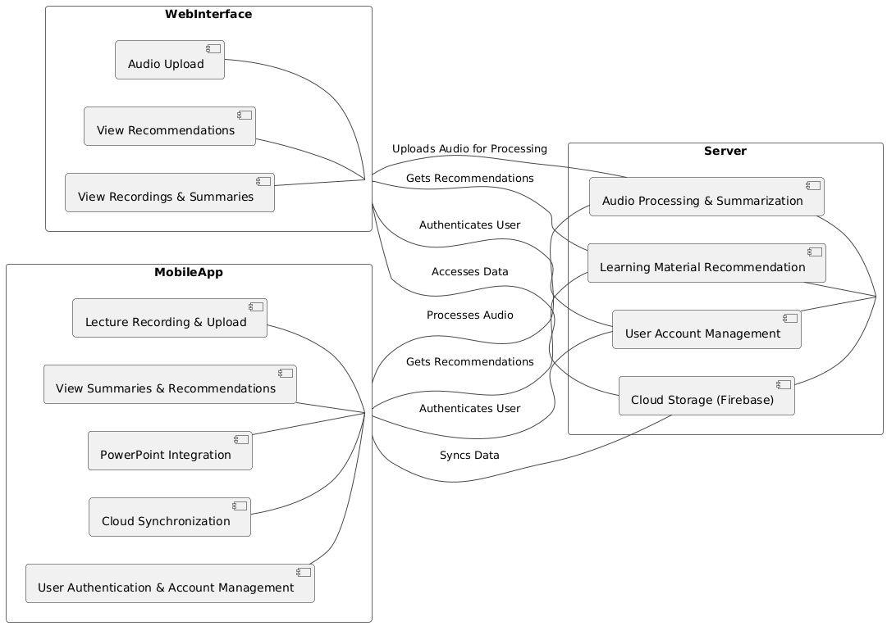

*Figure 2.1: Block Diagram of AudioScholar System Components*

## User characteristics

***

The primary users of AudioScholar are college and university students. These users can be further characterized as follows:

-   **Student Type:** Undergraduate and graduate students across all disciplines.
-   **Technical Proficiency:** Users are expected to be generally comfortable using mobile applications and web browsers. No advanced technical skills are required.
-   **Learning Needs:** Users are seeking to improve their lecture note-taking efficiency, enhance comprehension of lecture material, and optimize their study habits. They are looking for tools to reduce the cognitive load of manual note-taking and provide structured study resources.
-   **Lecture Attendance:** Primarily students who attend in-person lectures, but also beneficial for students reviewing recorded online lectures.
-   **Accessibility Needs:** The application aims to be accessible to a wide range of students, including those who may benefit from improved organization and summarization of lecture content.

**User Roles and Privileges:**

-   **Logged-in Free User (Authenticated):**
    -   Access to core features including cloud synchronization (optional), learning material recommendations (basic), and web interface access (limited features, details in Freemium Model section).
    -   May have limitations on usage quotas or feature sets compared to premium users.
-   **Premium User (Subscribed):**
    -   Full access to all features, including advanced summarization, expanded recommendation sources, priority processing, and potentially other premium features.

No usage limitations (or higher quotas) compared to free users.

*Figure 2.2.1: Use Case Diagram for AudioScholar User Types and Feature Access*

## 2.4. Constraints

The development of AudioScholar is subject to the following constraints:

-   **Development Timeline:** The project must be completed within an 8-week timeframe.
-   **Resource Limitations:** Development resources are primarily limited to the student team members and freely available open-source tools and cloud services (Firebase free tier, limited AI API usage).
-   **Platform Focus:** Initial mobile application development is restricted to the Android platform. iOS development is out of scope for version 1.0.
-   **AI API Dependency:** The system’s core functionality relies on the Google Gemini AI API. Changes to the API’s availability, pricing, or functionality could impact the project.
-   **Language Constraint:** The system will initially support English language lectures only.
-   **Freemium Model Constraints:** Feature limitations for free users, such as disabled background recording and limited recommendation sources, are part of the planned freemium model.
-   **No Real-time Transcription:** Real-time transcription is not a planned feature for this version.
-   **Web Interface Limitations:** Web interface will not support direct recording.

## 2.5. Assumptions and dependencies

The following assumptions and dependencies are relevant to the requirements outlined in this SRS:

-   **Availability of Google Gemini AI API:** It is assumed that the Google Gemini AI API will be available and functional throughout the development and operational phases of AudioScholar.
-   **Firebase Service Availability:** The project depends on the availability and reliability of Firebase services (Firestore, Authentication) and Nhost Storage services.
-   **Internet Connectivity (for some features):** Cloud synchronization, AI processing (server-side), and web interface access require internet connectivity. However, mobile recording is designed to function offline.
-   **User Access to Android Devices and Web Browsers:** It is assumed that target users have access to Android mobile devices for using the mobile application and computers with web browsers for accessing the web interface.
-   **Acceptance of Freemium Model:** The success of the freemium model depends on user acceptance of tiered feature access and the perceived value of premium features (future).
-   **Accuracy of AI Summarization:** The quality and accuracy of AI-generated summaries are dependent on the capabilities of the Google Gemini AI API. It is assumed that the API will provide reasonably accurate and useful summaries for lecture content.

# Specific Requirements

## External interface requirements

***

### 3.1.1. Hardware interfaces

-   **Microphone:** The mobile application will utilize the built-in microphone of the Android device for recording lectures. External microphones connected to the Android device should also be supported.
-   **Speakers/Headphones:** For audio playback of recordings and summaries on both mobile and web interfaces.
-   **Display:** Android device screen for mobile application UI and computer monitor for web interface UI.
-   **Storage:** Local storage on the Android device for offline recording storage. Cloud storage (Nhost Storage) for optional cloud synchronization. Server-side storage for processed data.

### 3.1.2. Software interfaces

-   **Operating System:**
    -   **Mobile Application:** Android OS (minimum version TBD, targeting recent versions).
    -   **Web Interface:** Compatible with modern web browsers (Chrome, Firefox, Safari, Edge) on Windows, and macOS.

Server-side: Spring Boot (Java) for server-side application development.

-   **Server-side:** Windows-based server environment for Spring Boot application deployment.
-   **AI API:** Google Gemini AI API for audio processing, summarization, and learning material recommendations. Google Files API may be utilized for handling large file transfers associated with AI processing.
-   **Authentication APIs:**
    -   Google OAuth 2.0 API for Google login.
    -   GitHub OAuth 2.0 API for GitHub login.
    -   Firebase Authentication for email/password login and user account management.
-   **Database:** Firebase Firestore for storing user data, recordings metadata, summaries, and recommendations.
-   **Cloud Storage:** Nhost Storage for optional cloud storage of audio recordings and summaries.
-   **Development Libraries and Frameworks:**
    -   Kotlin for Android mobile application development.
    -   ReactJS for web interface development.
    -   Spring Boot (Java) for server-side application development.
    -   Firebase SDKs for Android, Web, and Server.

### 3.1.3. Communications interfaces

-   **Network Protocols:**
    -   HTTP/HTTPS for communication between mobile app, web interface, and server.
    -   WebSockets (potentially) for real-time updates or notifications (future enhancement).
-   **Internet Connectivity:** Required for:
    -   AI processing via Google Gemini AI API (server-side).
    -   Learning material recommendations (server-side).
    -   Cloud synchronization (mobile app).
    -   User authentication (initial login and account management).
    -   Web interface access.
    -   Mobile application updates and potential online features.
-   **Offline Capability:** Mobile application recording functionality must operate offline, storing audio files locally when internet connectivity is unavailable.

## Functional requirements

***

### Module 1: Lecture Recording & Upload

#### **1.1 Start/Stop Lecture Recording (Mobile)**

##### Use Case Diagram

*Figure 3.2.1.1: Use Case Diagram for Start/Stop Recording*

##### Use Case Description: Start Recording

-   **Use Case ID:** UC_Record_Start
    -   **Primary Actor:** Logged-in Free User
    -   **Goal:** To begin recording a lecture using the mobile application.
    -   **Preconditions:**
        -   The AudioScholar mobile application is installed and running on the student’s Android device.
        -   The student has launched the application.
    -   **Normal Flow:**
1.  The student taps the “Record” button in the mobile application UI.
2.  The application initiates audio recording using the device’s microphone.
3.  The application provides visual feedback to the student indicating that recording has started (e.g., displaying a recording timer, changing button state).
4.  The audio is recorded and temporarily stored in the device’s memory.
-   **Alternative Flows:**
    -   **A1. Recording already in progress:** If the student attempts to start recording when a recording is already active, the application displays an error message or prevents the action, indicating that a recording is already in progress.
    -   **A2. Microphone access denied:** If the application does not have permission to access the device’s microphone, the application prompts the user to grant microphone access in the device settings. If permission is denied, recording cannot start, and an informative message is displayed.
-   **Postconditions:**
    -   Audio recording is actively in progress.
    -   The application UI reflects the recording status.
-   **Priority:** High
-   **Frequency of Use:** Frequent (multiple times per lecture/day)

##### Use Case Description: Stop Recording

-   **Use Case ID:** UC_Record_Stop
-   **Primary Actor:** Logged-in Free User
-   **Goal:** To stop the ongoing lecture recording and save it.
-   **Preconditions:**
    -   A lecture recording is currently in progress (initiated by UC_Record_Start).
-   **Normal Flow:**
1.  The student taps the “Stop” button in the mobile application UI.
2.  The application stops the audio recording.
3.  The application prompts the student to provide a title for the recording (optional).
4.  The application saves the recorded audio file to the device’s local storage.
5.  The application provides confirmation to the student that the recording has been saved successfully.
-   **Alternative Flows:**
    -   **A1. No recording in progress:** If the student attempts to stop recording when no recording is active, the application displays an error message or prevents the action, indicating that no recording is currently in progress.
        -   **A2. Storage error:** If there is insufficient storage space on the device to save the recording, the application displays an error message and prompts the user to free up storage space. The recording may not be saved in this case.
-   **Postconditions:**
    -   Audio recording is stopped.
        -   The recorded audio is saved to local storage.
        -   The application UI reflects the stopped recording status.
-   **Priority:** High
-   **Frequency of Use:** Frequent (multiple times per lecture/day)

##### Activity Diagram: Record Lecture (Start/Stop)

*Figure 3.2.1.2: Activity Diagram for Record Lecture (Start/Stop)*

##### Wireframe: Recording Screen (Mobile)

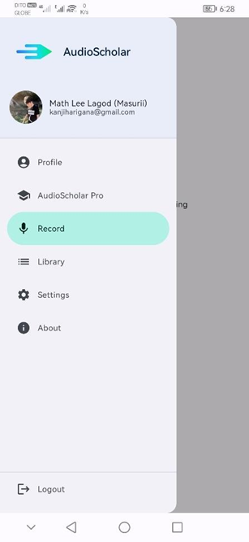 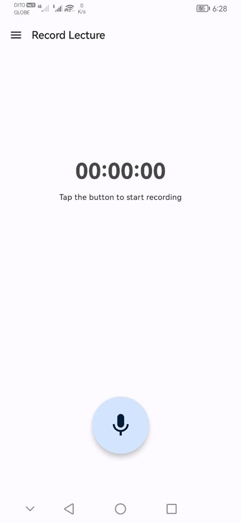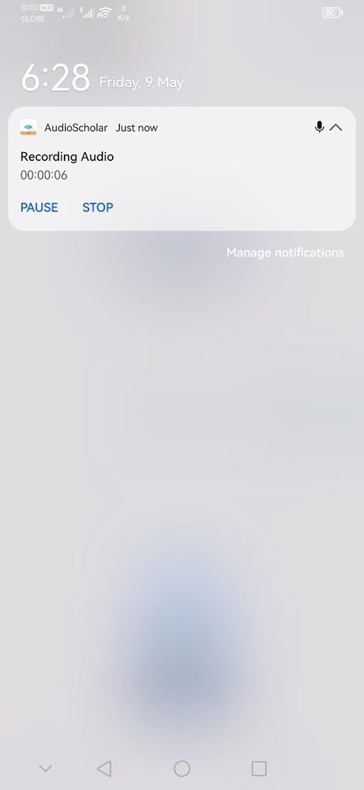

*Figure 3.2.1.3: Wireframe for Recording Screen (Mobile)*

#### **1.2 Upload Audio File (Mobile & Web)**

##### Use Case Diagram

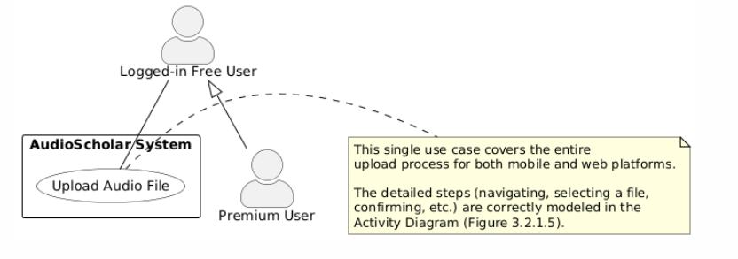

*Figure 3.2.1.4: Use Case Diagram for Upload Audio File*

##### Use Case Description: Upload Audio File (Mobile)

-   **Use Case ID:** UC_Upload_Audio_Mobile
-   **Primary Actor:** Logged-In Free User
-   **Goal:** To upload a pre-recorded audio file from the mobile device to the system for processing.
-   **Preconditions:**
    -   The AudioScholar mobile application is installed and running on the student’s Android device.
    -   The student has launched the application and is logged in (for logged-in user features).
    -   The audio file to be uploaded is stored on the mobile device’s local storage.
    -   Internet connectivity is available.
-   **Normal Flow:**
1.  The student navigates to the “Upload Audio” section in the mobile application.
2.  The application presents a file selection interface, allowing the student to browse the device’s local storage.
3.  The student selects the audio file to be uploaded.
4.  The application displays a confirmation screen showing the selected file and prompts for an optional title/description.
5.  The student confirms the upload.
6.  The application uploads the selected audio file to the server for processing.
7.  The application displays a progress indicator during the upload process.
8.  Upon successful upload, the application displays a confirmation message.
-   **Alternative Flows:**
    -   **A1. No file selected:** If the student attempts to initiate upload without selecting a file, the application displays an error message prompting file selection.
    -   **A2. File format not supported:** If the selected file is not in a supported audio format (Supported formats: WAV, MP3, AIFF, AAC, OGG Vorbis, FLAC), the application displays an error message indicating the unsupported format and prompts the user to select a valid file.
    -   **A3. Upload failure (network error):** If the upload fails due to network connectivity issues or server errors, the application displays an error message and provides options to retry the upload.
    -   **A4. File size limit exceeded:** If the selected file exceeds the maximum allowed file size (500MB), the application displays an error message indicating the file size limit.
-   **Postconditions:**
    -   The selected audio file is successfully uploaded to the server and queued for processing.
    -   The application UI reflects the successful upload status.
-   **Priority:** Medium
-   **Frequency of Use:** Less frequent than recording, but still important for users with pre-recorded lectures.

##### Use Case Description: Upload Audio File (Web)

-   **Use Case ID:** UC_Upload_Audio_Web
-   **Primary Actor:** Logged-in Free User
-   **Goal:** To upload a pre-recorded audio file from a computer via the web interface to the system for processing.
-   **Preconditions:**
    -   The user is accessing the AudioScholar web interface through a compatible web browser.
    -   The user is logged in (for logged-in user features).
    -   The audio file to be uploaded is stored on the user’s computer.
    -   Internet connectivity is available.
-   **Normal Flow:**
1.  The user navigates to the “Upload Audio” section in the web interface.
2.  The web interface presents a file upload control, allowing the user to browse their computer’s file system.
3.  The user selects the audio file to be uploaded.
4.  The web interface displays a confirmation showing the selected file and prompts for an optional title/description.
5.  The user confirms the upload.
6.  The web interface uploads the selected audio file to the server for processing.
7.  The web interface displays a progress indicator during the upload process.
8.  Upon successful upload, the web interface displays a confirmation message.
-   **Alternative Flows:**
    -   **A1. No file selected:** If the student attempts to initiate upload without selecting a file, the application displays an error message prompting file selection.
        -   **A2. File format not supported:** If the selected file is not in a supported audio format (e.g., mp3, wav - specify supported formats), the application displays an error message indicating the unsupported format and prompts the user to select a valid file.
        -   **A3. Upload failure (network error):** If the upload fails due to network connectivity issues or server errors, the application displays an error message and provides options to retry the upload.
        -   **A4. File size limit exceeded:** If the selected file exceeds the maximum allowed file size (define limit), the application displays an error message indicating the file size limit.
-   **Postconditions:**
    -   The selected audio file is successfully uploaded to the server and queued for processing.
        -   The application UI reflects the successful upload status.
-   **Priority:** Medium
-   **Frequency of Use:** Less frequent than mobile recording, but important for web users and users with audio files on computers.

##### Activity Diagram: Upload Audio File (Mobile/Web)

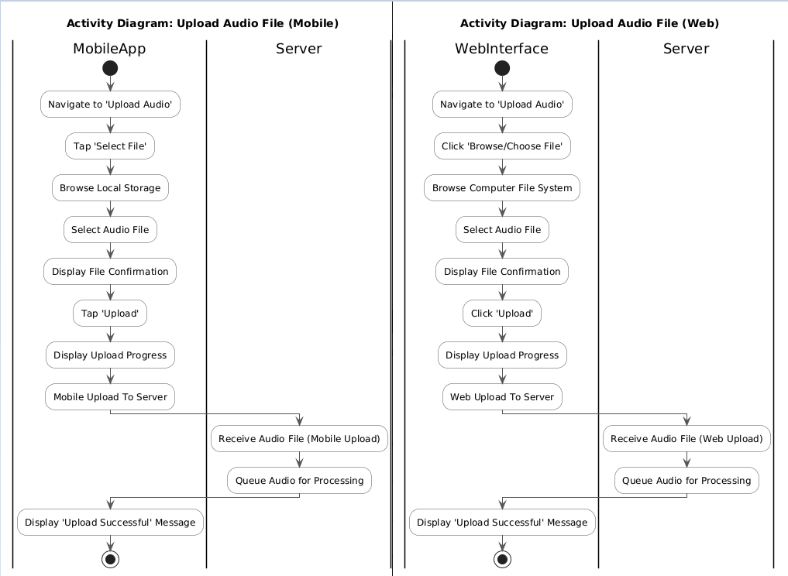

*Figure 3.2.1.5*: *Activity Diagram for Upload Audio File (Mobile/Web)*

##### Wireframe: Upload Audio Screen (Mobile)

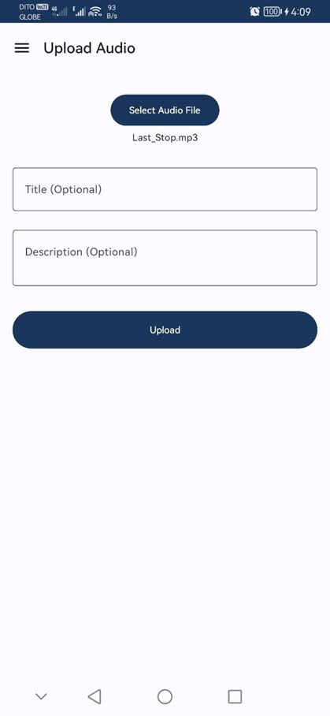

*Figure 3.2.1.6: Wireframe for Upload Audio Screen (Mobile)*

##### Wireframe: Upload Audio Screen (Web)

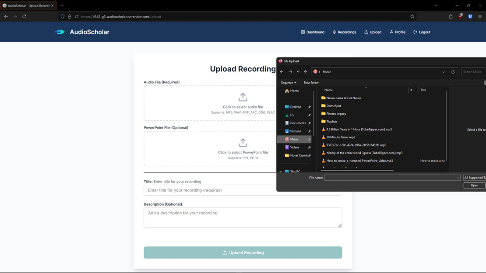

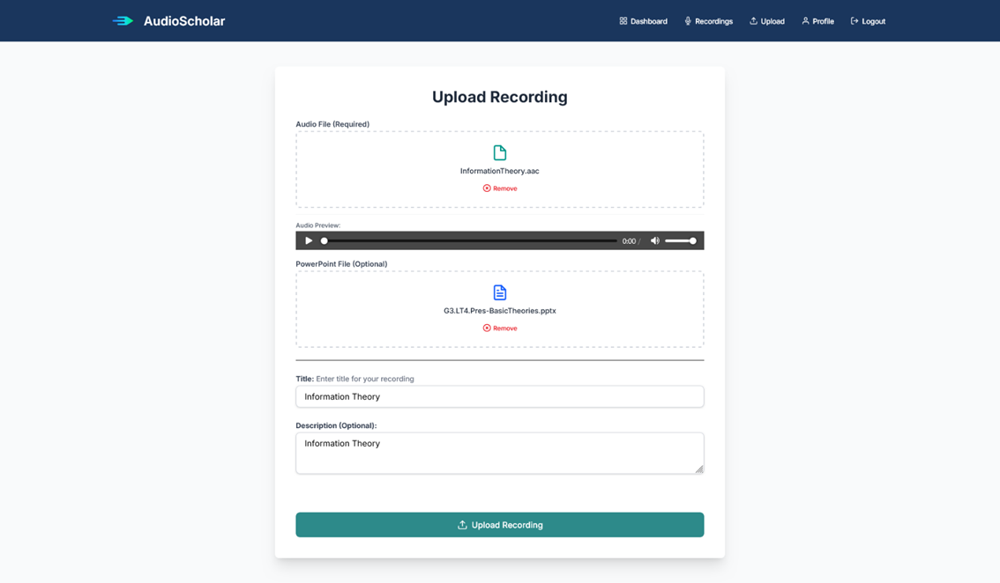

*Figure 3.2.1.7: Wireframe for Upload Audio Screen (Web)*

### Module 2: Audio Processing & Summarization

#### **2.1 Receive Audio for Processing**

##### Use Case Diagram (Internal Server-side Use Case, not directly initiated by user)

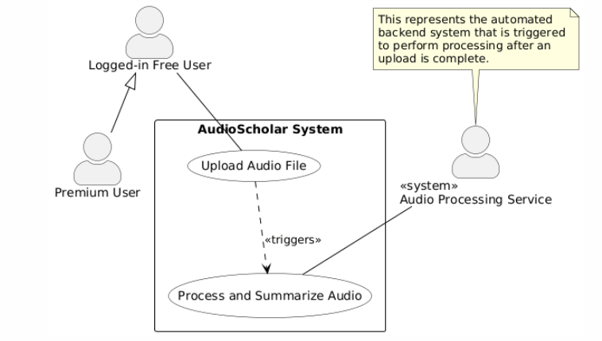

*Figure 3.2.2.1: Use Case Diagram for Receive Audio for Processing (Server-side)*

##### Use Case Description: Receive Audio for Processing (Server-side)

-   **Use Case ID:** UC_Process_Receive_Audio_Server
-   **Primary Actor:** Server-side System (Audio Processing Module)
-   **Goal:** To receive uploaded audio files from the mobile application or web interface and prepare them for AI-based processing.
-   **Preconditions:**
    -   Audio file has been successfully uploaded from the mobile application or web interface.
    -   The server-side Audio Processing Module is running and ready to receive requests.
-   **Normal Flow:**
1.  The Audio Processing Module receives the uploaded audio file and associated metadata (e.g., user ID, recording title, upload timestamp).
2.  The module validates the received audio file (e.g., checks file format, size - server-side limits).
3.  The module queues the audio file for processing by the AI summarization service.
4.  The module logs the receipt of the audio file and its processing status.
-   **Alternative Flows:**
    -   **A1. File validation failed:** If the received audio file fails validation (e.g., unsupported format, exceeds server-side size limit, corrupted file), the module logs an error, rejects the file, and may notify the user (via mobile app/web interface feedback) about the upload failure and reason.
    -   **A2. Queueing failure:** If there is an issue queueing the audio file for processing (e.g., queue service unavailable, queue full), the module logs an error and may implement retry mechanisms or notify system administrators.
-   **Postconditions:**
    -   The audio file is successfully received and queued for AI processing.
    -   The processing status of the audio file is tracked by the system.
-   **Priority:** High (Core server-side functionality)
-   **Frequency of Use:** On-demand, whenever a user uploads or finishes recording a lecture.

##### Activity Diagram

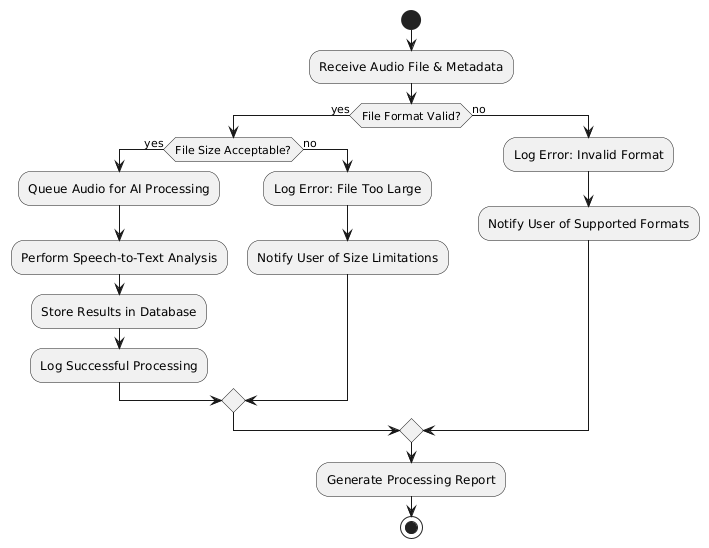

*Figure 3.2.2.2: Activity Diagram for Receive Audio for Processing (Server-side)*

##### Wireframe: (No direct UI wireframe for this server-side process)

-   As this module outlines server-side processes that do not involve direct user interface interactions, UI wireframes are not applicable.

#### **2.2 Process Audio using AI API**

##### Use Case Diagram: (Internal Server-side Use Case)

*Figure 3.2.2.3: Use Case Diagram for Process Audio using AI API (Server-side)*

##### Use Case Description: Process Audio using AI API (Server-side)

-   **Use Case ID:** UC_Process_AudioAI_Server
-   **Primary Actor:** Server-side System (Audio Processing Module)
-   **Goal:** To process queued audio files using the Google Gemini AI API to generate lecture summaries.
-   **Preconditions:**
    -   Audio files are queued for processing (from UC_Process_ReceiveAudio_Server).
    -   The server-side Audio Processing Module is running and has access to the Google Gemini AI API (API key configured) and potentially the Google Files API for large file handling.
    -   Internet connectivity is available for API communication.
-   **Normal Flow:**
1.  The Audio Processing Module retrieves an audio file from the processing queue.
2.  The module prepares the audio data for submission to the Google Gemini AI API (e.g., format conversion if needed, API request construction).
3.  The module sends a request to the Google Gemini AI API, including the audio data.
4.  The module waits for a response from the AI API.
5.  Upon receiving a successful response from the API, the module extracts the generated summary text from the API response.
-   **Alternative Flows:**
    -   **A1. API request failure (network error):** If the API request fails due to network connectivity issues, the module implements retry logic (e.g., retry a certain number of times with backoff). If retries fail, the module logs an error and marks the audio processing as failed.
    -   **A2. API service unavailable:** If the Google Gemini AI API service is temporarily unavailable or returns an error response indicating service outage, the module logs an error, may implement retry logic with longer backoff, and potentially alerts system administrators.
    -   **A3. API response error (invalid response format, no summary generated):** If the API returns a response but it is in an unexpected format or does not contain a valid summary, the module logs an error and marks the audio processing as failed.
    -   **A4. API usage limits exceeded:** If API usage limits are exceeded (e.g., rate limits, quota limits), the module implements rate limiting or pauses processing to avoid further API errors. It may also log warnings and alert administrators about potential quota issues.
-   **Postconditions:**
    -   The audio file has been processed by the Google Gemini AI API (attempted, may have failed in alternative flows).
    -   If successful, a summary text is obtained from the API response.
    -   Processing status (success or failure) is tracked for the audio file.
-   **Priority:** High (Core server-side functionality)
-   **Frequency of Use:** On-demand, triggered by audio uploads and recordings.

##### Activity Diagram: Process Audio using AI API (Server-side)

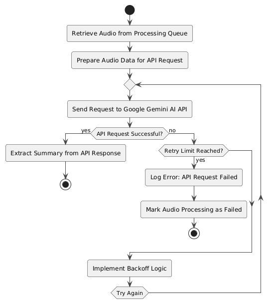

*Figure 3.2.2.4: Activity Diagram for Process Audio using AI API (Server-side)*

##### Wireframe: (No direct UI wireframe for this server-side process)

-   As this module outlines server-side processes that do not involve direct user interface interactions, UI wireframes are not applicable.

#### **2.3 Generate Lecture Summary**

##### Use Case Diagram: (Internal Server-side Use Case)

*Figure 3.2.2.5: Use Case Diagram for Generate Lecture Summary (Server-side)*

##### Use Case Description: Generate Lecture Summary (Server-side)

-   **Use Case ID:** UC_Generate_Summary_Server
-   **Primary Actor:** Server-side System (Audio Processing Module)
-   **Goal:** To take the raw summary text received from the Google Gemini AI API and structure and format it into a user-friendly lecture summary.
-   **Preconditions:**
    -   Audio processing using the AI API has been successfully completed (UC_Process_AudioAI_Server).
    -   Raw summary text is available from the API response.
-   **Normal Flow:**
    1.  The Audio Processing Module receives the raw summary text from the AI API processing step.
    2.  The module structures the summary text into logical sections or subsections (e.g., based on topic changes, keywords, or using heuristics to identify key points, and potentially generating a glossary of terms). (Initial version may be basic structuring, future versions can improve this)*.*
    3.  The module formats the structured summary for display in the mobile application and web interface (e.g., using Markdown or similar formatting for headings, bullet points, bold text).
    4.  The module stores the structured and formatted lecture summary in the database, associated with the original audio recording and user.
-   **Alternative Flows:**
    -   **A1. No summary text received from API:** If, for some reason, the API processing step did not return any summary text (even if the API request was technically successful), the module logs a warning and may generate a placeholder summary message (e.g., “Summary generation failed”).
    -   **A2. Structuring/formatting error:** If there is an error during the structuring or formatting process, the module logs an error and may store a fallback, unformatted version of the summary or a placeholder message.
-   **Postconditions:**
    -   A structured and formatted lecture summary is generated.
    -   The summary is stored in the database, linked to the audio recording.
    -   The user is notified (e.g., via push notification on mobile using FCM, as per FR2) that the summary is ready for viewing.
-   **Priority:** High (Core server-side functionality)
-   **Frequency of Use:** On-demand, after successful AI audio processing.

##### Activity Diagram: Generate Lecture Summary (Server-side)

*Figure 3.2.2.6: Activity Diagram for Generate Lecture Summary (Server-side)*

##### Wireframe: (No direct UI wireframe for this server-side process, but the output will be displayed in Mobile and Web interfaces - wireframes for those will show summary display)

-   As this module outlines server-side processes that do not involve direct user interface interactions, UI wireframes are not applicable.

### Module 3: Learning Material Recommendation

#### **3.1 Analyze Lecture Content**

##### Use Case Diagram: (Internal Server-side Use Case)

*Figure 3.2.3.1: Use Case Diagram for Analyze Lecture Content (Server-side)*

##### Use Case Description: Analyze Lecture Content (Server-side)

-   **Use Case ID:** UC_Analyze_LectureContent_Server
-   **Primary Actor:** Server-side System (Recommendation Module)
-   **Goal:** To analyze the text content of a lecture summary to extract relevant keywords and identify key topics. This analysis is used to generate effective learning material recommendations.
-   **Preconditions:**
    -   A lecture summary has been successfully generated and stored in the database (Module 2).
    -   The Recommendation Module is running and ready to perform content analysis.
    -   The ID of the lecture recording (or summary) to be analyzed is available.
-   **Normal Flow:**
    1.  The Analyze Lecture Content transaction is initiated, receiving the lecture recording (or summary) ID as input.
    2.  The module retrieves the lecture summary text from the database using the provided ID.
    3.  The module applies Natural Language Processing (NLP) techniques to the summary text to:
        -   **Extract Keywords:** Identify significant keywords and phrases that represent the core concepts of the lecture. This may involve techniques like term frequency-inverse document frequency (TF-IDF), keyword extraction algorithms, or using NLP libraries.
            -   **Identify Key Topics:** Determine the main topics or themes discussed in the lecture. This may involve topic modeling techniques, semantic analysis, or rule-based topic identification. *Initial version may use simpler keyword-based topic identification, more advanced topic modeling for future versions.*
    4.  The module outputs the extracted keywords and identified key topics as analysis results. These results will be used by the “Generate Learning Material Recommendations” transaction (3.2) to formulate search queries.
    5.  The module logs the completion of the content analysis process and stores the analysis results (keywords, topics) temporarily or for future reference (optional).
-   **Alternative Flows:**
    -   **A1. Summary retrieval failure:** If retrieving the lecture summary text from the database fails (e.g., due to database errors, invalid recording ID), the module logs an error and may indicate that content analysis could not be performed for this lecture.
    -   **A2. No keywords or topics extracted:** If the NLP analysis fails to extract any relevant keywords or identify key topics from the summary text (e.g., due to poor summary quality, insufficient text content), the module may output an empty set of keywords and topics or a message indicating that analysis yielded no results. In this case, recommendation generation may rely on default keywords or broader search terms (fallback strategy).
    -   **A3. NLP processing error:** If there is an error during the NLP processing steps (e.g., library errors, unexpected input format), the module logs an error and may mark the content analysis as failed.
-   **Postconditions:**
    -   Relevant keywords and key topics are extracted from the lecture summary text.
    -   The analysis results (keywords, topics) are outputted and are ready to be used for generating learning material recommendations.
    -   Processing status (success or failure) is tracked for the content analysis.
-   **Priority:** High (Core server-side functionality for recommendations)
-   **Frequency of Use:** On-demand, triggered before or during learning material recommendation generation.

##### Activity Diagram: Analyze Lecture Content (Server-side)

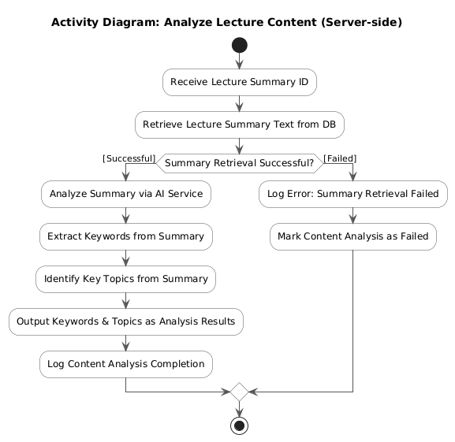

*Figure 3.2.3.2: Activity Diagram for Analyze Lecture Content (Server-side)*

##### Wireframe: (No direct UI wireframe for this server-side process)

-   This module details backend operations for generating learning material recommendations. Therefore, direct user interface wireframes are not relevant for its processes.

#### **3.2 Generate Learning Material Recommendations**

##### Use Case Diagram

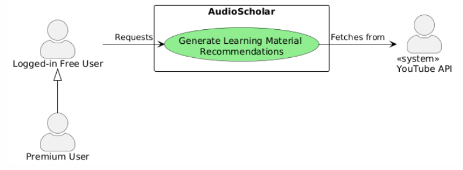

*Figure 3.2.3.3: Use Case Diagram for Generate Learning Material Recommendations (Server-side)*

##### Use Case Description: Generate Learning Material Recommendations (Server-side)

-   **Use Case ID:** UC_Generate_Recommendations_Server
-   **Primary Actor:** Server-side System (Recommendation Module)
-   **Goal:** To generate personalized learning material recommendations for a lecture based on its summary content, initially from YouTube.
-   **Preconditions:**
    -   A lecture summary has been successfully generated and stored (Module 2).
    -   The Recommendation Module is running and has access to the YouTube Data API (API key configured).
    -   Internet connectivity is available for API communication.
-   **Normal Flow:**
1.  The Recommendation Module receives a request to generate recommendations for a specific lecture (triggered after summary generation or LoggedInFreeUser's request to view recommendations).
2.  The module analyzes the lecture summary content to extract keywords, key topics, and relevant concepts.
3.  The module uses the extracted keywords and topics to formulate search queries for the YouTube Data API.
4.  The module sends search requests to the YouTube Data API.
5.  The module receives search results from the YouTube API (videos related to the search queries).
6.  The module filters and ranks the search results based on relevance, video quality (e.g., view count, ratings - if available from API), and potentially other criteria.
7.  The module returns a list of recommended YouTube video links (and potentially titles, descriptions, thumbnails if available from API) as learning materials.
8.  The module stores the generated recommendations in the database, associated with the lecture and user.
-   **Alternative Flows:**
    -   **A1. No relevant keywords found in summary:** If the analysis of the lecture summary fails to extract relevant keywords or topics, the module may return a default set of recommendations or a message indicating that recommendations could not be generated.
    -   **A2. YouTube API request failure:** If the YouTube API request fails due to network issues, API service unavailability, or API key errors, the module logs an error, may implement retry logic, and may return a message indicating that recommendations are temporarily unavailable.
    -   **A3. No search results from YouTube API:** If the YouTube API returns no search results for the formulated queries, the module may return a message indicating that no relevant learning materials were found on YouTube for this lecture.
    -   **A4. Filtering/ranking error:** If there's an error during the filtering or ranking of search results, the module logs a warning and may return unfiltered or unranked results, or a reduced set of recommendations.
-   **Postconditions:**
    -   Learning material recommendations (YouTube videos) are generated and associated with the lecture.
    -   Recommendations are stored in the database and are ready to be displayed to the user.
-   **Priority:** Medium (Enhancement to core functionality)
-   **Frequency of Use:** On-demand, when users request to view recommendations for a lecture.

##### Activity Diagram: Generate Learning Material Recommendations (Server-side)

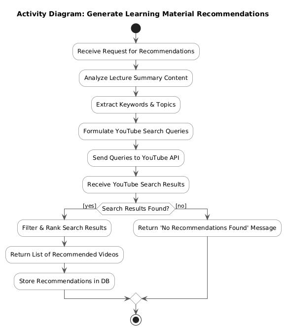

*Figure 3.2.3.4: Activity Diagram for Generate Learning Material Recommendations (Server-side)*

##### Wireframe: (No direct UI wireframe for this server-side process, but the output will be displayed in Mobile and Web interfaces - wireframes for those will show recommendation display)

-   This module details backend operations for generating learning material recommendations. Therefore, direct user interface wireframes are not relevant for its processes.

### Module 4: User Authentication & Account Management

#### **4.1 User Authentication & Account Management**

##### Use Case Diagram

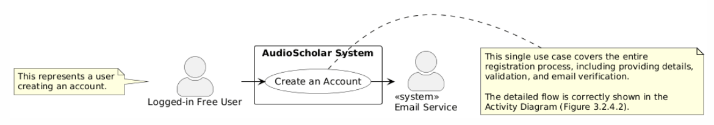

*Figure 3.2.4.1: Use Case Diagram for User Registration (Mobile)*

##### Use Case Description: User Registration (Mobile)

-   **Use Case ID:** UC_Register_User_Mobile
-   **Primary Actor:** Logged-in Free User
-   **Goal:** To create a new user account within the AudioScholar mobile application using email/password registration.
-   **Preconditions:**
    -   The AudioScholar mobile application is installed and running.
    -   The student has navigated to the registration screen.
    -   Internet connectivity is available.
-   **Normal Flow:**
1.  The student selects the “Register” option in the mobile application.
2.  The application displays a registration form, prompting for required details (e.g., email address, password, name).
3.  The student enters the required information.
4.  The application validates the input data (e.g., email format, password strength).
5.  The application sends a registration request to the server (Firebase Authentication).
6.  Firebase Authentication creates a new user account.
7.  (Optional) Firebase Authentication sends a verification email to the provided email address.
8.  The application creates a user profile in the database, storing user details.
9.  The application logs the user in automatically after successful registration.
10. The application displays a registration success message and redirects the user to the main application interface.
-   **Alternative Flows:**
    -   **A1. Invalid input data:** If the student enters invalid data in the registration form (e.g., invalid email format, weak password, missing required fields), the application displays appropriate error messages next to the invalid fields and prompts the student to correct the input.
    -   **A2. Email already registered:** If the entered email address is already registered with an existing account, the application displays an error message indicating that the email is already in use and prompts the user to use a different email or log in.
    -   **A3. Registration failure (server error, network error):** If the registration request to Firebase Authentication fails due to server errors or network connectivity issues, the application displays a generic error message and prompts the user to try again later.
    -   **A4. Email verification failure (if implemented):** If email verification is implemented and the verification email fails to send or the user does not verify their email, the account may be created but may have limited functionality until verification is completed. *(Email verification may be considered for future enhancement)*
-   **Postconditions:**
    -   A new user account is created in Firebase Authentication.
    -   A user profile is created in the database.
    -   The user is logged into the mobile application.
    -   The application UI reflects the logged-in user state.
-   **Priority:** High (Essential for user account management)
-   **Frequency of Use:** Infrequent (once per user, or when creating a new account)

##### Activity Diagram (User Registration (Mobile)

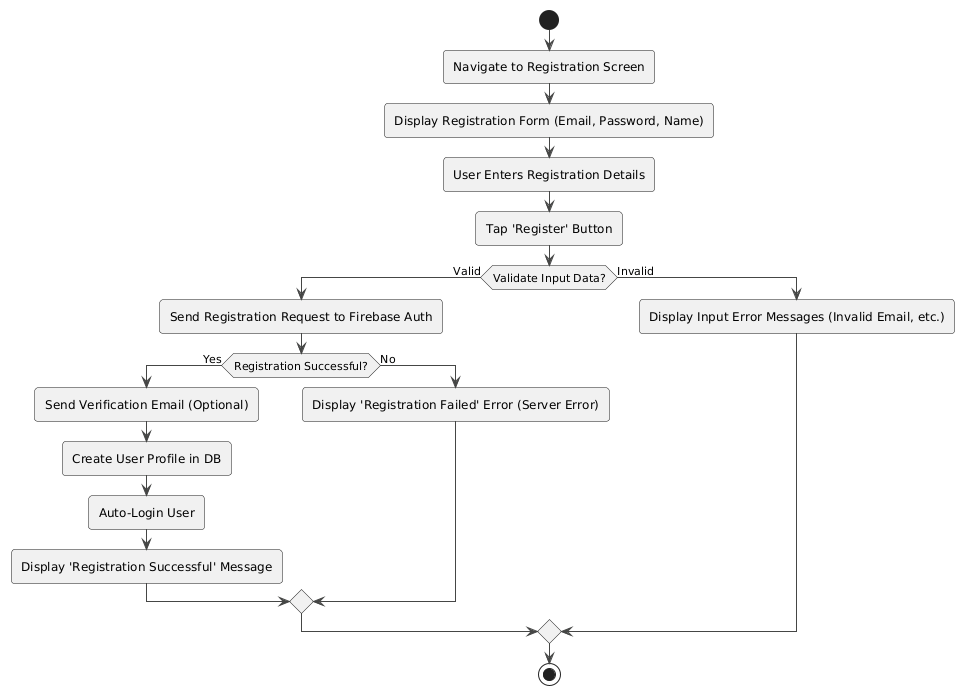

*Figure 3.2.4.2: Activity Diagram for User Registration (Mobile)*

##### Wireframe: Registration Screen (Mobile)

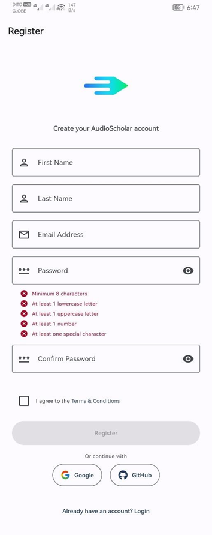

*Figure 3.2.4.3: Wireframe for Registration Screen (Mobile)*

#### **4.2 User Login (Mobile)**

#### **4.2.1 User Login with Google OAuth 2.0 (Mobile)**

##### Use Case Diagram

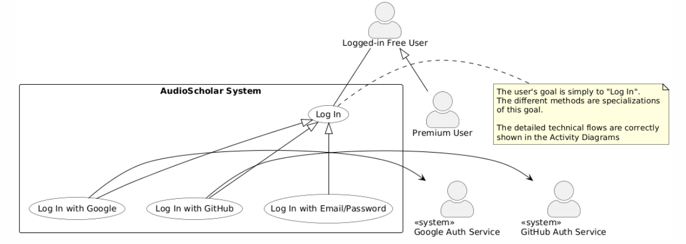

*Figure 3.2.4.4: Use Case Diagram for User Login with Google OAuth 2.0 (Mobile)*

##### Use Case Description: User Login with Google OAuth 2.0 (Mobile)

-   **Use Case ID:** UC_Login_Google_Mobile
-   **Primary Actor:** LoggedInFreeUser
-   **Goal:** To log into the AudioScholar mobile application using their Google account via OAuth 2.0.
-   **Preconditions:**
    -   The AudioScholar mobile application is installed and running.
    -   The student has a Google account.
    -   Internet connectivity is available.
-   **Normal Flow:**
1.  The student selects the "Login with Google" option on the login screen of the mobile application.
2.  The application initiates the Google Sign-In flow using the Google Sign-In SDK.
3.  The Google Sign-In SDK presents the student with a Google account selection dialog or redirects them to the Google account login page if not already logged in to Google on the device.
4.  The student selects their Google account and grants necessary permissions to the AudioScholar application.
5.  The Google Sign-In SDK obtains an OAuth 2.0 access token and ID token upon successful Google authentication.
6.  The application sends the Google ID token to Firebase Authentication for verification and authentication.
7.  Firebase Authentication verifies the Google ID token and authenticates the user.
8.  Upon successful Firebase authentication, the application retrieves the user's profile information from the database (or creates a new profile if it's the first Google login).
9.  The application establishes a user session, marking the user as logged in.
10. The application redirects the user to the main application interface.
-   **Alternative Flows:**
    -   **A1. Google Sign-In cancellation:** If the student cancels the Google Sign-In process at any point (e.g., closes the account selection dialog, declines permissions), the login process is aborted, and the application may return to the login screen with a message indicating login cancellation.
    -   **A2. Google Sign-In failure (network error, Google service unavailable):** If the Google Sign-In process fails due to network connectivity issues or Google service unavailability, the application displays an error message indicating Google login failure and prompts the user to try again or use another login method.
    -   **A3. Firebase Authentication failure (invalid token, server error):** If Firebase Authentication fails to verify the Google ID token or encounters a server error, the application displays an error message indicating login failure and prompts the user to try again or use another login method.
    -   **A4. User profile retrieval failure:** If Firebase authentication is successful but retrieving the user profile from the database fails, the application may log the user in with limited profile information or display an error message and prompt the user to try again.
-   **Postconditions:**
    -   The user is successfully logged into the AudioScholar mobile application using their Google account.
    -   A user session is established.
    -   The application UI reflects the logged-in user state.
-   **Priority:** High (Provides convenient login option)
-   **Frequency of Use:** Frequent (for users preferring Google login)

##### Activity Diagram: User Login with Google OAuth 2.0 (Mobile)

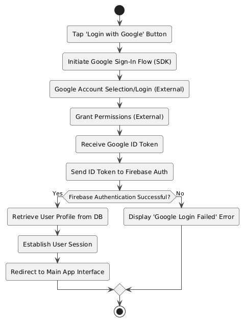

*Figure 3.2.4.5: Activity Diagram for User Login with Google OAuth 2.0 (Mobile)*

##### Wireframe: Login Screen (Mobile) - Google Login Button

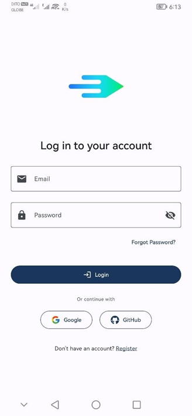

*Figure 3.2.4.6: Wireframe for Login Screen (Mobile)*

#### **4.2.2 User Login with GitHub OAuth 2.0 (Mobile)**

##### Use Case Diagram

*Figure 3.2.4.7: Use Case Diagram for User Login with GitHub OAuth 2.0 (Mobile)*

##### Use Case Description: User Login with GitHub OAuth 2.0 (Mobile)

-   **Use Case ID:** UC_Login_GitHub_Mobile
-   **Primary Actor:** LoggedInFreeUser
-   **Goal:** To log into the AudioScholar mobile application using their GitHub account via OAuth 2.0.
-   **Preconditions:**
    -   The AudioScholar mobile application is installed and running.
    -   The student has a GitHub account.
    -   Internet connectivity is available.
-   **Normal Flow:**
1.  The student selects the "Login with GitHub" option on the login screen of the mobile application.
2.  The application initiates the GitHub Sign-In flow, typically by opening a WebView to the GitHub authorization page.
3.  The GitHub authorization page (within the WebView) prompts the student to log in to their GitHub account if not already logged in.
4.  After successful GitHub login, the student is prompted to authorize the AudioScholar application to access their GitHub account (basic profile information).
5.  Upon authorization, GitHub redirects back to the application with an OAuth 2.0 authorization code.
6.  The application exchanges the authorization code for an access token and ID token by communicating with Firebase Authentication (using GitHub as the provider).
7.  Firebase Authentication verifies the GitHub credentials and authenticates the user.
8.  Upon successful Firebase authentication, the application retrieves the user's profile information from the database (or creates a new profile if it's the first GitHub login).
9.  The application establishes a user session, marking the user as logged in.
10. The application redirects the user to the main application interface.
-   **Alternative Flows:**
    -   **A1. GitHub Sign-In cancellation:** If the student cancels the GitHub Sign-In process at any point (e.g., closes the WebView, declines authorization), the login process is aborted, and the application may return to the login screen with a message indicating login cancellation.
    -   **A2. GitHub Sign-In failure (network error, GitHub service unavailable):** If the GitHub Sign-In process fails due to network connectivity issues or GitHub service unavailability, the application displays an error message indicating GitHub login failure and prompts the user to try again or use another login method.
    -   **A3. Firebase Authentication failure (invalid token, server error):** If Firebase Authentication fails to verify the GitHub credentials or encounters a server error, the application displays an error message indicating login failure and prompts the user to try again or use another login method.
    -   **A4. User profile retrieval failure:** If Firebase authentication is successful but retrieving the user profile from the database fails, the application may log the user in with limited profile information or display an error message and prompt the user to try again.
-   **Postconditions:**
    -   The user is successfully logged into the AudioScholar mobile application using their GitHub account.
    -   A user session is established.
    -   The application UI reflects the logged-in user state.
-   **Priority:** Medium (Provides alternative convenient login option)
-   **Frequency of Use:** Less frequent than Google login, but important for users preferring GitHub login.

##### Activity Diagram: User Login with GitHub OAuth 2.0 (Mobile)

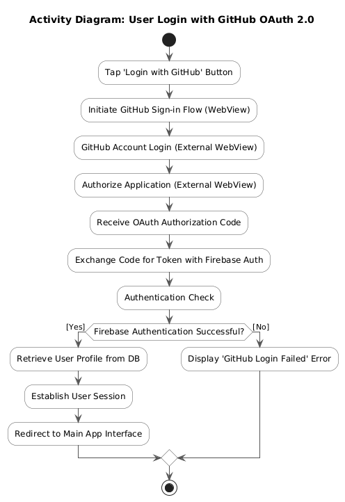

*Figure 3.2.4.8: Activity Diagram for User Login with GitHub OAuth 2.0 (Mobile)*

##### Wireframe: Login Screen (Mobile) - GitHub Login Button

*Figure 3.2.4.9: Wireframe for Login Screen (Mobile)*

#### **4.2.3 User Login with Email/Password (Mobile)**

##### Use Case Diagram

*Figure 3.2.4.10: Use Case Diagram for User Login with Email/Password (Mobile)*

##### Use Case Description

-   **Use Case ID:** UC_Login_EmailPassword_Mobile
-   **Primary Actor:** LoggedInFreeUser
-   **Goal:** To log into the AudioScholar mobile application using their registered email address and password.
-   **Preconditions:**
    -   The AudioScholar mobile application is installed and running.
    -   The student has a registered account with email and password credentials.
    -   Internet connectivity is available.
-   **Normal Flow:**
1.  The student selects the "Login with Email/Password" option (or directly enters credentials in the login form) on the login screen of the mobile application.
2.  The application displays fields for the student to enter their registered email address and password.
3.  The student enters their email and password.
4.  The application sends the email and password to Firebase Authentication for verification.
5.  Firebase Authentication verifies the email and password against the stored credentials.
6.  Upon successful Firebase authentication, the application retrieves the user's profile information from the database.
7.  The application establishes a user session, marking the user as logged in.
8.  The application redirects the user to the main application interface.
-   **Alternative Flows:**
    -   **A1. Invalid email or password:** If the entered email or password does not match the stored credentials in Firebase Authentication, the application displays an error message indicating "Invalid email or password" and prompts the user to re-enter their credentials.
    -   **A2. Firebase Authentication failure (server error, user account disabled):** If Firebase Authentication fails to authenticate the user due to server errors, or if the user account is disabled for some reason, the application displays an error message indicating login failure and prompts the user to try again later or contact support.
    -   **A3. Network error:** If there is a network connectivity issue preventing communication with Firebase Authentication, the application displays a network error message and prompts the user to check their internet connection and try again.
-   **Postconditions:**
    -   The user is successfully logged into the AudioScholar mobile application using their email and password.
    -   A user session is established.
    -   The application UI reflects the logged-in user state.
-   **Priority:** High (Provides standard login option)
-   **Frequency of Use:** Frequent (for users preferring email/password login)

##### Activity Diagram: User Login with Email/Password (Mobile)

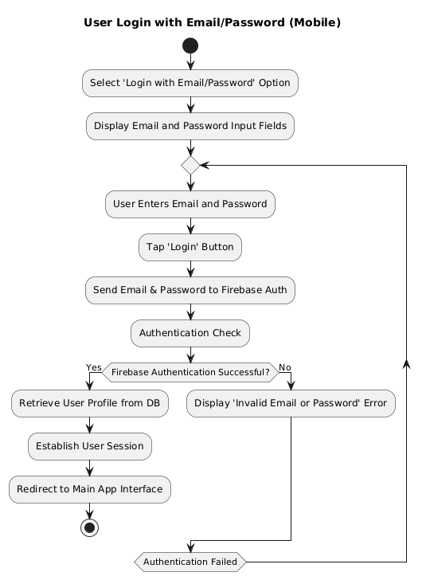

*Figure 3.2.4.11: Activity Diagram for User Login with Email/Password (Mobile)*

##### Wireframe: Login Screen (Mobile) - Email/Password Form

*Figure 3.2.4.12: Wireframe for Login Screen (Mobile)*

#### **4.3 Account Profile Management (Mobile)**

#### **4.3.1 View User Profile (Mobile)**

##### Use Case Diagram

*Figure 3.2.4.13: Use Case Diagram for View User Profile (Mobile)*

##### Use Case Description: View User Profile (Mobile)

-   **Use Case ID:** UC_View_Profile_Mobile
-   **Primary Actor:** LoggedInFreeUser
-   **Goal:** To view their user profile information within the AudioScholar mobile application.
-   **Preconditions:**
    -   The AudioScholar mobile application is installed and running.
    -   The student is logged into the application.
-   **Normal Flow:**
1.  The student navigates to the "Profile" section in the mobile application (e.g., from a menu or settings).
2.  The application retrieves the user's profile data from the database.
3.  The application displays the user profile information on the screen, including details like name, email address (potentially masked for security), and potentially other profile-related information.
-   **Alternative Flows:**
    -   **A1. Profile data retrieval failure (network error, database error):** If retrieving the user profile data from the database fails due to network issues or database errors, the application displays an error message indicating that the profile could not be loaded and prompts the user to try again later.
    -   **A2. No profile data found:** In rare cases, if for some reason the user profile data is not found in the database (though it should exist for logged-in users), the application may display a message indicating that the profile is unavailable or show a default/empty profile view.
-   **Postconditions:**
    -   The user's profile information is displayed on the mobile application screen.
-   **Priority:** Medium (Important for user account management and personalization)
-   **Frequency of Use:** Infrequent (typically accessed when users want to view or manage their account details)

##### Activity Diagram: View User Profile (Mobile)

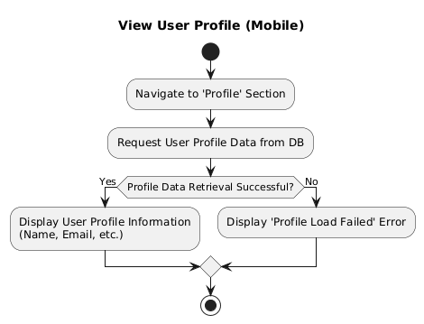

*Figure 3.2.4.14: Activity Diagram for View User Profile (Mobile)*

##### Wireframe: User Profile Screen (Mobile)

*Figure 3.2.4.15: Wireframe for User Profile Screen (Mobile)*

#### **4.3.2 Edit User Profile (Mobile)**

##### Use Case Diagram

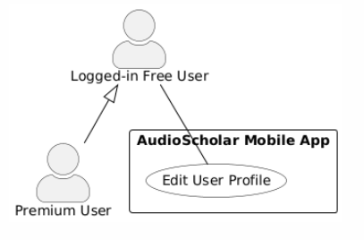

*Figure 3.2.4.16: Use Case Diagram for Edit User Profile (Mobile)*

##### Use Case Description: Edit User Profile (Mobile)

-   **Use Case ID:** UC_Edit_Profile_Mobile
-   **Primary Actor:** LoggedInFreeUser
-   **Goal:** To edit and update their user profile information within the AudioScholar mobile application.
-   **Preconditions:**
    -   The AudioScholar mobile application is installed and running.
    -   The student is logged into the application.
    -   The student is currently viewing their profile or navigates to the profile edit screen.
-   **Normal Flow:**
1.  The student navigates to the "Edit Profile" option from their profile viewing screen or settings.
2.  The application displays the profile edit screen, pre-populated with the user's current profile information (e.g., name).
3.  The student modifies the editable profile fields (e.g., changes their name).
4.  The application performs client-side validation on the modified input data (e.g., name format).
5.  The student taps the "Save" or "Update" button.
6.  The application sends a request to the server to update the user's profile in the database with the modified information.
7.  Upon successful update, the application displays a confirmation message indicating that the profile has been updated successfully.
8.  The application may redirect the user back to the profile viewing screen, now showing the updated information.
-   **Alternative Flows:**
    -   **A1. Invalid input data during edit:** If the student enters invalid data in the edit form (e.g., invalid name format), the application displays appropriate error messages next to the invalid fields and prevents saving until the input is corrected.
    -   **A2. Profile update failure (network error, database error):** If the profile update request to the server fails due to network issues or database errors, the application displays an error message indicating that the profile update failed and prompts the user to try again later.
    -   **A3. No changes made:** If the student navigates to the edit profile screen but makes no changes and tries to save, the application may either prevent saving (if no changes are detected) or proceed with saving (effectively re-saving the same profile data). The behavior should be consistent and user-friendly.
-   **Postconditions:**
    -   The user's profile information is updated in the database with the modified details.
    -   The application UI reflects the updated profile information.
-   **Priority:** Medium (Important for user account management and personalization)
-   **Frequency of Use:** Infrequent (typically accessed when users want to change their profile details)

##### Activity Diagram: Edit User Profile (Mobile)

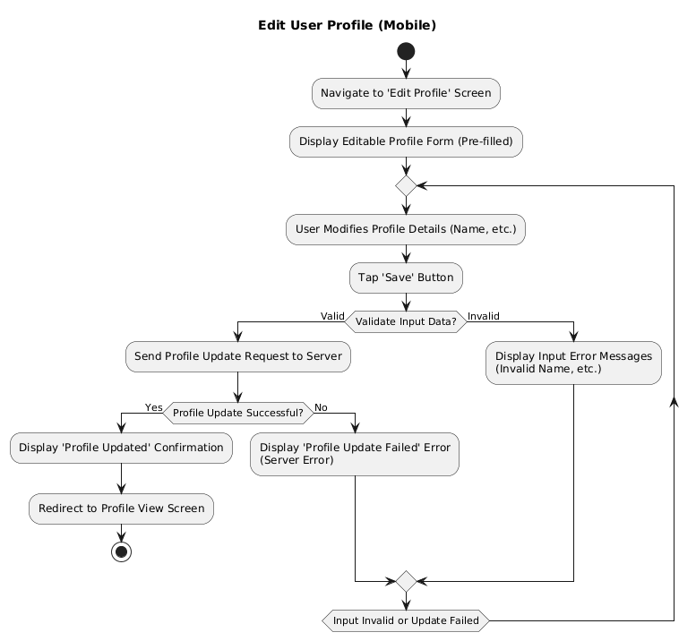

*Figure 3.2.4.17: Activity Diagram for Edit User Profile (Mobile)*

##### Wireframe: Edit User Profile Screen (Mobile)

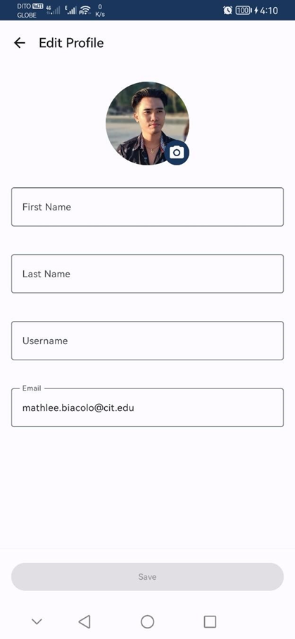

*Figure 3.2.4.18: Wireframe for Edit User Profile Screen (Mobile)*

#### **4.3.3 Change Password (Mobile)**

##### Use Case Diagram

*Figure 3.2.4.19: Use Case Diagram for Change Password (Mobile)*

##### Use Case Description: Change Password (Mobile)

-   **Use Case ID:** UC_Change_Password_Mobile
-   **Primary Actor:** LoggedInFreeUser
-   **Goal:** To change their account password within the AudioScholar mobile application (for email/password registered accounts).
-   **Preconditions:**
    -   The AudioScholar mobile application is installed and running.
    -   The student is logged into the application (using email/password or potentially other methods, but password change is relevant for email/password accounts).
    -   The user is currently using an email/password based account (password change may not be applicable or handled differently for OAuth logins).
-   **Normal Flow:**
1.  The student navigates to the "Change Password" option from their profile or settings screen.
2.  The application displays the change password screen, prompting for "Current Password," "New Password," and "Confirm New Password."
3.  The student enters their current password, new password, and confirms the new password.
4.  The application performs client-side validation on the entered passwords (e.g., password strength for new password, confirmation match).
5.  The application sends a request to Firebase Authentication to change the password, including the current password for re-authentication and the new password.
6.  Firebase Authentication verifies the current password and, if correct, updates the password to the new password.
7.  Upon successful password change, the application displays a confirmation message indicating that the password has been changed successfully.
8.  The application may optionally log the user out after password change for security reasons, requiring them to log in again with the new password.
-   **Alternative Flows:**
    -   **A1. Invalid input data (passwords do not match, weak new password):** If the student enters invalid data in the change password form (e.g., new password and confirm password do not match, new password does not meet strength requirements), the application displays appropriate error messages and prevents password change.
    -   **A2. Incorrect current password:** If the entered current password does not match the user's actual current password in Firebase Authentication, the application displays an error message indicating "Incorrect current password" and prompts the user to re-enter the correct current password.
    -   **A3. Password change failure (network error, Firebase Auth error):** If the password change request to Firebase Authentication fails due to network issues or Firebase Authentication errors, the application displays an error message indicating that the password change failed and prompts the user to try again later.
-   **Postconditions:**
    -   The user's password for their email/password account is updated in Firebase Authentication.
    -   The application UI reflects the successful password change.
    -   (Optionally) The user session may be invalidated, requiring re-login with the new password.
-   **Priority:** Medium (Important for user account security)
-   **Frequency of Use:** Infrequent (typically accessed when users want to change their password for security reasons)

##### Activity Diagram: Change Password (Mobile)

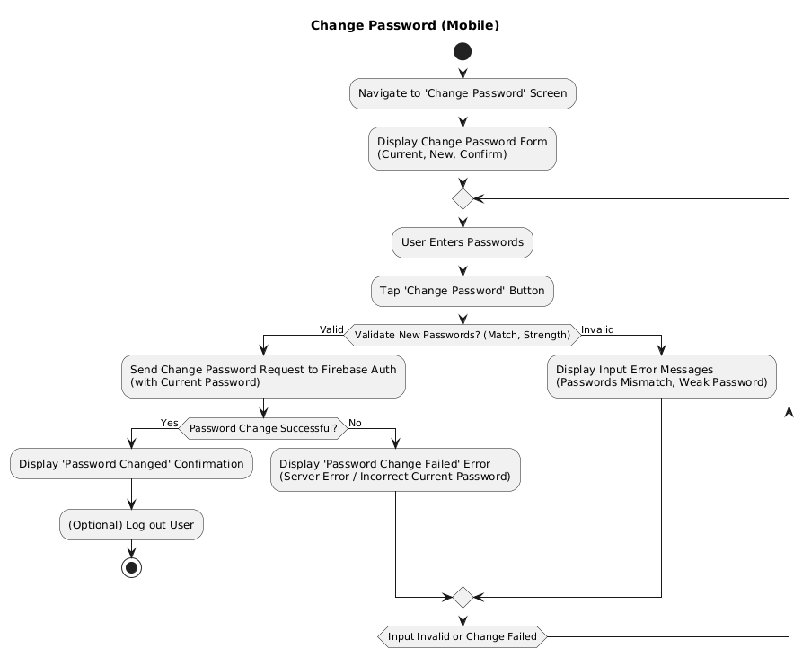

*Figure 3.2.4.20: Activity Diagram for Change Password (Mobile)*

##### Wireframe: Change Password Screen (Mobile)

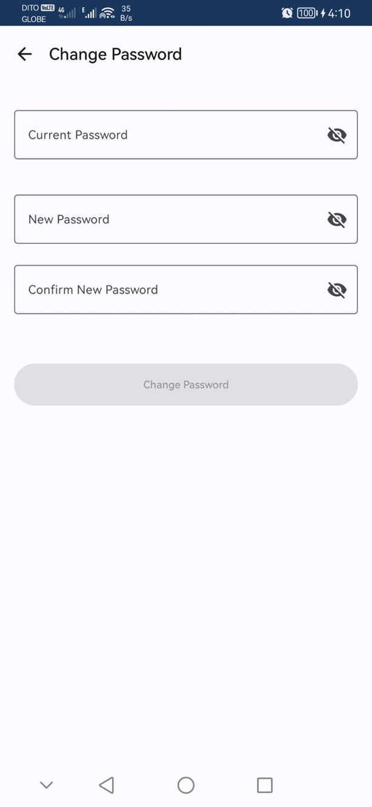

*Figure 3.2.4.21: Wireframe for Change Password Screen (Mobile)*

### Module 5: Cloud Synchronization

#### 5.1 **Configure Cloud Sync Settings (Mobile)**

##### Use Case Diagram 

*Figure 3.2.5.1: Use Case Diagram for Configure Cloud Sync Settings (Mobile)*

##### Use Case Description: Configure Cloud Sync Settings (Mobile)

-   **Use Case ID**: UC_Configure_SyncSettings_Mobile
-   **Primary Actor**: LoggedInFreeUser
-   **Goal**: To configure the cloud synchronization settings for their AudioScholar account within the mobile application. This includes enabling/disabling cloud sync, setting the sync frequency, and choosing which data types to synchronize.
-   **Preconditions**:
    -   The AudioScholar mobile application is installed and running.
    -   The student is logged into the application.
    -   The student has navigated to the settings or profile section of the application to access sync settings.
-   **Normal Flow**:
    1.  The student navigates to the "Sync Settings" screen within the mobile application's settings or profile section.
    2.  The application displays the cloud synchronization settings screen, showing options to configure sync behavior.
    3.  The student interacts with the settings to:
        -   **Enable/Disable Cloud Sync**: Toggles a switch or checkbox to turn cloud synchronization ON or OFF.
        -   **Set Sync Frequency**: Selects a desired synchronization frequency from a predefined list (e.g., "Manual Only," "Daily," "Weekly"). If "Manual Only" is selected, automatic sync is disabled, and sync is only initiated manually.
        -   **Choose Sync Data**: Selects which data types to synchronize to the cloud (e.g., "Recordings," "Summaries," or both). Options may be presented as checkboxes.
    4.  As the student modifies the settings, the application updates the user's preferences locally on the device.
    5.  The application may provide visual feedback indicating that the settings have been saved.
    6.  The student may navigate away from the sync settings screen.
-   **Alternative Flows:**
    -   **A1. Invalid frequency selection**: If the selected sync frequency is invalid or outside the allowed range (though this is unlikely with predefined options), the application may display an error message or revert to a default frequency.
    -   **A2. Settings save failure (local storage error):** If saving the sync settings to local device storage fails due to storage errors, the application may display an error message and prompt the user to try again or indicate that settings were not saved.
-   **Postconditions:**
    -   The user's cloud synchronization preferences (enabled/disabled, frequency, data types) are configured and saved locally on the device.
    -   The application will use these settings to govern cloud synchronization behavior.
    -   The application UI reflects the configured sync settings when the user revisits the settings screen.
-   **Priority**: Medium (Important for users who want to customize cloud sync)
-   **Frequency of Use**: Infrequent (typically configured once or changed occasionally)

##### Activity Diagram: **Configure Cloud Sync Settings (Mobile)**

**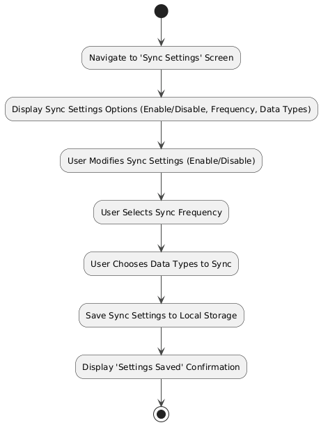**

*Figure 3.2.5.2: Activity Diagram for Configure Cloud Sync Settings (Mobile)*

##### Wireframe: Sync Settings Screen (Mobile)

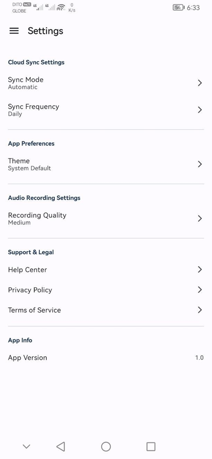 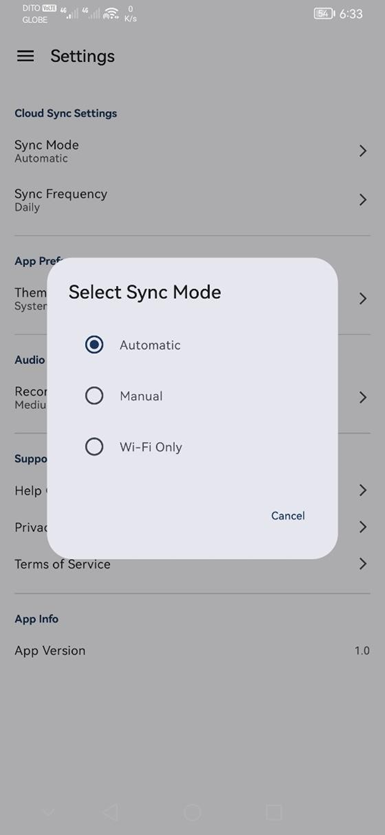

*Figure 3.2.5.3: Wireframe for Sync Settings Screen (Mobile)*

#### **5.2 Manual/Automatic Cloud Sync (Mobile)**

##### Use Case Diagram

*Figure 3.2.5.4: Use Case Diagram for Manual Cloud Synchronization (Mobile)*

##### Use Case Description: Manual Cloud Synchronization (Mobile)

-   **Use Case ID**: UC_Manual_CloudSync_Mobile
-   **Primary Actor**: LoggedInFreeUser
-   **Goal**: To manually initiate cloud synchronization of their AudioScholar data (recordings, summaries) from the mobile application to Nhost Cloud Storage and vice versa.
-   **Preconditions:**
    -   The AudioScholar mobile application is installed and running.
    -   The student is logged into the application.
    -   Cloud synchronization is enabled in the sync settings.
    -   Internet connectivity is available.
-   **Normal Flow:**
    1.  The student initiates manual cloud synchronization from within the mobile application (e.g., by tapping a "Sync Now" button in settings or recordings list).
    2.  The application checks the user's cloud sync settings to confirm that cloud sync is enabled and to determine which data types (recordings, summaries) are configured for synchronization.
    3.  The application initiates the synchronization process:
    4.  Upload Phase: The application identifies new or modified recordings and summaries on the device that need to be uploaded to the cloud. It uploads these data items to Nhost Cloud Storage.
    5.  Download Phase: The application checks for new or modified recordings and summaries in Nhost Cloud Storage that are not yet present or are outdated on the device. It downloads these data items from Nhost Cloud Storage to the device.
    6.  During the synchronization process, the application displays a progress indicator to the user, showing the status of upload and download operations.
    7.  If any data conflicts are detected during synchronization (e.g., same recording modified both locally and in the cloud since last sync), the application attempts to handle them automatically (conflict resolution strategy TBD - e.g., prioritize cloud version, prioritize local version, prompt user for resolution - initial version may prioritize cloud or local, more complex conflict resolution for future).
    8.  Upon completion of the synchronization process (upload and download phases), the application displays a summary status message indicating whether the synchronization was successful or if any errors occurred.
-   **Alternative Flows:**
    -   **A1. Cloud sync disabled**: If cloud sync is disabled in the user's settings when manual sync is initiated, the application displays a message indicating that cloud sync is disabled and prompts the user to enable it in settings if they want to synchronize.
    -   **A2. No internet connectivity**: If internet connectivity is not available when manual sync is initiated, the application displays a network error message and indicates that synchronization cannot be performed offline.
    -   **A3. Upload failure (network error, cloud storage error):** If uploading data to Nhost Cloud Storage fails due to network issues or cloud storage errors, the application displays an error message indicating upload failure and may provide options to retry the upload.
    -   **A4. Download failure (network error, cloud storage error):** If downloading data from Nhost Cloud Storage fails due to network issues or cloud storage errors, the application displays an error message indicating download failure and may provide options to retry the download.
    -   **A5. Conflict resolution failure**: If automatic conflict resolution fails for any data conflicts, the application may display an error message indicating sync conflicts and potentially provide options for manual conflict resolution (more complex conflict resolution for future). Initial version may simply log conflicts if automatic resolution fails.
-   **Postconditions**:
    -   Data (recordings, summaries) is synchronized between the mobile device and Nhost Cloud Storage (to the extent possible, considering potential errors).
    -   The application UI reflects the synchronization status and any errors encountered.
-   **Priority**: Medium (Important for users relying on cloud sync)
-   **Frequency of Use:** User-dependent, may be frequent for users who prefer manual control over sync.

##### Activity Diagram: Manual Cloud Synchronization (Mobile)

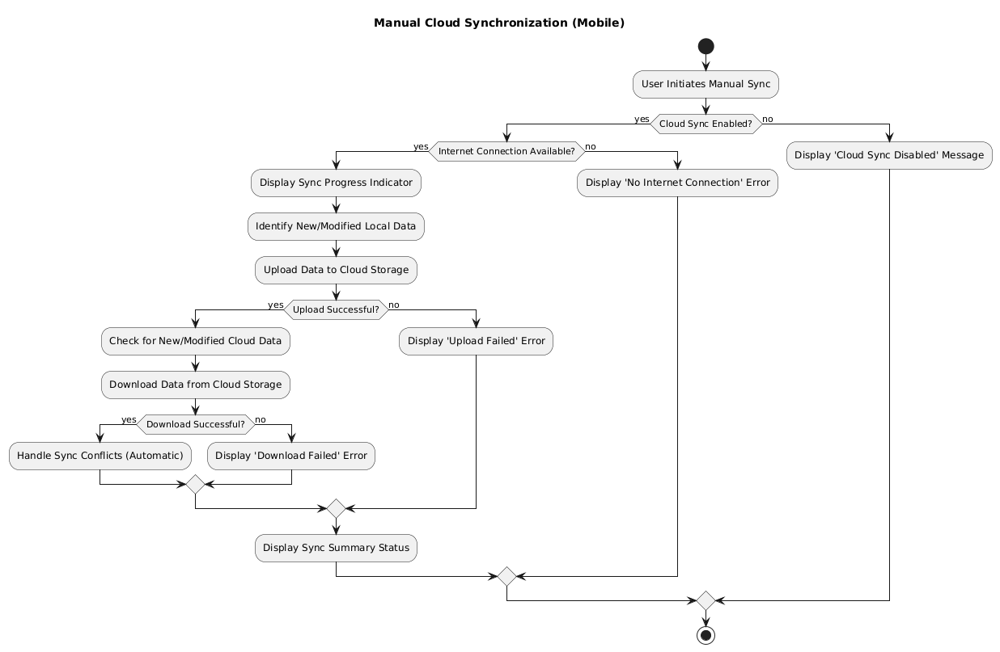

*Figure 3.2.5.5: Activity Diagram for Manual Cloud Synchronization (Mobile)*

##### Wireframe: Manual Sync Initiation (Mobile) - Example in Recordings List

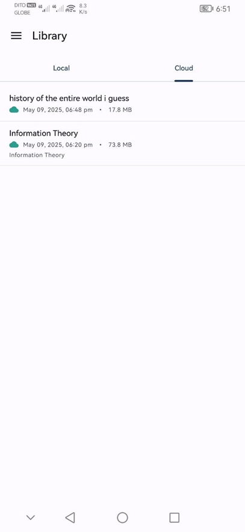 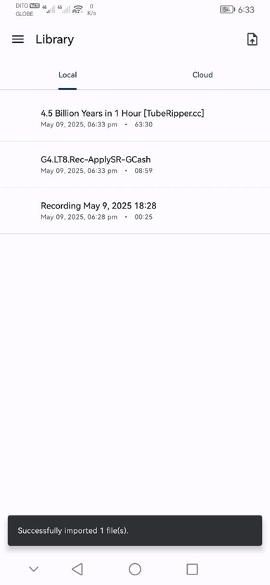

*Figure 3.2.5.6: Wireframe for Manual Sync Initiation (Mobile)*

### Module 6: PowerPoint Integration

#### **6.1 Upload PowerPoint (Mobile)**

##### Use Case Diagram

*Figure 3.2.6.1: Use Case Diagram for Associate PowerPoint with Recording (Mobile)*

##### Use Case Description: Upload PowerPoint (Mobile)

-   **Use Case ID:** UC_Upload_PowerPoint_Mobile
-   **Primary Actor:** LoggedInFreeUser
-   **Goal:** To upload a PowerPoint presentation file (e.g., .pptx) from their mobile device to the AudioScholar application. The uploaded PowerPoint will be temporarily stored and intended to be associated with a lecture recording later.
-   **Preconditions:**
    -   The AudioScholar mobile application is installed and running.
    -   The student is logged into the application (for logged-in user features).
    -   The PowerPoint presentation file is stored on the mobile device's local storage.
    -   The student has navigated to the PowerPoint upload section within the application.
-   **Normal Flow:**
    1.  The student navigates to the "Upload PowerPoint" section within the mobile application (e.g., from a menu or recording details screen).
    2.  The application presents a file selection interface, allowing the student to browse the device's local storage.
    3.  The student selects the PowerPoint presentation file (e.g., .pptx) to be uploaded.
    4.  The application may (optionally) display a preview of the PowerPoint presentation (e.g., thumbnails of slides) for confirmation. *Initial version may skip preview for simplicity.*
    5.  The application temporarily stores the uploaded PowerPoint file locally on the device. It is not yet uploaded to the cloud or server at this stage.
    6.  The application displays a confirmation message indicating that the PowerPoint file has been uploaded and is ready to be associated with a recording.
-   **Alternative Flows:**
    -   **A1. No file selected:** If the student attempts to initiate upload without selecting a PowerPoint file, the application displays an error message prompting file selection.
    -   **A2. File format not supported:** If the selected file is not in a supported PowerPoint format (e.g., only .pptx supported initially), the application displays an error message indicating the unsupported format and prompts the user to select a valid file.
    -   **A3. File size limit exceeded:** If the selected file exceeds the maximum allowed file size for PowerPoint uploads (define limit), the application displays an error message indicating the file size limit.
    -   **A4. Storage error (local storage full):** If there is insufficient local storage space to temporarily store the uploaded PowerPoint file, the application displays an error message and prompts the user to free up storage space.
-   **Postconditions:**
    -   The selected PowerPoint presentation file is temporarily uploaded and stored locally on the mobile device, ready for association with a lecture recording.
    -   The application UI reflects the successful PowerPoint upload status.
-   **Priority:** Medium (Enhancement for improved summarization)
-   **Frequency of Use:** Less frequent than recording, used when users have PowerPoint slides for a lecture.

##### Activity Diagram: Upload PowerPoint (Mobile)

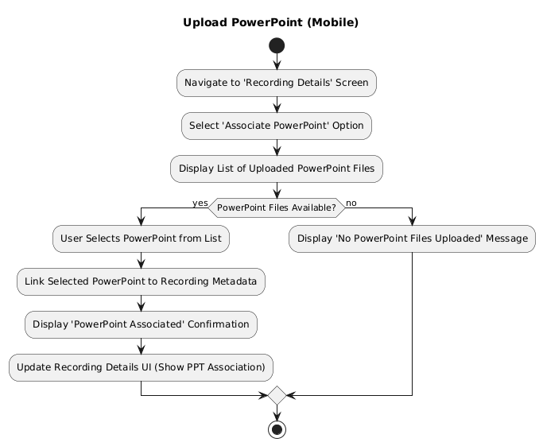

*Figure 3.2.6.2: Activity Diagram for Upload Powerpoint (Mobile)*

##### Wireframe: PowerPoint Upload Screen (Mobile)

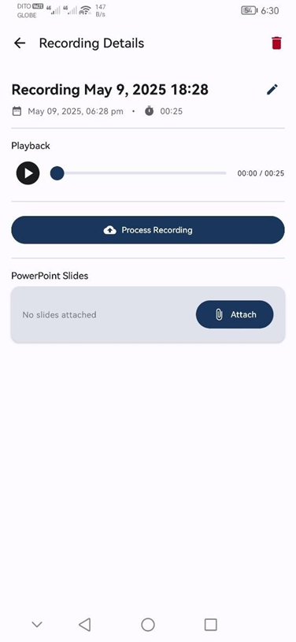 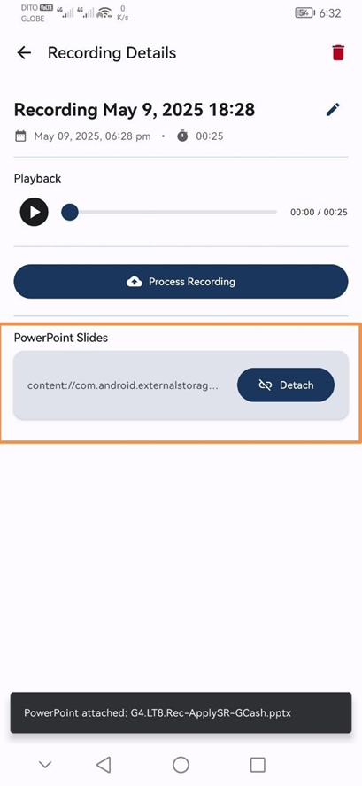

*Figure 3.2.6.3: Wireframe for PowerPoint Upload Screen (Mobile)*

#### **6.2 Associate PowerPoint with Recording (Mobile)**

##### Use Case Diagram

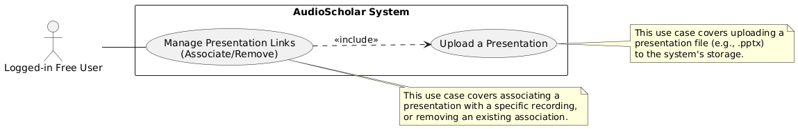

*Figure 3.2.6.4: Use Case Diagram for Upload PowerPoint (Mobile)*

##### Use Case Description: Associate PowerPoint with Recording (Mobile)

-   **Use Case ID:** UC_Associate_PowerPoint_Mobile
-   **Primary Actor:** LoggedInFreeUser
-   **Goal:** To associate a previously uploaded PowerPoint presentation file with a specific lecture recording within the AudioScholar mobile application. This link will inform the AI summarization process.
-   **Preconditions:**
    -   The AudioScholar mobile application is installed and running.
    -   The student is logged into the application.
    -   A lecture recording exists in the application.
    -   A PowerPoint presentation file has been previously uploaded (using UC_Upload_PowerPoint_Mobile) and is available for association.
    -   The student has navigated to the details screen of a specific lecture recording.
-   **Normal Flow:**
    1.  The student navigates to the "Recording Details" screen for a specific lecture recording they want to associate a PowerPoint with.
    2.  On the recording details screen, the student selects an option to "Associate PowerPoint" or similar.
    3.  The application displays a list of PowerPoint presentations that have been previously uploaded and are available for association.
    4.  The student selects a PowerPoint presentation from the list to associate with the current lecture recording.
    5.  The application links the selected PowerPoint presentation to the lecture recording by updating the recording's metadata to store a reference to the PowerPoint file.
    6.  The application displays a confirmation message indicating that the PowerPoint presentation has been successfully associated with the recording.
    7.  The recording details screen may now visually indicate that a PowerPoint is associated with the recording (e.g., an icon or label).
-   **Alternative Flows:**
    -   **A1. No PowerPoint files uploaded:** If no PowerPoint files have been uploaded yet when the student tries to associate one, the application displays a message indicating that no PowerPoint files are available and prompts the user to upload a PowerPoint first.
    -   **A2. No recordings available:** If there are no lecture recordings in the application when the student tries to access recording details, the "Associate PowerPoint" option may be disabled or not visible, or the application may guide the user to record a lecture first.
    -   **A3. Association failure (data storage error):** If linking the PowerPoint to the recording metadata fails due to local storage errors, the application displays an error message indicating association failure and prompts the user to try again.
    -   **A4. PowerPoint already associated:** If a PowerPoint is already associated with the recording, the application may either prevent associating another one (one-to-one association) or allow replacing the existing association, depending on the desired behavior. *Initial version likely to allow replacing or simply not offer the option if already associated.*
-   **Postconditions:**
    -   The selected PowerPoint presentation is successfully associated with the chosen lecture recording.
    -   The association is recorded in the recording's metadata.
    -   The application UI reflects the PowerPoint association status on the recording details screen.
-   **Priority:** Medium (Enhancement for improved summarization)
-   **Frequency of Use:** Less frequent than recording, used when users want to link slides to specific lectures.

##### Activity Diagram: Associate PowerPoint with Recording (Mobile)

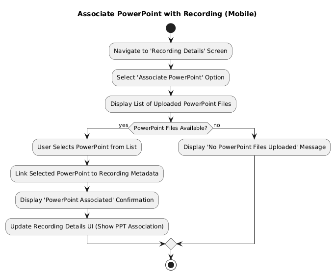

*Figure 3.2.6.5: Activity Diagram for Associate PowerPoint with Recording (Mobile)*

##### Wireframe: Recording Details Screen (Mobile) – PowerPoint/PDF Association

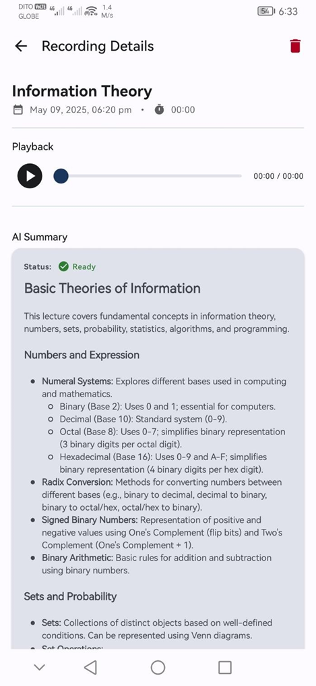 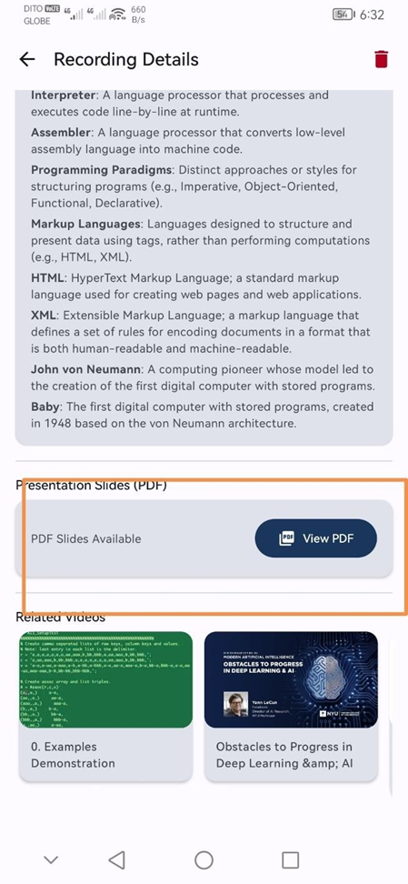

*Figure 3.2.6.6: Wireframe for Recording Details Screen (Mobile)*

### Module 7: Web Interface

#### **7.1 View Recordings and Summaries (Web)**

##### Use Case Diagram

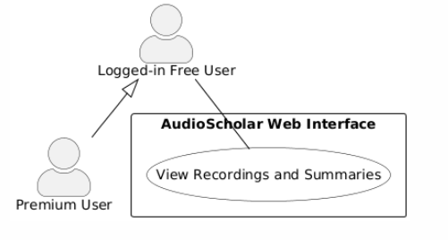

*Figure 3.2.7.1: Use Case Diagram for View Recordings and Summaries (Web)*

##### Use Case Description: View Recordings and Summaries (Web)

-   **Use Case ID:** UC_View_RecordingsSummaries_Web
-   **Primary Actor:** Logged-in Free User
-   **Goal:** To access and view their lecture recordings and associated summaries through the AudioScholar web interface. This allows users to review lecture content on a computer using a web browser.
-   **Preconditions:**
    -   The user is accessing the AudioScholar web interface through a compatible web browser.
    -   The user is logged into the web interface (authentication handled by web authentication module).
    -   The user has lecture recordings and summaries associated with their account.
    -   Internet connectivity is available.
-   **Normal Flow:**
    1.  The user logs into the AudioScholar web interface using their credentials (Google, GitHub, or Email/Password - web login authentication process).
    2.  Upon successful login, the web interface displays a list of the user's lecture recordings. The list may show recording titles, dates, and potentially summary status.
    3.  The user browses the list of recordings.
    4.  The user selects a specific lecture recording from the list to view its details and summary.
    5.  The web interface retrieves the summary associated with the selected recording from the server.
    6.  The web interface displays the lecture summary in a readable format below or alongside the recording information.
    7.  The user can review the summary text.
    8.  Optionally, the user may also have the option to play back the audio recording directly from the web interface (see 7.1.5 Play Recording (Web).
-   **Alternative Flows:**
    -   **A1. User not logged in:** If the user attempts to access the recordings and summaries view without being logged in, the web interface redirects them to the login page.
    -   **A2. No recordings available:** If the user is logged in but has no lecture recordings associated with their account, the web interface displays a message indicating that no recordings are currently available.
    -   **A3. Summary not available:** If a summary has not yet been generated for a selected recording, the web interface may display a message indicating "Summary pending" or "Summary not available" instead of the summary text.
    -   **A4. Data retrieval failure (network error, server error):** If retrieving the recordings list or a specific summary from the server fails due to network issues or server errors, the web interface displays an error message indicating data retrieval failure and prompts the user to try again later.
-   **Postconditions:**
    -   The web interface displays a list of the user's lecture recordings.
    -   Upon selection, the web interface displays the summary for the chosen recording.
    -   The user can review their lecture recordings and summaries via the web interface.
-   **Priority:** High (Core web interface functionality)
-   **Frequency of Use:** Frequent (for users who prefer to review notes on a computer)

##### Activity Diagram: View Recordings and Summaries (Web)

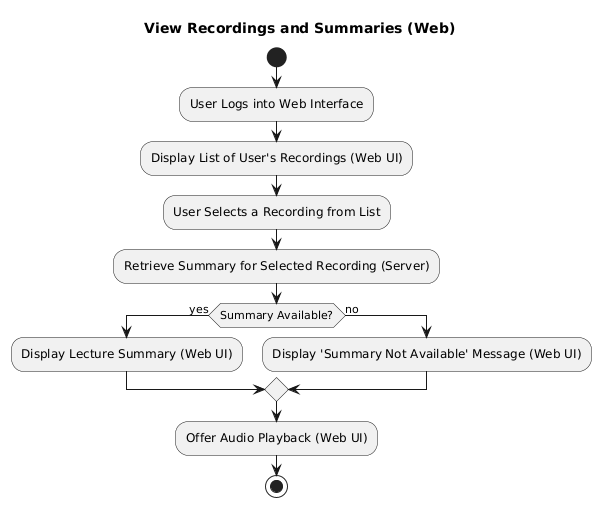

*Figure 3.2.7.2: Activity Diagram for View Recordings and Summaries (Web)*

##### Wireframe: Views Recording and Summary (Web)

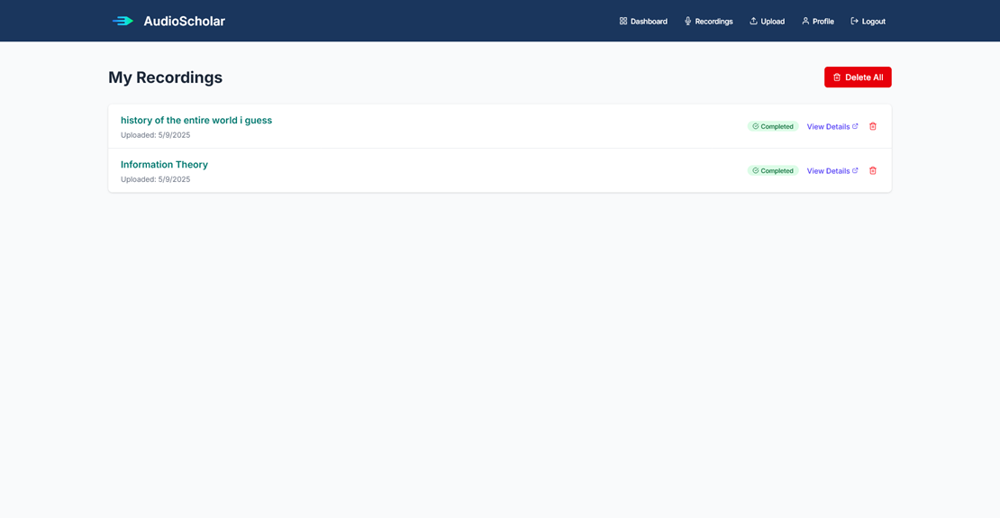

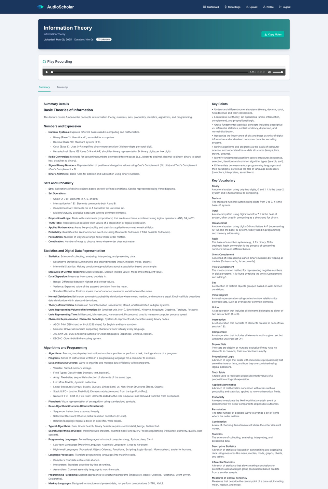

*Figure 3.2.7.3: Wireframe for Views Recording and Summary (Web)*

#### **7.2 Upload Audio Files (Web)**

##### Use Case Diagram

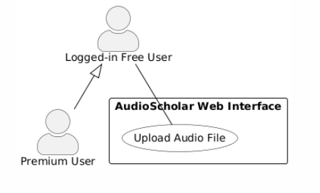

*Figure 3.2.7.4: Use Case Diagram for Upload Audio Files (Web)*

##### Use Case Description: Upload Audio Files (Web)

-   **Use Case ID:** UC_Upload_Audio_Web_Interface
-   **Primary Actor:** Logged-in Free User
-   **Goal:** To upload pre-recorded audio files from their computer to the AudioScholar system through the web interface for processing and summarization.
-   **Preconditions:**
    -   The user is accessing the AudioScholar web interface through a compatible web browser.
    -   The user is logged into the web interface.
    -   The audio file to be uploaded is stored on the user's computer.
    -   Internet connectivity is available.
-   **Normal Flow:**
    1.  The user logs into the AudioScholar web interface.
    2.  The user navigates to the "Upload Audio" section or page within the web interface.
    3.  The web interface presents a file upload control (e.g., a "Choose File" button).
    4.  The user clicks the file upload control and uses the browser's file selection dialog to browse their computer's file system.
    5.  The user selects the audio file they want to upload.
    6.  The web interface may display the name of the selected file.
    7.  The user initiates the upload process (e.g., by clicking an "Upload" button).
    8.  The web interface uploads the selected audio file to the server for processing.
    9.  The web interface displays a progress indicator during the upload process.
    10. Upon successful upload, the web interface displays a confirmation message indicating that the audio file has been uploaded successfully and is being processed.
-   **Alternative Flows:** (Similar to Mobile Upload - A1, A2, A3, A4 - File selection, format, network, size errors, but within the context of the web interface)
    -   **A1. No file selected:** If the user attempts to upload without selecting a file, the web interface displays an error message prompting file selection.
    -   **A2. File format not supported:** File format not supported: If the selected file is not in a supported audio format (Supported formats: WAV, MP3, AIFF, AAC, OGG Vorbis, FLAC), the web interface displays an error message indicating the unsupported format.
    -   **A3. Upload failure (network error, server error):** If the upload fails due to network issues or server errors, the web interface displays an error message and may provide options to retry.
    -   **A4. File size limit exceeded:** If the selected file exceeds the maximum allowed file size (500MB), the web interface displays an error message indicating the file size limit.
-   **Postconditions:**
    -   The selected audio file is successfully uploaded to the server and queued for processing.
    -   The web interface displays a confirmation message to the user.
-   **Priority:** Medium (Important for web interface functionality)
-   **Frequency of Use:** Less frequent than mobile recording, but important for web users and users with audio files on computers.

##### Activity Diagram: Upload Audio Files (Web)

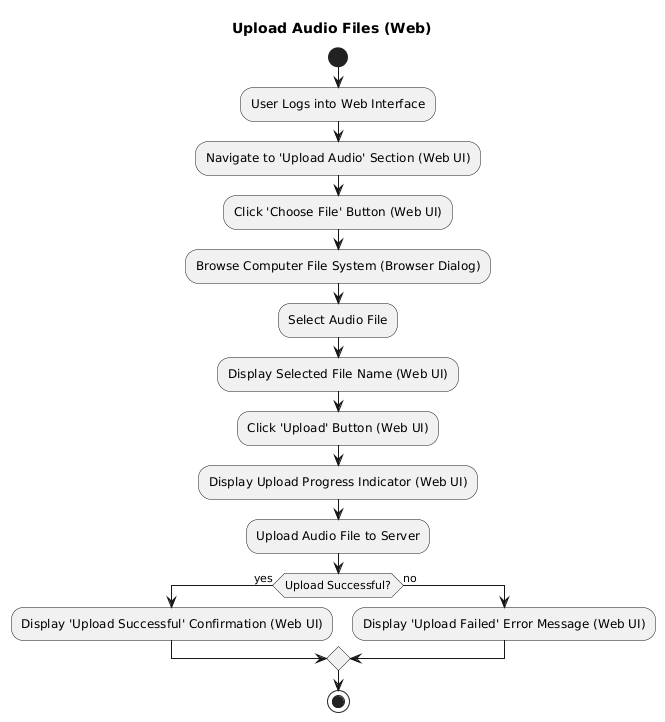

*Figure 3.2.7.5: Activity Diagram for Upload Audio Files (Web)*

##### Wireframe: Audio Upload Screen (Web)

*Figure 3.2.7.6: Wireframe for Audio Upload Screen (Web)*

#### ** 7.3 Views Recommendations (Web)**

##### Use Case Diagram

*Figure 3.2.7.7: Use Case Diagram for View Recommendations (Web)*

##### Use Case Description: Views Recommendations (Web)

-   **Use Case ID:** UC_View_Recommendations_Web
-   **Primary Actor:** Logged-in Free User
-   **Goal:** To view learning material recommendations generated for a specific lecture recording through the AudioScholar web interface. This allows users to access supplementary learning resources on a computer.
-   **Preconditions:**
    -   The user is accessing the AudioScholar web interface through a compatible web browser.
    -   The user is logged into the web interface.
    -   The user has selected a lecture recording for which recommendations have been generated.
    -   Recommendations have been successfully generated for the selected recording (Module 3).
    -   Internet connectivity is available (to access recommendation links, typically YouTube).
-   **Normal Flow:**
    1.  The user logs into the AudioScholar web interface.
    2.  The user navigates to the list of their lecture recordings and selects a specific recording to view its details.
    3.  The web interface retrieves the learning material recommendations associated with the selected recording from the server.
    4.  The web interface displays a "Recommendations" section on the recording details page.
    5.  Within the recommendations section, the web interface lists the generated recommendations, typically as links to YouTube videos (initially). Each recommendation may include the video title, description (if available), and a thumbnail.
    6.  The user reviews the list of recommendations.
    7.  The user can click on a recommendation link to open the recommended learning material (e.g., YouTube video) in a new browser tab or window.
-   **Alternative Flows:**
    -   **A1. User not logged in:** If the user attempts to access recommendations without being logged in, the web interface redirects them to the login page.
    -   **A2. No recommendations generated:** If recommendations have not been generated for the selected recording yet, the web interface may display a message indicating "Recommendations pending" or "No recommendations available for this recording" in the recommendations section.
    -   **A3. Recommendation retrieval failure (network error, server error):** If retrieving recommendations from the server fails due to network issues or server errors, the web interface displays an error message indicating recommendation retrieval failure and prompts the user to try again later.
    -   **A4. No recommendations found:** If the recommendation engine did not find any relevant learning materials for the lecture, the web interface may display a message indicating "No relevant learning materials found" in the recommendations section.
-   **Postconditions:**
    -   The web interface displays the learning material recommendations for the selected lecture recording.
    -   The user can access the recommended learning materials via links in the web interface.
-   **Priority:** Medium (Enhancement for web interface functionality)
-   **Frequency of Use:** On-demand, when users want to explore learning resources for a lecture via the web interface.

##### Activity Diagram: Views Recommendations (Web)

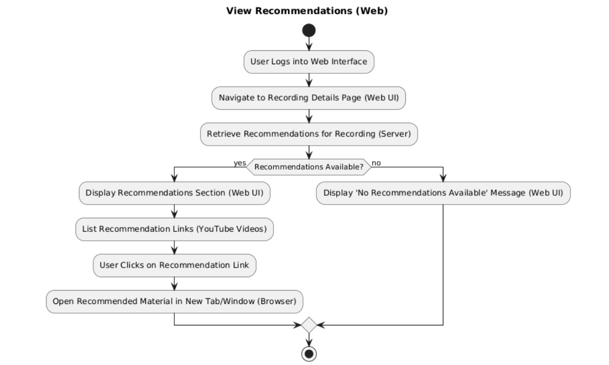

*Figure 3.2.7.8: Activity Diagram for View Recommendations (Web)*

##### Wireframe: Recording Details Screen (Web) - Recommendation Section

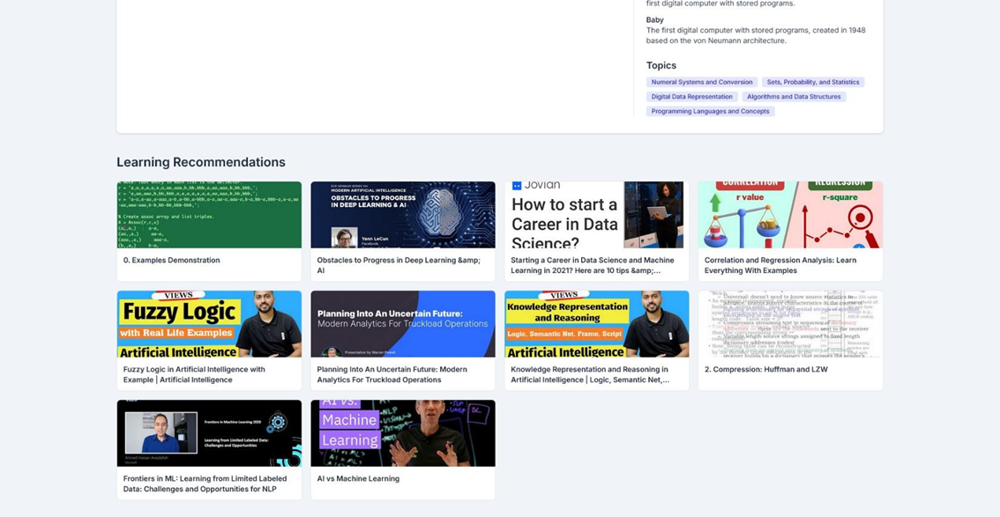

*Figure 3.2.7.9: Wireframe for Recording Details Screen (Web)*

### Module 8: Freemium Model

#### **8.1 Feature Access Control based on User Status (Mobile & Web)**

##### Use Case Diagram

##### 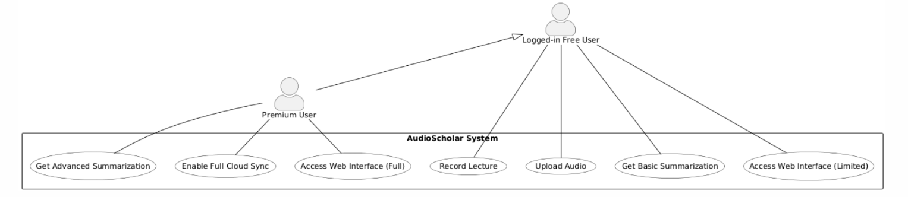

*Figure 3.2.8.1: Use Case Diagram for Feature Access Control based on User Status (Mobile & Web)*

##### Use Case Description: Feature Access Control Based on User Status (Mobile & Web)

-   **Use Case ID:** UC_Feature_Access_Control
-   **Primary Actors:** Logged-in Free User, Premium User (Future)
-   **Goal:** To control access to different features and functionalities within AudioScholar (both mobile and web) based on the user's authentication and subscription status, implementing the freemium model.
-   **Preconditions:**
    -   The AudioScholar mobile application and web interface are running.
    -   The application can determine the user's authentication status (logged-in) and (in the future) subscription status (free or premium).
    -   Feature access control logic is implemented throughout the application.
-   **Normal Flow:**
    1.  When a user attempts to access a feature or functionality within AudioScholar (e.g., start recording, upload audio, view summaries, access cloud sync settings, use advanced summarization options - *future feature*).
    2.  The application's feature access control module intercepts the request.
    3.  The module checks the user's current authentication status:
        -   **Logged-in User:** If the user is logged in, the module proceeds to check their subscription status (in the future). For now, all logged-in users are considered logged-in free users.
        -   **Premium User (Future):** In the future, if premium subscriptions are implemented, the module will also check if the logged-in user has an active premium subscription.
    4.  Based on the user's status, the feature access control module determines if the requested feature is accessible:
        -   **Logged-in Free Users:** Access to core features including online recording (foreground only, background recording is disabled for this tier), basic AI summarization, learning material recommendations (basic YouTube only), optional cloud synchronization, and limited web interface access (viewing recordings/summaries, audio upload). Some features may have usage quotas or limitations.
        -   **Premium Users (Future):** Full access to all features, including advanced AI summarization, expanded recommendation sources, priority processing, potentially background recording, and full web interface functionality. No (or higher) usage limitations.
    5.  The application either grants access to the requested feature if authorized or denies access and provides appropriate feedback to the user:
        -   **Feature Granted:** The application proceeds with the requested functionality.
        -   **Feature Denied:** The application may display a message indicating that the feature is not available for their current user status and potentially prompt them to log in or subscribe (for premium features in the future). UI elements for restricted features may be disabled or hidden for free users.
-   **Alternative Flows:**
    -   **A1. User status determination failure:** If the application cannot reliably determine the user's authentication or subscription status (e.g., due to session errors, network issues), the application may default to the most restrictive access level (Logged-in Free User) to ensure security and freemium model enforcement.
    -   **A2. Feature access rule misconfiguration:** If the feature access control rules are misconfigured, users may be granted incorrect access levels (e.g., free users getting premium features or vice versa). Proper testing and configuration management are needed to prevent this.
-   **Postconditions:**
    -   Access to features and functionalities within AudioScholar is correctly controlled based on the user's authentication and (future) subscription status, enforcing the freemium model.
    -   Users are granted access to features appropriate for their user tier, and restricted from features outside their tier.
    -   The application UI reflects the available features based on user status (e.g., enabled/disabled UI elements).
-   **Priority:** High (Essential for business model implementation)
-   **Frequency of Use:** Every time a user attempts to access any feature within the application.

##### Activity Diagram: Feature Access Control (Mobile/Web)

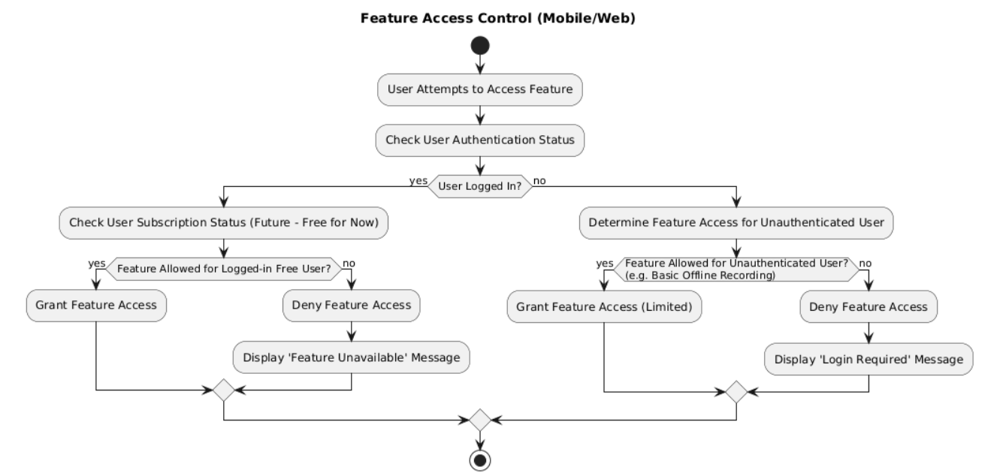

*Figure 3.2.8.2: Activity Diagram for Feature Access Control (Mobile/Web)*

##### Wireframe: Feature Restriction UI (Mobile & Web)

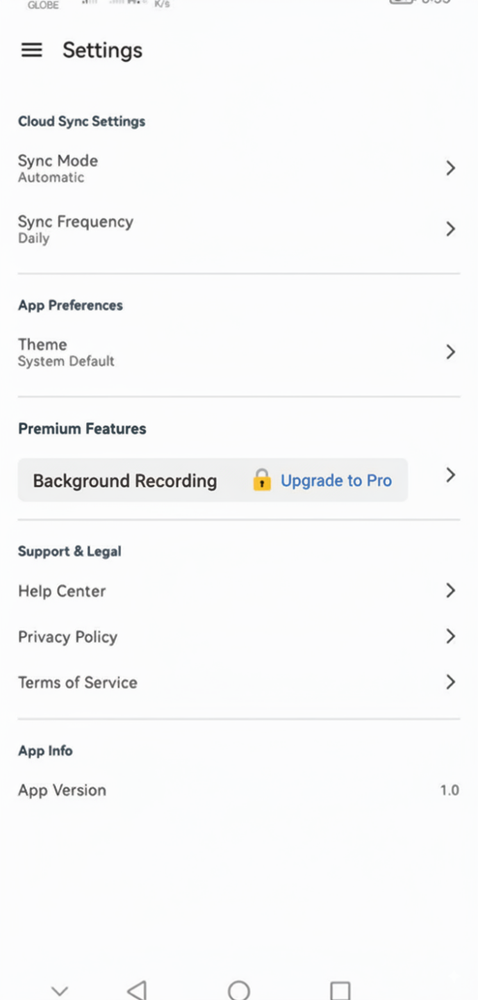 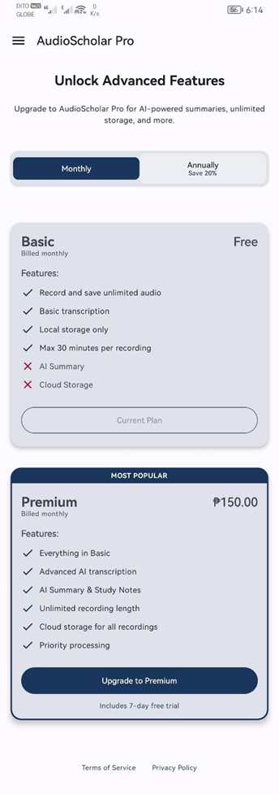

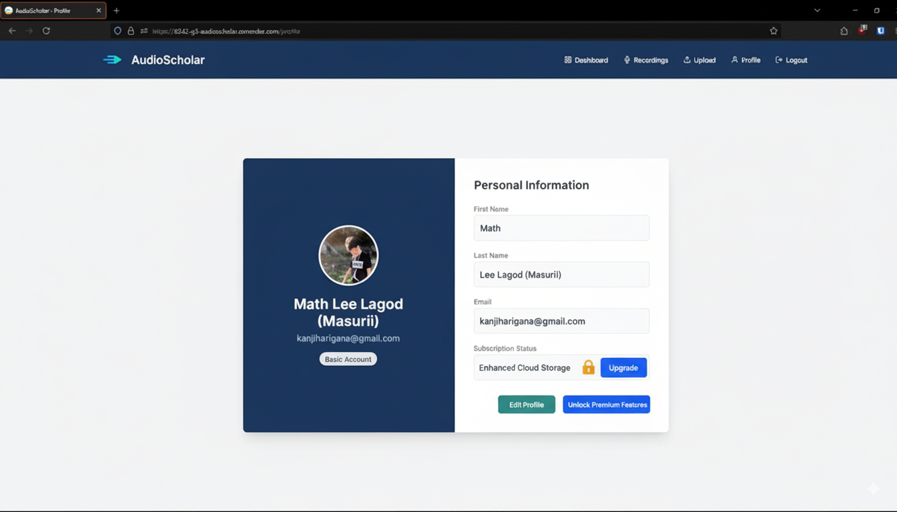

*Figure 3.2.8.3: Wireframe for Feature Restriction (Mobile & Web)*

#### **8.2 Premium Subscription Management**

##### Use Case Diagram

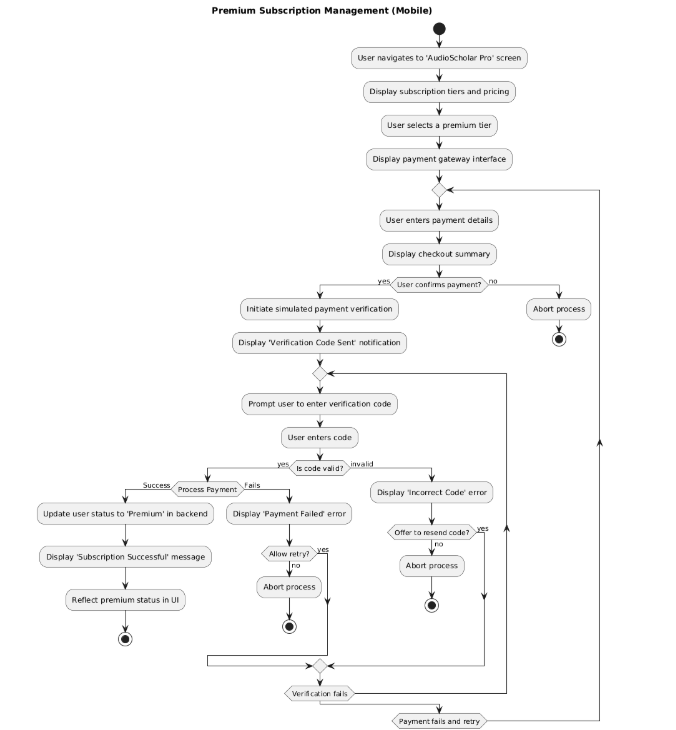

*Figure 3.2.8.4: Use Case Diagram for Premium Subscription Management (Mobile)*

##### Use Case Description: Premium Subscription Management

-   **Use Case ID:** UC_Premium_Subscription_Mobile
-   **Primary Actor:** LoggedInFreeUser (on Mobile)
-   **Goal:** To allow a logged-in free user to subscribe to a premium tier of AudioScholar via the mobile application, process payment, and have their account status updated to “Premium”.
-   **Preconditions:**
    -   User is logged into the mobile application.
    -   User is currently on a free tier.
    -   Mobile application has access to the internet.
-   **Normal Flow:**
1.  User navigates to the ‘AudioScholar Pro’ screen (e.g., via Navigation Drawer or Settings).
2.  Application displays subscription tiers (e.g., Basic and Premium), features of each tier, and pricing.
3.  User selects a premium tier and proceeds to payment.
4.  Application presents a payment gateway interface, prompting for payment details (e.g., credit/debit card, e-wallets like GCash, PayMaya).
5.  User enters their payment details and submits.
6.  Application displays a checkout summary.
7.  User confirms the payment details.
8.  Application initiates a simulated payment verification process.
9.  User receives a realistic in-app notification (mimicking banking/e-wallet verification) with a verification code.
10. User is prompted to enter the verification code.
11. User enters the verification code.
12. Application validates the code.
13. Upon successful verification, the application updates the user’s status to “Premium” in the backend.
14. Application displays a success message confirming the subscription.
15. User’s status is visibly reflected in the side menu navigation (e.g., next to avatar) and on the User Profile screen.
-   **Alternative Flows:**
    -   **A1. Payment Failure:** If payment processing fails (e.g., declined card, insufficient funds, payment gateway error), the application displays an error message and allows the user to retry or use a different payment method.
    -   **A2. Verification Code Incorrect/Expired:** If the user enters an incorrect verification code or the code expires, the application displays an error and may offer to resend a code or restart the payment.
    -   **A3. User Cancels Subscription Process:** If the user cancels at any point before final payment confirmation, the process is aborted, and no subscription change occurs.
-   **Postconditions:**
    -   User’s account status is updated to “Premium”.
    -   User has access to premium features.
    -   Payment transaction is recorded (simulated for Capstone).
-   **Priority:** High (as per SPP FR1)
-   **Frequency of Use:** Infrequent (per user, when upgrading)

##### Activity Diagram: Premium Subscription Management (Mobile)

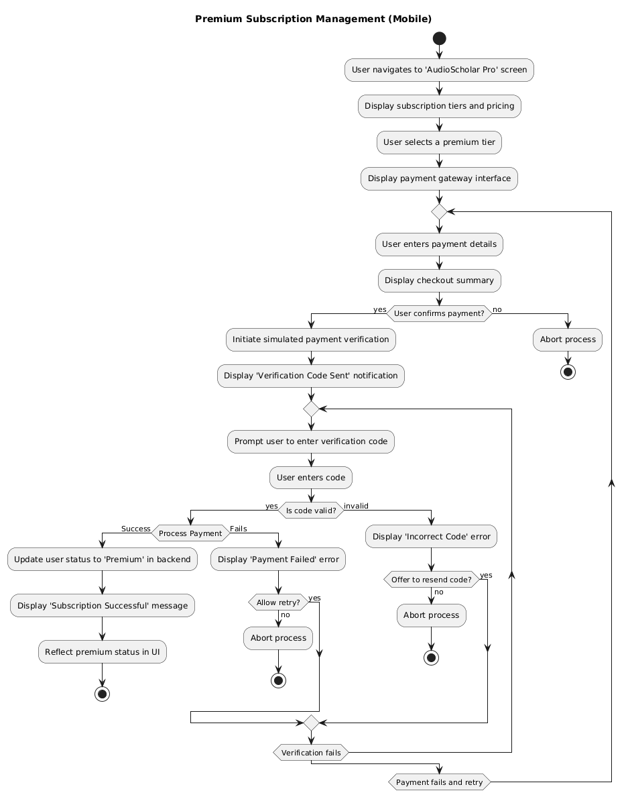

*Figure 3.2.8.4.A: Activity Diagram for Premium Subscription Management (Mobile)*

##### Wireframe: Premium Subscription Management (Mobile)

 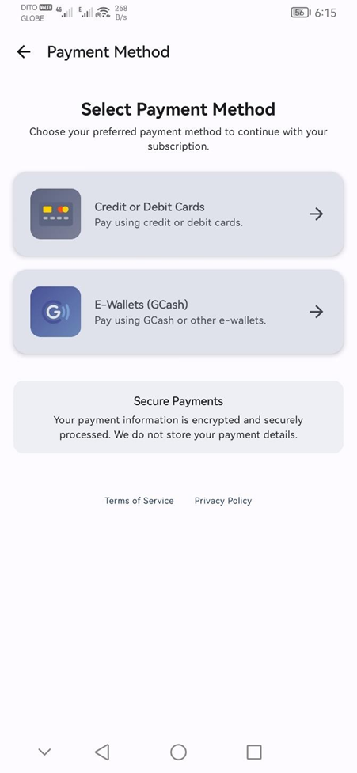 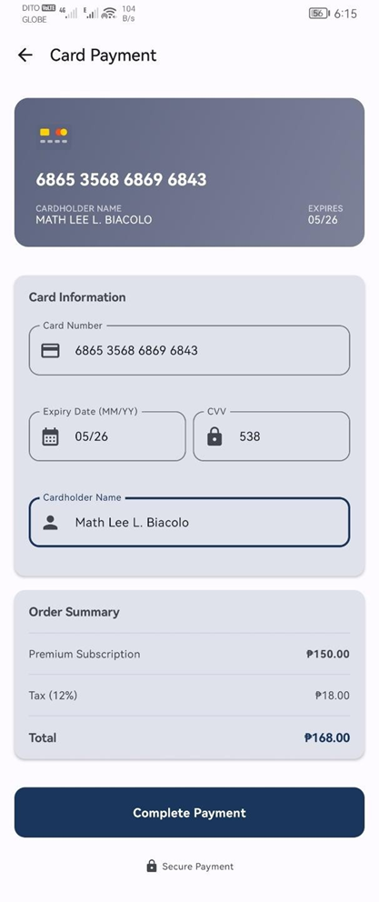

*Figure 3.2.8.4.B: Wireframe for Premium Subscription Management (Mobile)*

#### **8.3 Premium Subscription Signup and Payment (Web)**

##### Use Case Diagram

*Figure 3.2.8.5: Use Case Diagram for Premium Subscription Management (Web)*

##### Use Case Description: Premium Subscription Signup and Payment (Web)

-   **Use Case ID:** UC_Premium_Subscription_Web
-   **Primary Actor:** LoggedInFreeUser (on Web Interface)
-   **Goal:** To allow a logged-in free user to subscribe to a premium tier of AudioScholar via the web interface, process payment, and have their account status updated to “Premium”.
-   **Preconditions:**
    -   User is logged into the web interface.
    -   User is currently on a free tier.
    -   Web interface has access to the internet.
-   **Normal Flow:**
1.  User navigates to a dedicated pricing page or account upgrade section on the web interface.
2.  Web interface displays subscription tiers (e.g., Basic and Premium), features, and pricing.
3.  User selects a premium tier.
4.  Web interface directs user to a payment methods page.
5.  User selects a payment method and is presented with screens for entering card/e-wallet payment details.
6.  User enters their payment details.
7.  Web interface displays a checkout summary page.
8.  User confirms the payment details and submits the payment.
9.  Upon successful submission of payment (simulated verification assumed for Capstone, or direct success), the web interface updates the user’s status to “Premium” in the backend.
10. User is automatically navigated back to their user profile page.
11. The user profile page displays their updated account status as “Premium”.
-   **Alternative Flows:**
    -   **A1. Payment Failure:** If payment processing fails, the web interface displays an error message and allows the user to retry or use a different payment method.
    -   **A2. User Cancels Subscription Process:** If the user cancels at any point before final payment confirmation, the process is aborted.
-   **Postconditions:**
    -   User’s account status is updated to “Premium”.
    -   User has access to premium features.
    -   Payment transaction is recorded (simulated for Capstone).
-   **Priority:** High (as per SPP FR7)
-   **Frequency of Use:** Infrequent (per user, when upgrading)

##### Activity Diagram: Premium Subscription Signup and Payment (Web)

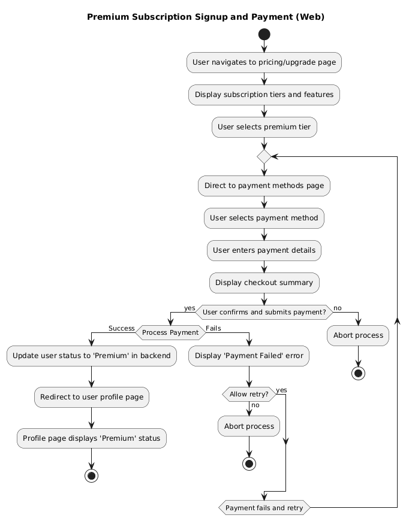

*Figure 3.2.8.5.A: Activity Diagram for Premium Subscription Signup and Payment (Web)*

##### Wireframe: Premium Subscription Signup and Payment (Web)

*Figure 3.2.8.5.B: Wireframe for Premium Subscription Signup and Payment (Web)*

#### **8.4 Update User Status to Premium (System Process)**

##### Use Case Diagram

*Figure 3.2.8.6: Use Case Diagram for Update User Status to Premium*

##### Use Case Description: Update User Status to Premium (System Process)

-   **Use Case ID:** UC_Update_User_Status_Premium
-   **Primary Actor:** System (AudioScholar Backend, specifically triggered by Payment Verification components from UC_Premium_Subscription_Mobile or UC_Premium_Subscription_Web)
-   **Goal:** To update a user’s account status to “Premium” in the system’s database after successful completion of a premium subscription payment process.
-   **Preconditions:**
    -   A user has successfully completed the payment and verification steps for a premium subscription (via mobile or web interface, as per UC_Premium_Subscription_Mobile or UC_Premium_Subscription_Web).
    -   The payment verification component has confirmed the payment success.
    -   The user’s ID is known.
-   **Normal Flow:**
1.  The system receives a trigger indicating successful payment verification for a specific user ID.
2.  The system accesses the user’s account record in the database (e.g., Firebase Firestore).
3.  The system updates the user’s account status field (or equivalent attribute) from “Free” (or current tier) to “Premium”.
4.  The system may also record the subscription start date, tier type, and next renewal date (if applicable for future versions, for v1.0 it might just be a status change).
5.  The system logs the successful status update.
6.  This updated status will now be reflected when the user’s profile is loaded on mobile or web, and will be used by the Feature Access Control module (UC_Feature_Access_Control).
-   **Alternative Flows:**
    -   **A1. User Record Not Found:** If, for some reason, the user record associated with the user ID cannot be found in the database, the system logs a critical error. Manual intervention might be required to resolve the discrepancy. (This should be a rare occurrence).
    -   **A2. Database Update Failure:** If the system fails to update the user’s status in the database (e.g., due to database connectivity issues or write errors), the system logs an error and may implement a retry mechanism. If retries fail, an alert should be sent to system administrators for manual correction to ensure the user receives their premium status.
-   **Postconditions:**
    -   The user’s account status is officially marked as “Premium” in the database.
    -   The user will be granted access to premium features upon their next interaction or session refresh that checks their status.
-   **Priority:** High (Critical for delivering the paid service)
-   **Frequency of Use:** Occurs each time a user successfully subscribes to a premium tier.

##### Activity Diagram: Update User Status to Premium (System Process)

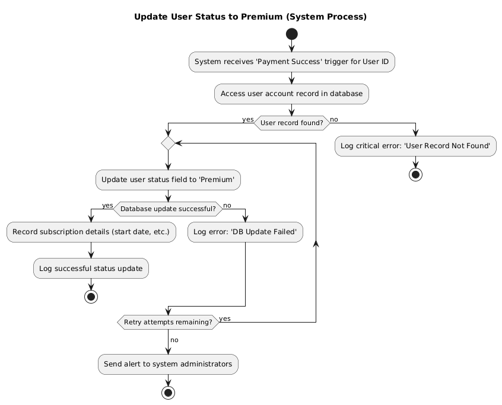

*Figure 3.2.8.6.A: Activity Diagram for Update User Status to Premium (System Process)*

##### Wireframe: (No direct UI wireframe for this server-side process)

###### As this module outlines a backend system process that is triggered automatically after a successful payment, it does not involve a direct user interface. Therefore, UI wireframes are not applicable. The result of this process (the user's "Premium" status) is reflected in the user's profile and through the unlocking of premium features, as shown in other wireframes.

## 3.3 Non-functional requirements

### Performance

##### Summarization Latency: The system shall generate lecture summaries within a reasonable timeframe after lecture recording or upload. Target average summarization time should be less than 15 minutes for a 1-hour lecture, assuming reasonable API processing times. (Note: Actual summarization time is heavily dependent on the AI API processing speed, which is an external factor.)

##### Recommendation Latency: Learning material recommendations should be generated and available to the user within seconds of summary generation completion.

##### Mobile Application Responsiveness: The mobile application UI shall be responsive and provide smooth transitions between screens. Recording should start and stop promptly upon user action.

##### Web Interface Responsiveness: The web interface shall load pages quickly and respond to user interactions without noticeable delays.

##### Upload/Download Speeds: Audio file uploads and (optional) cloud synchronization should utilize network bandwidth efficiently to minimize upload/download times, within reasonable network conditions.

### Security

##### User Authentication Security: User authentication credentials (passwords, OAuth tokens) shall be securely stored and transmitted. Firebase Authentication and OAuth 2.0 protocols are to be used for secure authentication.

##### Data Storage Security: User data, audio recordings, and summaries stored in Firebase shall be protected using Firebase security rules to prevent unauthorized access.

##### Data Transmission Security: All communication between the mobile application, web interface, and server, especially when transmitting sensitive data (authentication tokens, user data), shall be encrypted using HTTPS.

##### API Key Security: API keys for Google Gemini AI API and authentication APIs shall be securely managed and protected from unauthorized access. Keys should not be hardcoded in client-side applications.

##### Privacy: User data and recordings shall be handled with privacy in mind. Access to user data should be restricted to authorized users and system components. Data privacy policies should be considered and potentially documented.

##### Local Mobile Storage Security: Locally stored recordings on mobile devices shall be handled securely. Considerations must be made for potential security implications of offline data storage, such as employing appropriate file permissions or encryption if feasible within the project scope and platform capabilities.

### Reliability

##### System Uptime: The server-side system and core functionalities (recording, summarization, recommendation) shall aim for a 99% uptime to ensure continuous availability for users.

##### Error Handling: The system shall implement robust error handling to gracefully manage unexpected errors, API failures, network issues, and other potential problems. Informative error messages should be displayed to the user when appropriate, and errors should be logged for debugging and monitoring.

##### Data Integrity: The system shall ensure the integrity of recorded audio, summaries, and user data. Data should not be corrupted or lost during processing, storage, or transmission.

##### Crash Resistance: The mobile application and web interface should be stable and resistant to crashes. Appropriate exception handling and testing should be implemented to minimize crashes.

##### Recovery: In case of system failures, the system should be designed to recover gracefully and minimize data loss. Consider backup and recovery strategies for critical data (future enhancement).

### Usability

#### **Ease of Use:** The mobile application and web interface shall be user-friendly and intuitive, with a clear and easy-to-navigate UI. The application should be easy to learn and use for students with varying levels of technical proficiency.

#### **User Interface Consistency:** The UI elements and design should be consistent across the mobile application and web interface to provide a cohesive user experience.

#### **Accessibility:** Consider basic accessibility guidelines in UI design to make the application usable by a wider range of students (e.g., sufficient color contrast, keyboard navigation - future enhancement).

#### **Feedback and Guidance:** The application should provide clear feedback to users on their actions (e.g., recording status, upload progress, processing status). Guidance and tooltips may be provided to assist users in using the application features.

#### **Mobile-First Design (for App):** The mobile application should be designed with mobile usability in mind, considering screen size, touch interactions, and typical mobile usage scenarios.

### Efficiency

##### Battery Efficiency (Mobile App): The mobile application should be designed to minimize battery consumption during lecture recording. Optimize audio recording processes and background tasks to conserve battery life.

##### Resource Efficiency (Server-side): The server-side application should be designed to efficiently utilize server resources (CPU, memory, network bandwidth) during audio processing and recommendation generation. Optimize algorithms and resource management to handle concurrent user requests effectively.

##### Data Storage Efficiency: Consider efficient storage formats for audio recordings and summaries to minimize storage space usage, especially for free users with limited storage (if applicable in freemium model - future).

##### Network Bandwidth Efficiency: Minimize data transfer sizes where possible to reduce network bandwidth consumption, especially for users with limited data plans.

### Scalability

##### User Scalability: The server-side infrastructure should be scalable to accommodate a growing number of users and concurrent requests as user adoption increases. Firebase’s scalable infrastructure is expected to provide a base for user scalability.

##### Data Scalability: The system should be able to handle increasing volumes of audio recordings, summaries, and user data over time. Firebase database and storage scalability should be leveraged.

##### Feature Scalability: The system architecture should be designed to allow for future feature additions and expansions without requiring major redesigns. Modular design and API-driven architecture should support feature scalability.

### Offline Capability

##### Offline Recording (Mobile App): The mobile application must support lecture recording functionality even when there is no internet connectivity. Recordings should be stored locally and can be processed and synchronized later when connectivity is restored (for logged-in users).

##### Offline Access to Local Recordings (Mobile App): Users should be able to access and manage their locally stored recordings within the mobile application even in offline mode.
