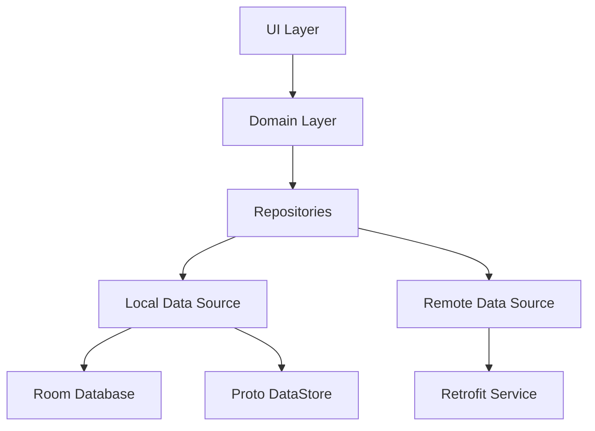

# Data Module

## Overview
The Data Module is the foundation of the AudioScholar application, responsible for managing all data operations. It handles local persistence through Room Database and DataStore, manages remote API communication via Retrofit, and orchestrates data flow through various repositories. This module ensures that the application functions seamlessly offline while synchronizing with the cloud when a connection is available.

## Architecture
The data layer follows the Clean Architecture principle, acting as the data source for the Domain layer.



## Key Components

| Component | Role | Description |
| :--- | :--- | :--- |
| `AppDatabase` | Local Database | Room database configuration managing `RecordingMetadata` and `UserNoteEntity`. |
| `ApiService` | Remote Service | Retrofit interface defining all network endpoints for authentication, audio management, and user data. |
| `RecordingMetadataDao` | DAO | Data Access Object for performing CRUD operations on recording metadata. |
| `UserNoteDao` | DAO | Data Access Object for managing user notes locally. |
| `UserDataStore` | Persistence | Manages user profile and preferences using Jetpack DataStore. |
| `RecordingFileHandler` | File Utility | Handles physical audio file operations like creation, deletion, and storage checks. |
| `AdminRepositoryImpl` | Repository | Implementation of admin-related data operations. |

## Dependencies
This module relies on the following internal and external dependencies:

- **Internal:**
    - `edu.cit.audioscholar.domain.model` (Domain models)
    - `edu.cit.audioscholar.util` (Resource wrapper, Constants)
- **External:**
    - `androidx.room:room-runtime` (Local Database)
    - `androidx.datastore:datastore-preferences` (Key-Value Storage)
    - `com.squareup.retrofit2:retrofit` (Network Requests)
    - `com.squareup.okhttp3:logging-interceptor` (Network Logging)
    - `com.google.dagger:hilt-android` (Dependency Injection)

## Usage

The data layer is primarily consumed by the Domain layer through Repository interfaces. Direct usage in UI is discouraged.

```kotlin
// Example: Repository Usage in a Use Case or ViewModel
class GetRecordingsUseCase(private val localAudioRepository: LocalAudioRepository) {
    operator fun invoke(): Flow<List<RecordingMetadata>> {
        return localAudioRepository.getLocalRecordings()
    }
}