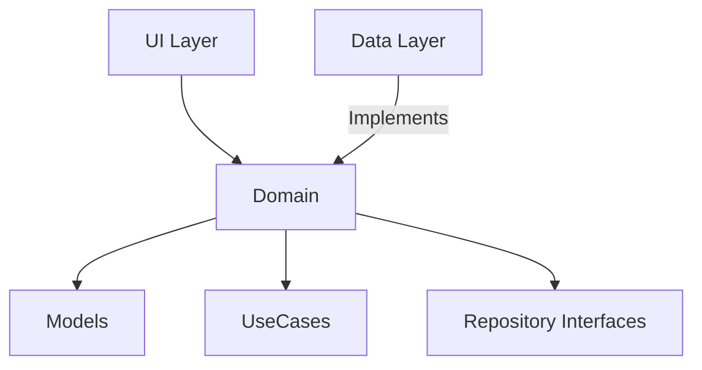

# Domain Module

## Overview
The Domain module encapsulates the core business logic, models, and repository interfaces of the AudioScholar application. It serves as the central layer in the Clean Architecture pattern, defining the rules and data structures that drive the application independent of external frameworks. It abstracts the data sources (handled by the Data layer) and provides pure business logic to the UI layer.

## Architecture



## Key Components

| Component | Role | Description |
| :--- | :--- | :--- |
| `PasswordStrength` | Model | Enum representing the strength level of a user's password. |
| `QualitySetting` | Model | Enum defining recording quality presets (Low, Medium, High). |
| `PasswordValidator` | Use Case | Validates password against complexity rules (length, case, digits, special chars). |
| `AuthRepository` | Repository Interface | Defines contract for user authentication and profile management. |
| `LocalAudioRepository` | Repository Interface | Defines contract for local audio file operations. |
| `RemoteAudioRepository` | Repository Interface | Defines contract for cloud-based audio operations. |
| `NotificationRepository`| Repository Interface | Defines contract for managing notification tokens. |
| `AdminRepository` | Repository Interface | Defines contract for administrative data access. |

## Dependencies
This module is designed to be as independent as possible, but currently relies on:
- `app/src/main/java/edu/cit/audioscholar/util/UiText.kt` (For localized error messages)
- Android Framework (specifically `androidx.annotation.StringRes` in `QualitySetting`)
- `edu.cit.audioscholar.R` (Resource references)
- Kotlin Coroutines (`Flow` types in Repositories)

## Usage
The domain components are typically injected into ViewModels in the UI layer. Use cases are used to validate input or perform business logic, while repository interfaces are used to interact with data.

```kotlin
// Example: Validating a password in a ViewModel
val (strength, errors) = PasswordValidator.validatePassword(inputPassword)

if (strength == PasswordStrength.WEAK) {
    // Map errors to UI
    errors.forEach { uiText ->
        val message = uiText.asString(context)
        // Show message
    }
}