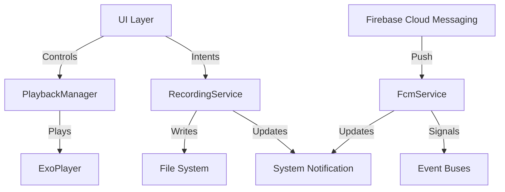

# Services Module

## Overview
The Services module contains the core background services and managers responsible for the application's heavy lifting. This includes handling long-running operations like audio recording, media playback using ExoPlayer, and Firebase Cloud Messaging (FCM) for push notifications. This layer acts as a bridge between the system's hardware capabilities (microphone, audio output) and the application's UI/Domain layers.

## Architecture



## Key Components

| Component | Role | Description |
| :--- | :--- | :--- |
| `RecordingService` | Android Service | A foreground service that manages audio recording using `MediaRecorder` and `AudioRecord`. It handles the recording lifecycle (start, stop, pause, resume) and provides real-time amplitude updates. |
| `PlaybackManager` | Singleton Manager | A wrapper around `ExoPlayer` that manages audio playback state, seeking, and progress updates throughout the application. |
| `FcmService` | Firebase Service | Extends `FirebaseMessagingService` to handle incoming push notifications, specifically for backend processing completion and general announcements. |

## Dependencies
This module relies on several Android framework components and external libraries:
- `android.app.Service` & `android.app.NotificationManager`
- `android.media.MediaRecorder` & `android.media.AudioRecord`
- `androidx.media3.exoplayer` (ExoPlayer)
- `com.google.firebase.messaging`
- `edu.cit.audioscholar.data.repository` (for token registration)
- `edu.cit.audioscholar.util` (Event buses and file handlers)

## Usage

### Recording Audio
The `RecordingService` is typically started via Intents from the UI layer.

```kotlin
// Starting the recording service
Intent(context, RecordingService::class.java).also {
    it.action = RecordingService.ACTION_START_RECORDING
    context.startService(it)
}
```

### Playing Audio
The `PlaybackManager` is a singleton that can be injected into ViewModels.

```kotlin
// Using PlaybackManager in a ViewModel
@HiltViewModel
class PlayerViewModel @Inject constructor(
    private val playbackManager: PlaybackManager
) : ViewModel() {
    
    fun playAudio(url: String) {
        playbackManager.prepareAndPlay(url)
    }
}