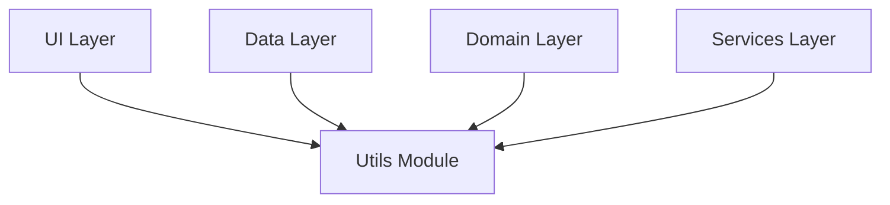

# Utils Module

## Overview
The Utils module provides shared utility classes, helper functions, and event buses that are used across the application. It includes components for file handling, UI string management, global event communication (like processing completion), and premium status management. This module acts as a support layer for Feature, Domain, and Data layers, ensuring common functionality is centralized and reusable.

## Architecture
This module sits at the lowest level of the application architecture, often depended upon by Data, Domain, and UI layers.



## Key Components

| Component | Role | Description |
| :--- | :--- | :--- |
| `FileUtils` | Helper | Utilities for file name extraction and manipulation from URIs. |
| `UiText` | Wrapper | Sealed class for handling Strings and StringResources in ViewModels and UI. |
| `FcmTokenProvider` | Helper | Retrieving the current Firebase Cloud Messaging token. |
| `PremiumStatusManager` | Manager | Manages the user's premium status via SharedPreferences and JWT inspection. |
| `ProcessingEventBus` | Event Bus | Global communication channel for backend processing completion events. |
| `TokenEventBus` | Event Bus | Global channel for broadcasting FCM token refresh events. |
| `Resource` | Wrapper | Generic wrapper for data states (Success, Error, Loading). |

## Dependencies
- `app/src/main/java/edu/cit/audioscholar/util/...`
- **External Libraries**:
    - `androidx.core` (Context access)
    - `kotlinx.coroutines` (Flows for Event Buses)
    - `com.google.firebase:firebase-messaging` (FCM Token)
    - `dagger.hilt` (Dependency Injection)

## Usage

```kotlin
// Example usage of UiText
val errorMessage = UiText.StringResource(R.string.error_generic)
val messageString = errorMessage.asString(context)

// Example usage of ProcessingEventBus
// In a Service or Repository:
processingEventBus.signalProcessingComplete(recordingId)

// In a ViewModel:
viewModelScope.launch {
    processingEventBus.processingCompleteEvent.collect { id ->
        refreshData(id)
    }
}