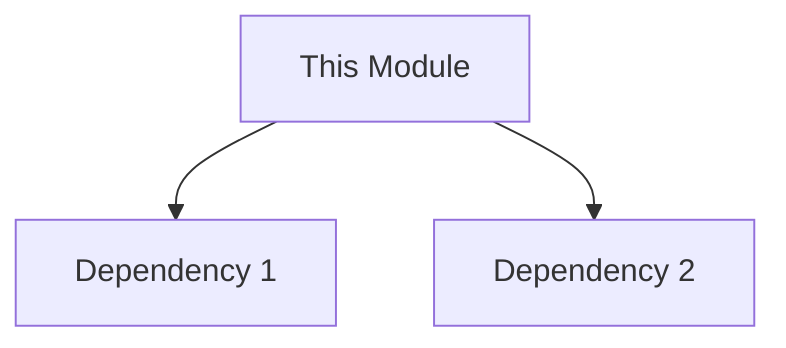

# [Module Name]

## Overview
Briefly describe the purpose of this module. What domain or technical problem does it solve?

## Architecture
(Optional) Include a Mermaid diagram or link to an image showing how this module fits into the broader application.



## Key Components
List the primary classes or components exposed by this module.

| Component | Role | Description |
| :--- | :--- | :--- |
| `ComponentName` | Service/Repo/ViewModel | Short description of responsibility. |

## Dependencies
List internal modules or external libraries this module relies on.
- `app/src/main/java/edu/cit/audioscholar/...`
- External Lib: Retrofit / Room / etc.

## Usage
Provide a high-level code snippet or explanation of how to consume this module.

```kotlin
// Example usage
val instance = ModuleComponent()
instance.performAction()